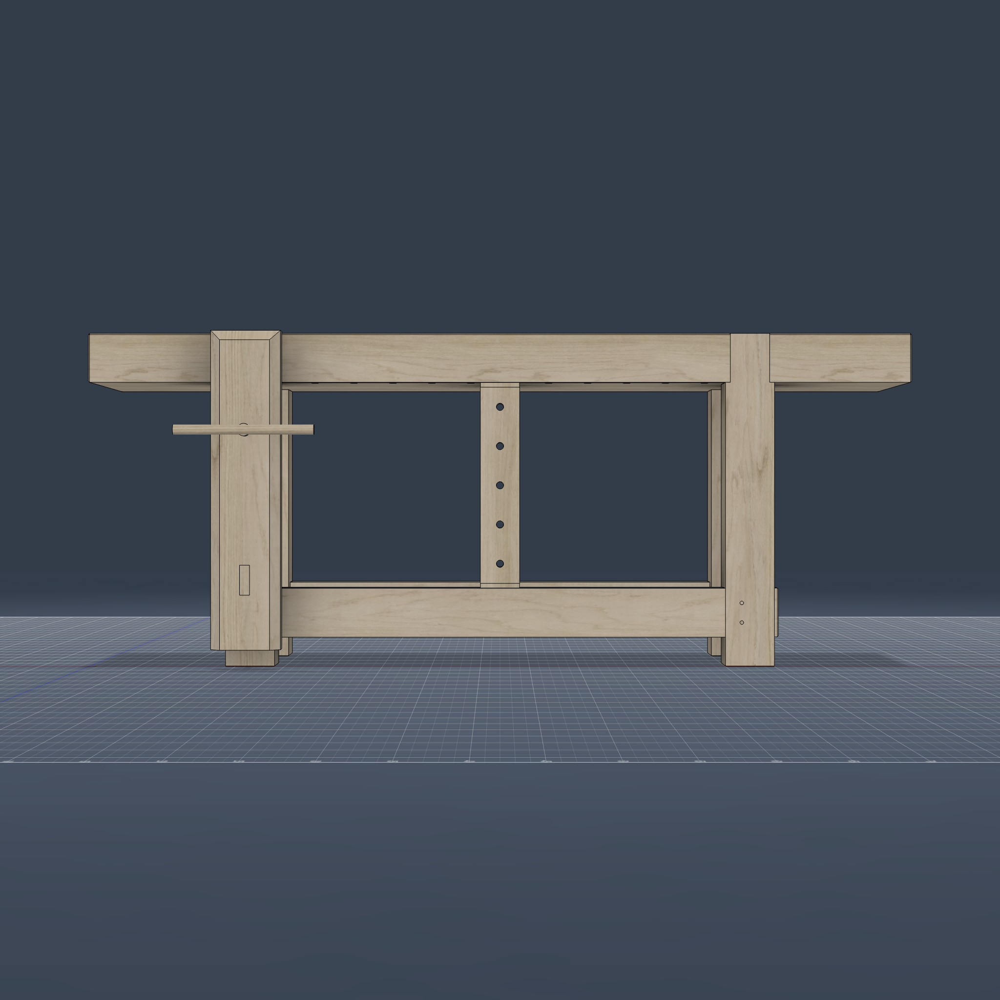
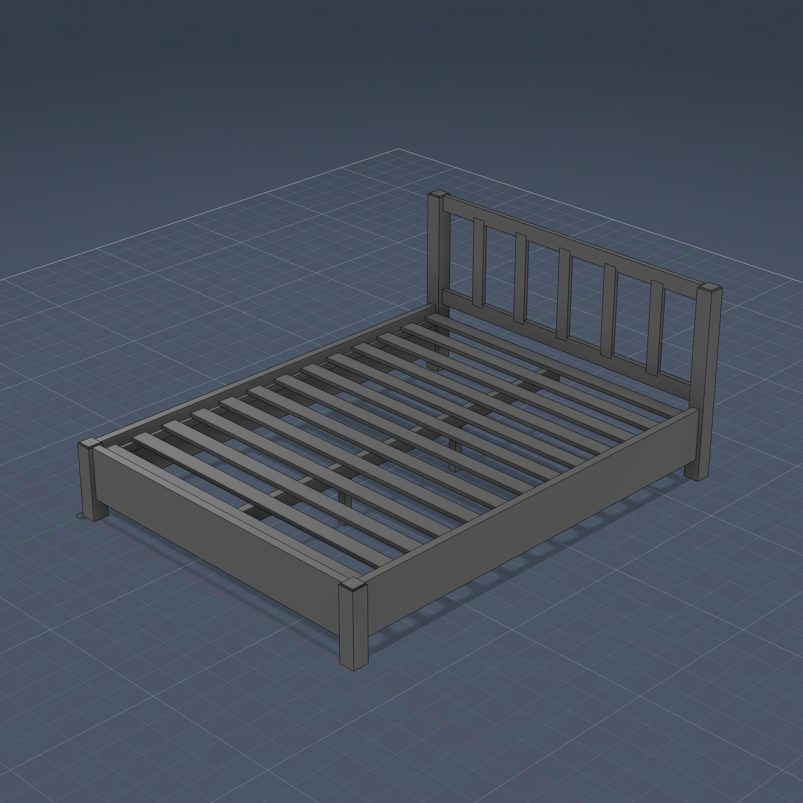
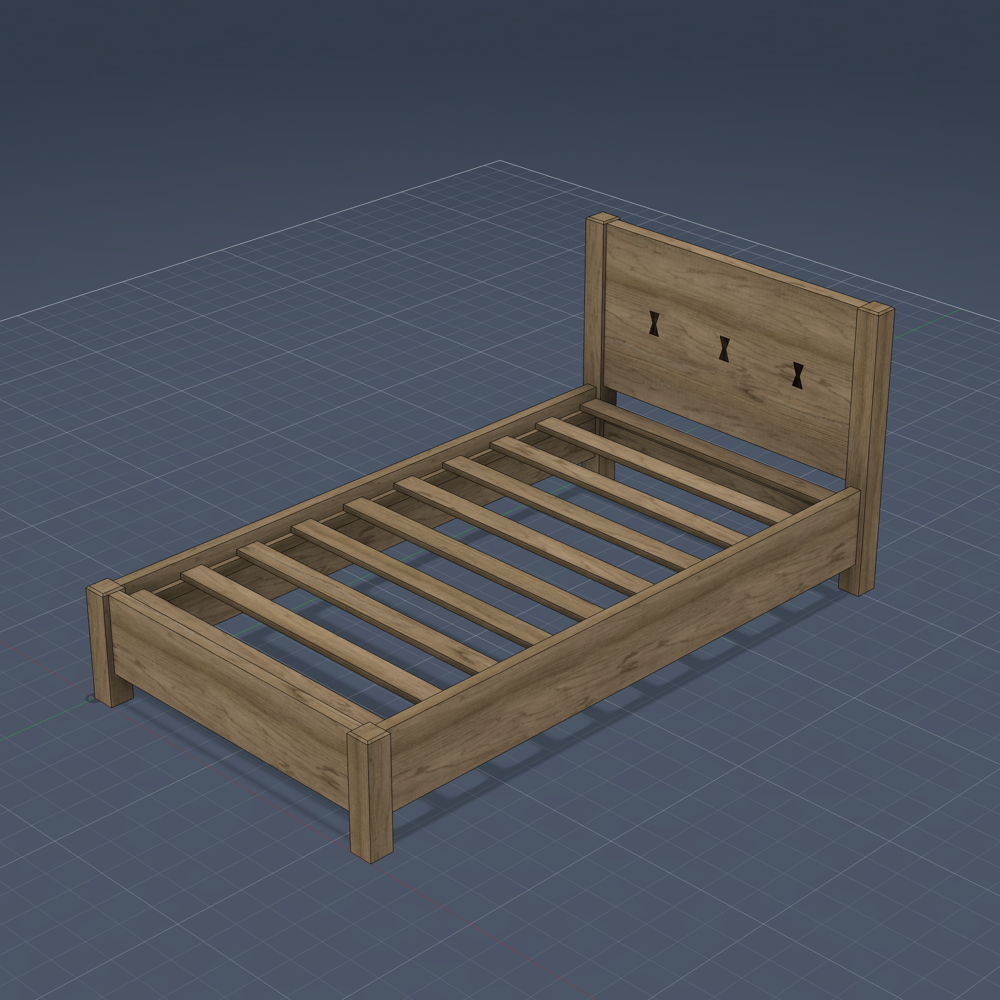
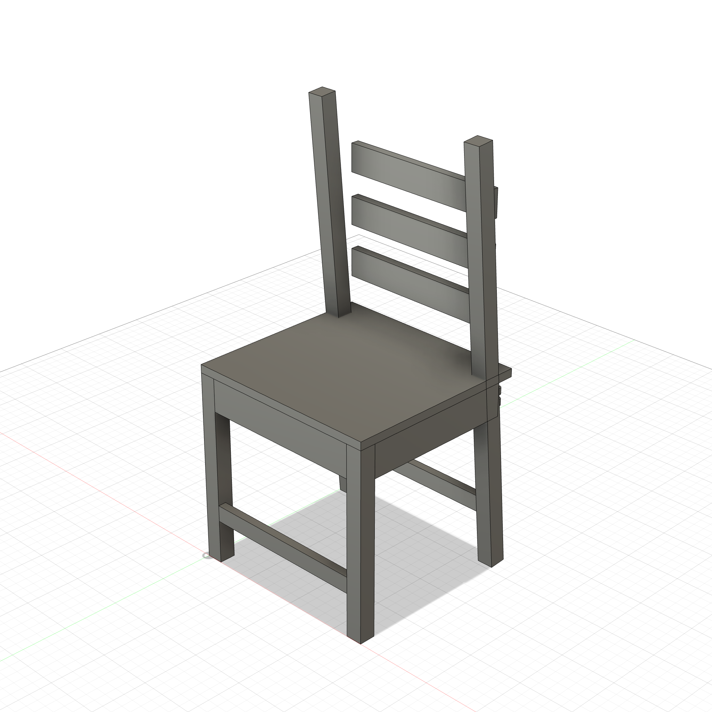
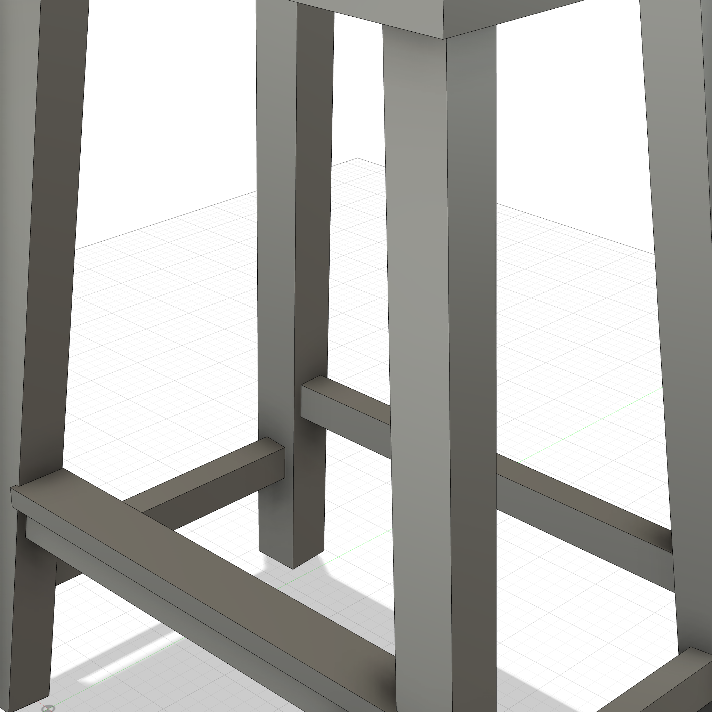
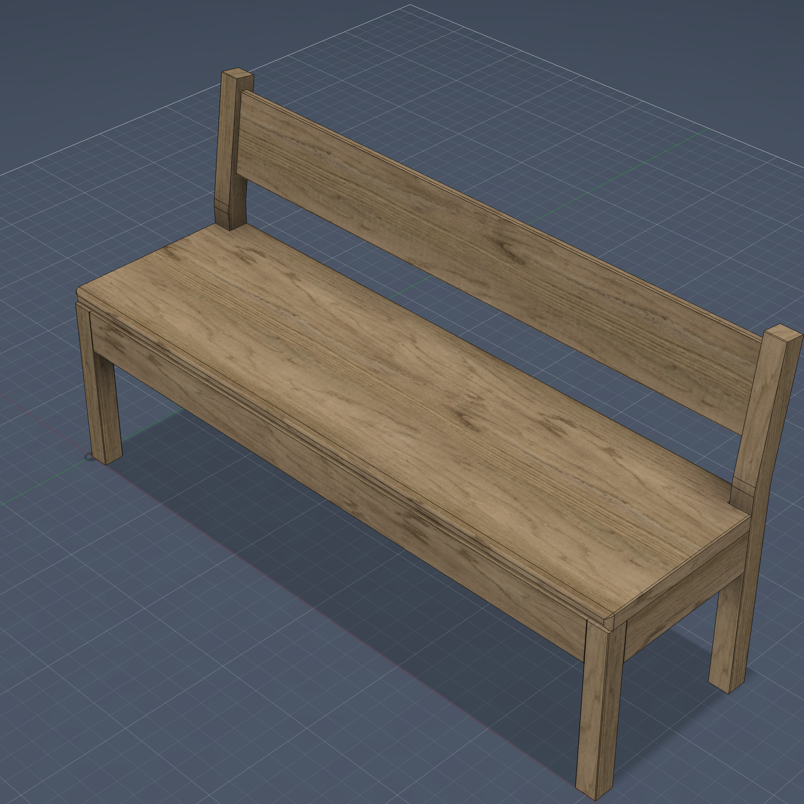
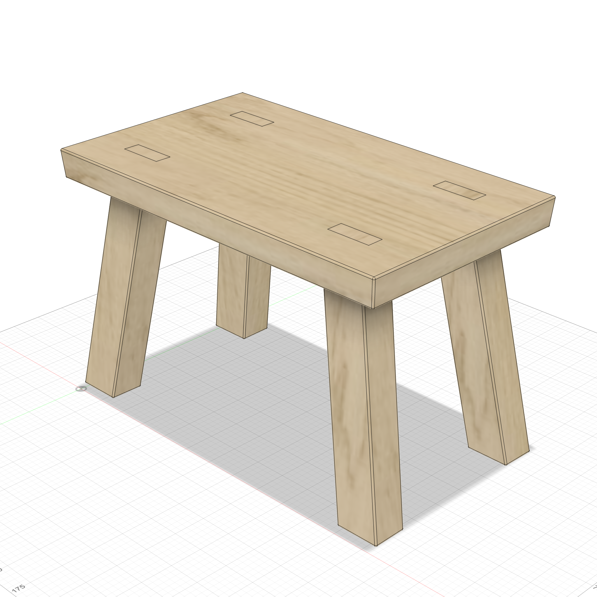
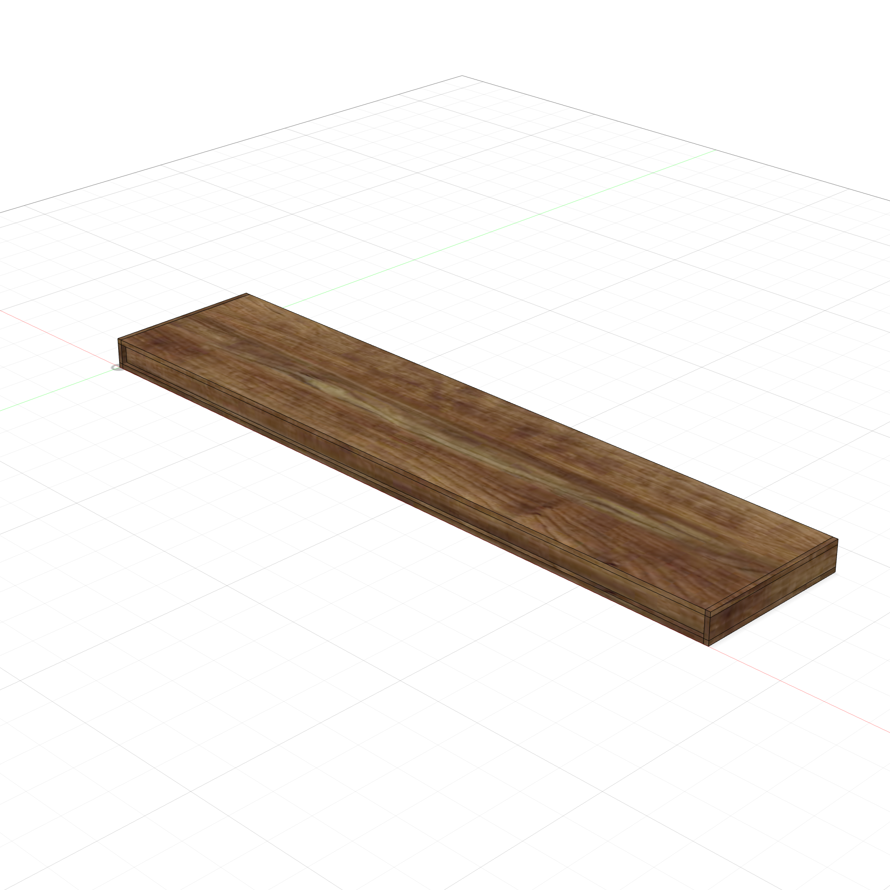

# ShopPrentice

Parametric furniture modeling for Fusion 360, driven by AI agents via MCP.

Describe a piece of furniture in natural language — or show the AI a photo — and ShopPrentice generates a fully parametric Fusion 360 Python script with proper feature timelines, mirror/pattern replication, and joinery. Connect to a running Fusion 360 instance via the built-in MCP server for live execution, validation, and iterative refinement.

## Model Support

ShopPrentice is developed and tested with **Claude Code** powered by **Claude Opus and Sonnet** models from Anthropic. The woodworking skill, joinery templates, and MCP tools are tuned for Claude's capabilities — particularly long-context reasoning, parametric code generation, and iterative debugging.

**Results may vary with other LLM models.** The skill relies on:
- Following multi-step build workflows (body → tenon → pins → mirror → JOIN/CUT)
- Generating syntactically correct Fusion 360 Python API calls
- Maintaining parametric relationships across 50+ parameters
- Interpreting user intent from UI edits and natural language

Other models may work for simple builds but are not tested for complex joinery or the interactive editing workflow.

## How It Works

```
You: "Build a bar-height side table, 36" tall, 4 splayed legs, shelf stretchers with angled tenons"

ShopPrentice agent:
  1. Plans the build (components, features, joinery)
  2. Writes a parametric Fusion 360 Python script
  3. Executes it in Fusion 360 via MCP
  4. Validates with capture_design (body count, volumes, positions)
  5. Fixes any issues and re-executes
  6. Takes a screenshot and presents the result
```

Every dimension uses parameter expressions — change any value in Modify > Change Parameters and the entire model updates.

## Install

One command — no clone needed:

```bash
curl -sSL https://raw.githubusercontent.com/ShopPrentice/shopprentice/main/install.sh | bash
```

This installs the `/woodworking` skill for Claude Code and optionally sets up the MCP server for live Fusion 360 execution.

### Options

```bash
# Explicit flags
curl ... | bash -s -- --claude-code     # skill only
curl ... | bash -s -- --mcp             # MCP server only
curl ... | bash -s -- --all             # skill + MCP

# No flags = auto-detect + MCP
```

### OpenClaw

If you're using [OpenClaw](https://openclaw.ai), install with:

```bash
curl -sSL https://raw.githubusercontent.com/ShopPrentice/shopprentice/main/install-openclaw.sh | bash
```

This configures the ShopPrentice skill and MCP tools for the OpenClaw platform automatically.

### Local install (from a clone)

```bash
git clone https://github.com/ShopPrentice/shopprentice.git
cd shopprentice
./install.sh            # auto-detect + MCP
./install.sh --all      # everything
```

## Usage

```
/woodworking
Build a 48" x 18" coffee table with tapered legs and a slatted top
```

The agent can also work from images — show it a photo or sketch of a piece and it will extract dimensions, proportions, and joint types to generate the parametric model.

## Examples

Each folder under `examples/` contains a complete Fusion 360 project with screenshots, a README, and the parametric Python script:

<table>
<tr>
<td align="center"><a href="examples/roubo_workbench/"><br /><b>Roubo Workbench</b></a><br />Leg vise, drawbore tenons, sliding deadman, dog holes</td>
<td align="center"><a href="examples/tv-console/"><br /><b>TV Console</b></a><br />Interlocking M&T, dovetails, dominos</td>
<td align="center"><a href="examples/dresser/"><br /><b>Dresser</b></a><br />3-drawer, through dovetail case</td>
</tr>
<tr>
<td align="center"><a href="examples/bed-frame/"><br /><b>Queen Bed</b></a><br />Bed rail fasteners, framed headboard, center beam</td>
<td align="center"><a href="examples/bed-frame/"><br /><b>Twin Bed (Live Edge)</b></a><br />Slab headboard, bowtie inlays, Nakashima style</td>
<td align="center"><a href="examples/crib/"><br /><b>Crib</b></a><br />CPSC spindles, dominos, mattress support</td>
</tr>
<tr>
<td align="center"><a href="examples/windsor-chair/"><br /><b>Windsor Chair</b></a><br />Splayed legs, turned stretchers, scooped seat</td>
<td align="center"><a href="examples/chair/"><br /><b>Dining Chair</b></a><br />Bent-back legs, vertical slats, tilted dominos</td>
<td align="center"><a href="examples/rachels-table/"><br /><b>Rachel's Table</b></a><br />Bridle joints, arched rails, tapered legs</td>
</tr>
<tr>
<td align="center"><a href="examples/bookshelf/"><br /><b>Bookshelf</b></a><br />Through M&T shelves, dovetail top</td>
<td align="center"><a href="examples/counter-stool/"><br /><b>Counter Stool</b></a><br />Splayed legs, dominos, stretchers</td>
<td align="center"><a href="examples/pergola-rebuild/"><br /><b>Pergola + Deck</b></a><br />43 bodies, scarf joints (rebuilt)</td>
</tr>
<tr>
<td align="center"><a href="examples/pencil-box/"><br /><b>Pencil Box</b></a><br />Dovetailed box with sliding lid</td>
<td align="center"><a href="examples/wrap-box/"><br /><b>Wrap Box</b></a><br />Dovetailed dispenser with cutter slot</td>
<td align="center"><a href="examples/wood-planter/"><br /><b>Wood Planter</b></a><br />Frame construction, T&G slat infill</td>
</tr>
<tr>
<td align="center"><a href="examples/hall_bench/"><br /><b>Hall Bench</b></a><br />Raked back, profiled posts, slab seat</td>
<td align="center"><a href="examples/bench/"><br /><b>Bench</b></a><br />Simple construction, domino joinery</td>
<td align="center"><a href="examples/stool-rebuild/"><br /><b>Step Stool</b></a><br />Splayed legs, through tenons (rebuilt)</td>
</tr>
<tr>
<td align="center"><a href="examples/desk/"><br /><b>Desk</b></a><br />Writing desk with aprons</td>
<td align="center"><a href="examples/side-table/"><br /><b>Side Table</b></a><br />Walnut with spalted maple drawer front</td>
<td align="center"><a href="examples/shelf/"><br /><b>Wall Shelf</b></a><br />Floating shelf, hidden hardware</td>
</tr>
</table>

### Rebuilt from existing designs

The **Step Stool** and **Pergola** examples were not generated from a text prompt — they were **reverse-engineered from existing Fusion 360 designs** using the capture-and-rebuild pipeline. The pergola (43 bodies, 97 timeline features) was reconstructed using search-based feature matching with per-body volume validation at 0.000% tolerance.

### Adding a new example

1. Create a folder under `examples/` (e.g. `examples/cabinet/`)
2. Add a `README.md` with screenshots and build spec
3. Add the `.py` Fusion 360 script
4. Commit

## Capabilities

### Parametric Modeling

Every script produces a full Fusion 360 parametric timeline — not static geometry. Sketches use parameter expressions for all dimensions, so changing any value in Change Parameters updates the entire model automatically.

- **Feature-based**: Sketch > Constrain > Extrude (never TemporaryBRepManager)
- **Build one, replicate the rest**: Mirror and Rectangular Pattern features for symmetric parts
- **Component structure**: logical grouping (Legs, Rails, Shelves, Top) with cross-component CUT operations via assembly proxies

### Parameter Editor

The ShopPrentice add-in includes a dockable parameter editor palette for iterating on designs without leaving Fusion:

- **Parameters tab** — all user parameters grouped by component, editable inline. Changes update the Fusion model immediately.
- **Rebuild button** — re-executes the tracked script with your current parameter values (~14s). Writes changes back to the `.py` file on disk so the script stays in sync.
- **History tab** — tracks what changed in each rebuild with timestamps and a Restore button to revert to any previous state.
- **Sync tab** — captures structural UI changes (added/removed features) and sends them to Claude Code for script integration.

The palette appears automatically when the add-in starts. Edit parameters, click Rebuild, and iterate — no need to go back to Claude for simple parameter tweaks.

### Joinery

12 joint types with parametric modeling guides and reusable Python templates for complex joints. The AI checks for a template first, then reads the reference file for orientation rules and sizing constraints.

**Templates** (`woodworking/templates/`) encapsulate complex joinery into single function calls — handling sketch geometry, CUT/JOIN operations, mirror/pattern replication, and parameter setup:

| Template | Best For |
|----------|----------|
| `mortise_tenon` | Rail-to-leg, shelf-to-side |
| `domino` | M&T replacement, edge jointing, case T-joints |
| `finger_joint` | Boxes, drawers, decorative corners |
| `dovetail` | Box corners, drawer fronts |
| `half_blind_dovetail` | Drawer fronts (hides end grain) |
| `splayed_legs` | Compound-splayed legs with floor trim |
| `dowel` | Spindle-to-rail, panel alignment, edge joining |
| `bowtie` | Live edge slab inlays (Nakashima style) |
| `drawbore` | Drawbore M&T with offset pins for stretchers, workbenches |
| `tabletop_bracket` | L-bracket with slotted holes for cross-grain top attachment |
| `bed_rail_fastener` | STEP hardware for rail-to-post connections |
| `dovetailed_drawer` | Complete drawer box |

**Reference files** (`woodworking/joinery/`) provide orientation rules, sizing constraints, and variant selection for all joint types:

| Joint | Reference | Template | Best For |
|-------|-----------|----------|----------|
| Mortise & Tenon | Inline in skill | `mortise_tenon` | Shelves, rails, stretchers |
| Tongue & Groove | Inline in skill | — | Slats, panel infill |
| Dado & Rabbet | [joinery/dado-rabbet.md](joinery/dado-rabbet.md) | — (inline) | Shelves, case backs |
| Lap Joint | [joinery/lap-joint.md](joinery/lap-joint.md) | — | Frames, cross braces |
| Box Joint | [joinery/box-joint.md](joinery/box-joint.md) | `finger_joint` | Boxes, drawers |
| Bridle Joint | [joinery/bridle-joint.md](joinery/bridle-joint.md) | — | Frame corners |
| Dowel Joint | [joinery/dowel-joint.md](joinery/dowel-joint.md) | `dowel` | Spindle connections, panel glue-ups |
| Spline Joint | [joinery/spline-joint.md](joinery/spline-joint.md) | — | Reinforced miters |
| Miter Joint | [joinery/miter-joint.md](joinery/miter-joint.md) | — | Picture frames, trim |
| Dovetail | [joinery/dovetail.md](joinery/dovetail.md) | `dovetail` | Drawer fronts, premium boxes |
| Pocket Hole | [joinery/pocket-hole.md](joinery/pocket-hole.md) | — | Face frames, quick assembly |
| Domino Joint | [joinery/domino-joint.md](joinery/domino-joint.md) | `domino` | Hidden structural connections |
| Drawbore M&T | [joinery/drawbore.md](joinery/drawbore.md) | `drawbore` | Stretchers, workbenches, timber frames |

All joinery uses the **combine-based** approach: build the tenon/tail as a body, CUT the receiving board (`keepTool=True`), then JOIN to the owner. One shape, perfect fit.

See [joinery/README.md](joinery/README.md) for the full selection guide, template usage, and conventions.

### Wood Appearance & Custom Species

Every model gets realistic wood grain automatically — `sp.apply_appearance("white oak")` applies photo-based textures with grain direction aligned to each body's longest axis and separate end grain on cross-cut faces.

**20+ built-in species** from Fusion 360's material library: cherry, walnut, oak, white oak, red oak, maple, ash, birch, pine, cedar, mahogany, beech, poplar, hickory, ebony, rosewood, sapele, bamboo, douglas fir.

**5 custom high-res species** with photo-based textures: teak, brazilian rosewood, cocobolo, ziricote, spalted maple. These use large source photos (1300-1700px wide) cropped from real wood veneer product shots with calibrated physical scales. No Fusion installation needed — textures are swapped at runtime via bitmap path injection.

Multi-species designs are supported — ask for "walnut case with ziricote drawer fronts" and each body gets the right appearance.

See [woodgrain/README.md](woodgrain/README.md) for texture specs and [woodworking/appearance.md](woodworking/appearance.md) for grain direction rules.

### Angled Construction

Splayed legs, compound angles, and connecting parts at non-orthogonal positions. The skill covers:

- **Trapezoid sketch + Move** for compound splay (primary in sketch, secondary via rotation)
- **Splay-adjusted positions** for stretchers and rails at any height
- **Angled tenon technique** (CUT leg from stretcher > sweep tenon from angled face)
- **Stretcher splay matching** (tilt stretcher to follow leg angle)

See [woodworking/angled-construction.md](woodworking/angled-construction.md) for the complete reference.

### Reverse Engineering (Search Build)

Reconstruct a parametric script from an existing Fusion 360 design:

1. **Capture** the design state (`capture_design`)
2. **Collect ground truth** volumes at each timeline step (`get_timeline_state`)
3. **Search build** — reconstruct feature-by-feature with breadth-first search over ambiguous options (sketch projection methods, extrude directions, profile selections), validating each step against ground truth

The pergola example (43 bodies, 97 features) was rebuilt this way at 0.000% volume tolerance. See [examples/pergola-rebuild/](examples/pergola-rebuild/) and `tools/search_build.py`.

## MCP Integration (ShopPrentice Add-in)

Connect your AI assistant to a running Fusion 360 instance via the ShopPrentice add-in — a built-in MCP-compatible JSON-RPC server on `localhost:9100`.

```bash
# Include --mcp during install
curl -sSL https://raw.githubusercontent.com/ShopPrentice/shopprentice/main/install.sh | bash -s -- --mcp

# Or add MCP to an existing install
cd ~/.shopprentice/repo && ./install.sh --mcp
```

The installer symlinks the `addin/` directory into Fusion 360's AddIns folder and configures MCP for Claude Code.

After install, enable it in Fusion 360: **Tools > Add-Ins > ShopPrentice > Run**

### Available Tools

| Tool | Purpose |
|------|---------|
| `capture_design` | Full design introspection: parameters, component tree with body geometry and sketch dimensions, timeline features |
| `get_timeline_state` | Roll timeline to any index, capture body geometry, restore position |
| `execute_script` | Run a Python script in Fusion 360 with transaction wrapping. `sandbox=true` for throwaway validation, `clean=true` for rebuild |
| `get_screenshot` | Capture the viewport with optional camera orientation |
| `get_selection` | Read the user's current selection — structured info for bodies, faces, edges, features |
| `set_selection` | Highlight entities in the UI by name or token |
| `modify_parameters` | Change parameter expressions with incremental recompute |
| `check_interference` | Detect body collisions for joinery validation |
| `suppress_features` | Toggle timeline features on/off for diagnostics |
| `get_changes` | Snapshot & diff — detect parameter, dimension, body, and feature count changes |
| `manage_documents` | List, create, close, or switch between open documents |
| `export_script` | Export the current script |
| `reload_addin` | Hot-reload all add-in modules without restarting Fusion |

### Verify

```bash
curl http://localhost:9100/health          # {"status": "healthy", "server": "ShopPrentice"}
curl http://localhost:9100/tools           # lists all 16 tools
```

## Project Structure

```
shopprentice/
  helpers/             Standalone script library (sp.py — sketch, extrude, combine utilities)
  addin/               Fusion 360 add-in (MCP server + tools)
    server/            MCP server and action log
    tools/             MCP tool implementations
      _script_generator/  Search-based script generation engine
  commands/            Claude Code skill definitions
  woodworking/         Skill topic files (joinery, angled construction, details)
    templates/         Reusable joinery templates (drawbore, mortise_tenon, domino, etc.)
    joinery/           13 joint type reference guides
  woodgrain/           Custom wood textures: source images, scales, documentation
  examples/            Complete furniture projects with scripts + screenshots
  tools/               Utility scripts (search_build, generate, simulate)
  tests/               Round-trip test suite (22 fixtures, 38+ tests)
  mcp/                 MCP setup and configuration
```

## Updating

```bash
cd ~/.shopprentice/repo && git pull && ./install.sh
```

This pulls the latest skill and joinery references.

## Uninstall

```bash
~/.shopprentice/repo/uninstall.sh
```

Removes all shopprentice-installed files: `~/.shopprentice/`, the Claude Code skill, and MCP configurations.

## Roadmap

Planned features and improvements — contributions welcome:

### Modeling
- **Live edge slabs** — generate organic live edge profiles from reference photos, with bark contours and natural curvature
- **Curved and organic forms** — bent laminations, Windsor chair spindles, cabriole legs, steam-bent backs
- **Panel construction** — frame-and-panel doors, raised panels, floating panels with proper cross-grain allowance
- **Drawer systems** — undermount slides, side-mount hardware, graduated drawer sizing
- **Turned parts** — lathe-turned legs, spindles, finials via revolution features

### Joinery
- **Castle joint** — CNC-cut interlocking joint for knockdown furniture
- **Scarf joint** — long-grain splicing for extending lumber
- **Sliding dovetail** — shelves and dividers in casework
- **Wedged tenon** — through-tenon with wedge slot for mechanical tightening
- **Butterfly/bowtie keys** — decorative crack repair and live edge stabilization (template exists, needs refinement)
- **Japanese joinery** — spliced and interlocking joints (kawai tsugite, etc.)

### Materials & Appearance
- **More custom wood species** — 5 custom high-res species added (teak, brazilian rosewood, cocobolo, ziricote, spalted maple). Need: purpleheart, wenge, padauk, bubinga, and larger end grain textures.
- **Grain direction visualization** — show grain direction arrows on bodies for proper orientation planning
- **Finish simulation** — oil, lacquer, paint effects on appearance
- **Metal hardware** — hinges, slides, knobs, pulls with parametric STEP models

### Output & Integration
- **Cut list generation** — BOM with board feet, rough dimensions, and waste calculation
- **CNC toolpath hints** — export sketches/faces tagged for CNC operations
- **Shop drawing export** — dimensioned 2D drawings for hand-tool builders
- **FreeCAD support** — port the parametric modeling approach beyond Fusion 360
- **Shapr3D / Onshape** — alternative CAD platform support

### AI & Workflow
- **Image-to-model improvements** — better dimension extraction, style recognition, proportional reasoning from photos
- **Interactive editing mode** — seamless detect-interpret-implement loop when user edits in Fusion UI (partially implemented, see `woodworking/incremental-updates.md`)
- **Multi-agent collaboration** — separate agents for design, joinery selection, and validation
- **Design critique** — structural analysis, wood movement warnings, grain orientation checks

## Current Limitations

- **Fusion 360 only** — requires Autodesk Fusion 360 with the ShopPrentice add-in running. No support for other CAD platforms yet.
- **Rectilinear geometry** — best at straight-line furniture (tables, shelves, benches, cabinets). Some curved forms are supported (Windsor chairs with turned legs/stretchers, swept crest rails) but cabriole legs and bent laminations are not yet supported.
- **Growing wood species catalog** — 20+ built-in species from Fusion's library plus 5 custom high-res exotic species (teak, brazilian rosewood, cocobolo, ziricote, spalted maple). More custom species can be added by dropping photos in `textures/wood/`.
- **Growing hardware catalog** — bed rail fasteners, hinges, and chest locks are supported. Drawer slides, knobs, and pulls are in progress.
- **No CNC/cut list output** — generates parametric models but not toolpaths, cut lists, or shop drawings.
- **Sketch on non-XY planes requires probing** — axis mapping must be detected with `sp.probe_orientations()` for correct dimension assignment. This is automated for helper functions but manual for custom sketches.
- **Appearance resets on rebuild** — each `clean=true` execution creates a fresh document. Appearance must be reapplied (now embedded in scripts via `sp.apply_appearance()`).
- **Single document workflow** — designs are built in a single Fusion document. Multi-document assemblies (e.g., separate files per component) are not supported.

## License

MIT — see [LICENSE](LICENSE).
