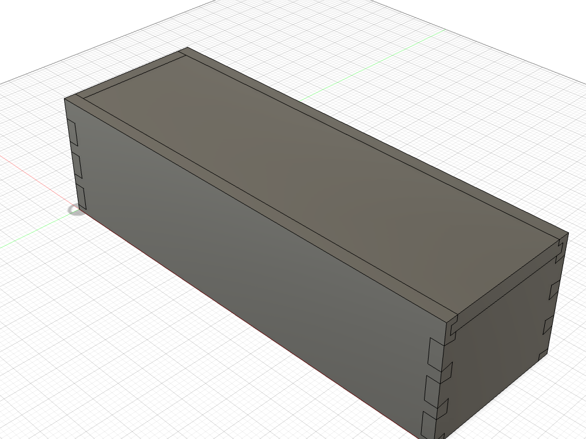
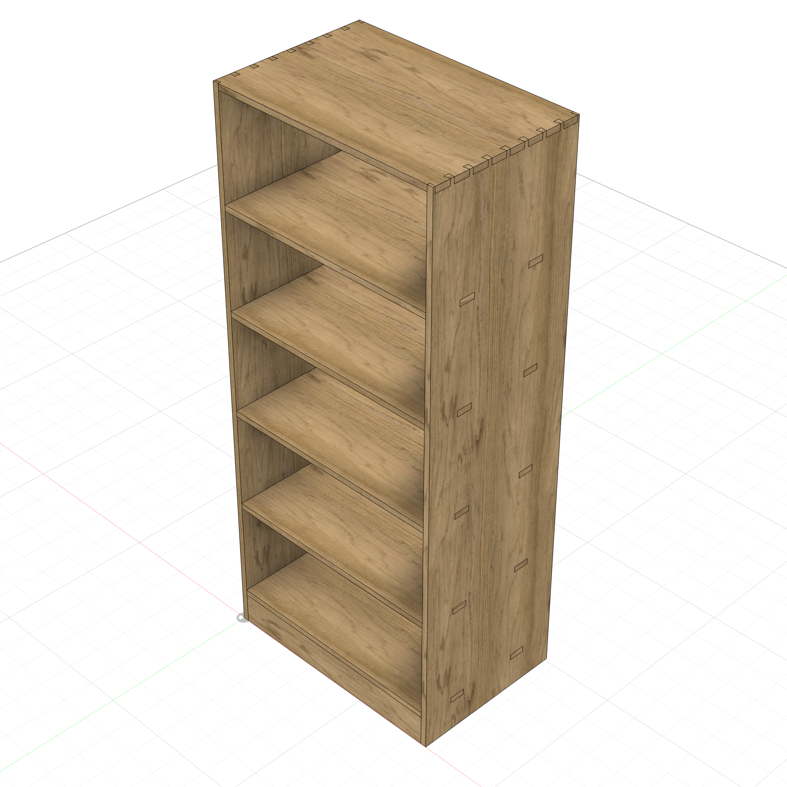
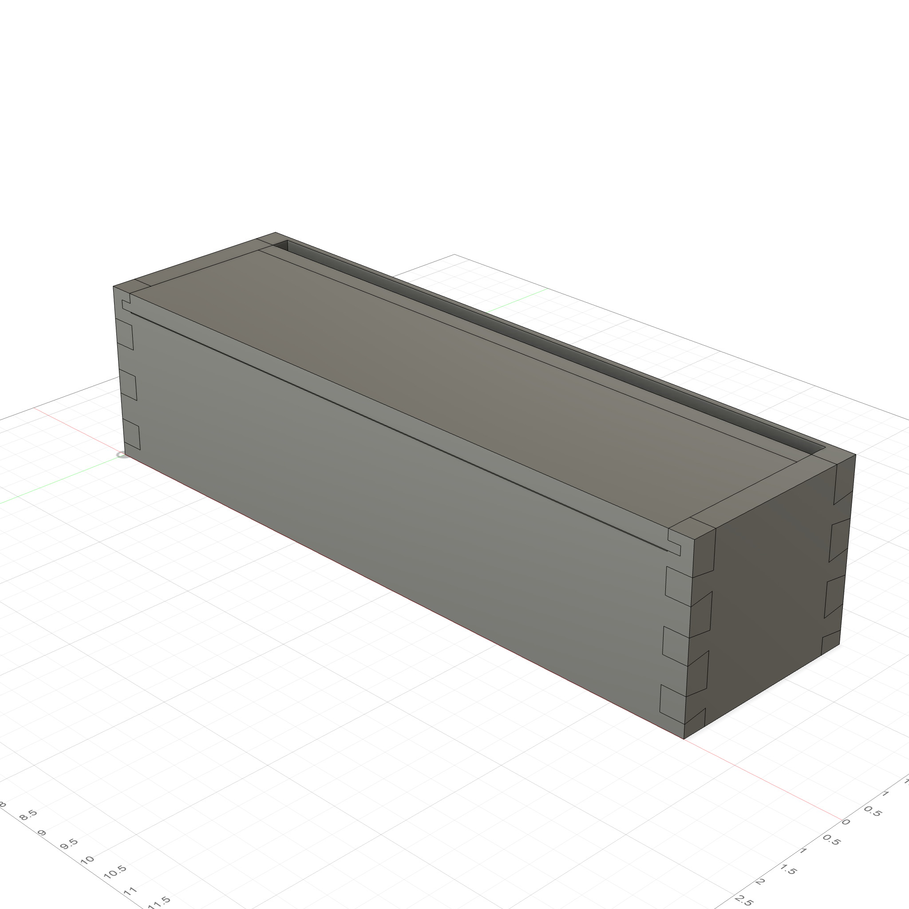
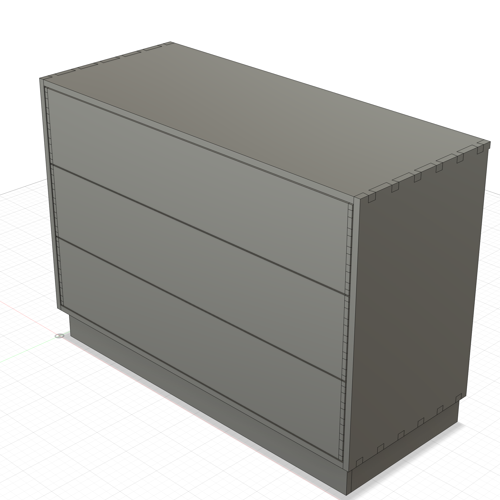
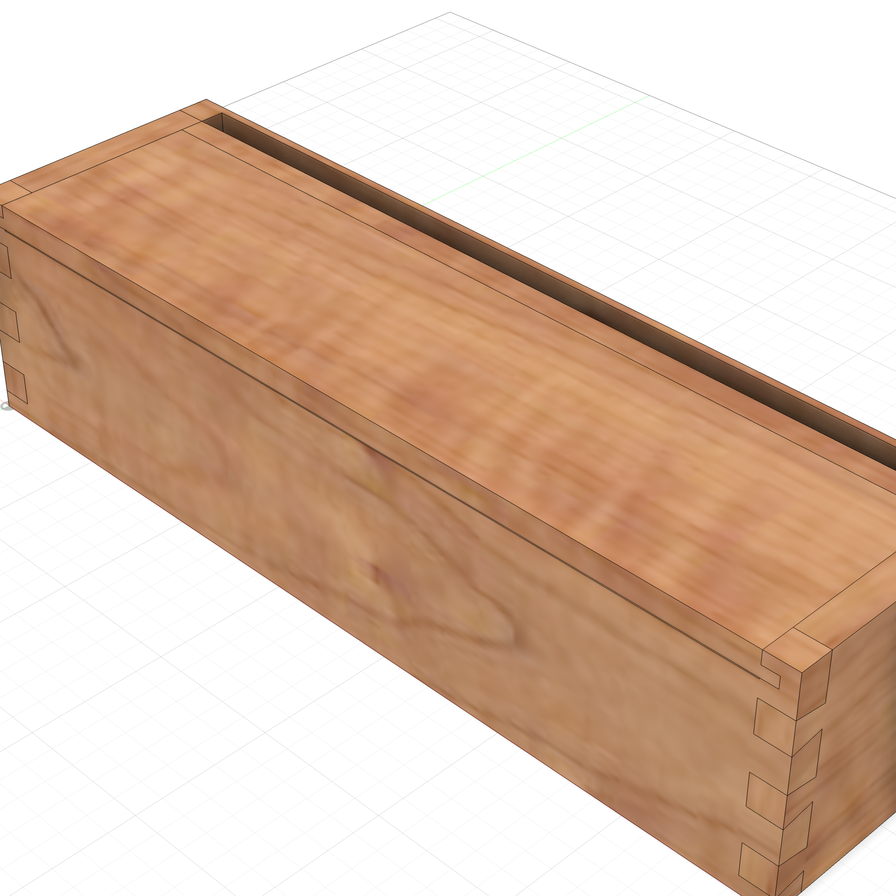
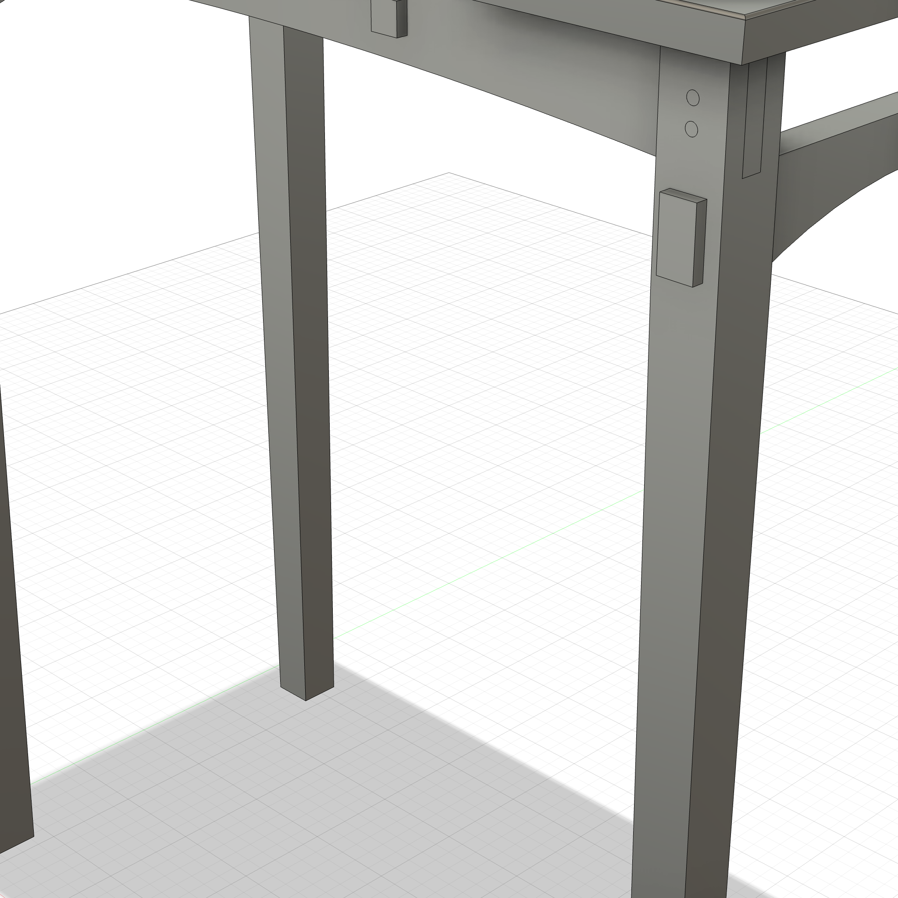
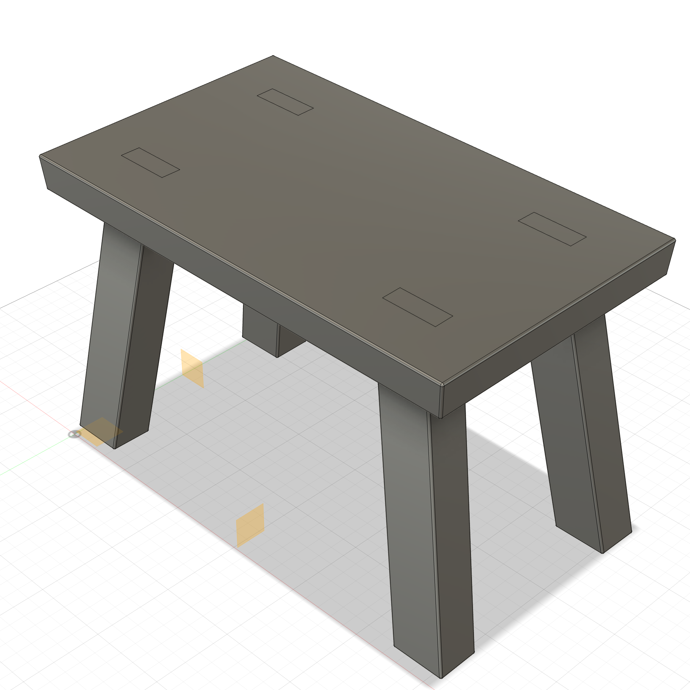
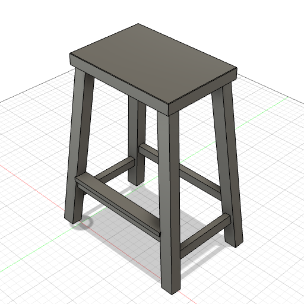
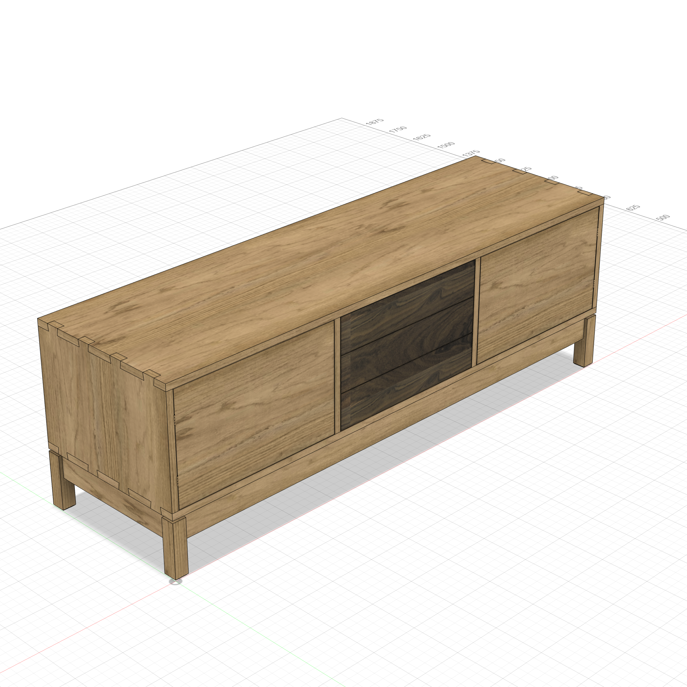

# AutoFusion

Parametric furniture modeling for Fusion 360, driven by AI agents via MCP.

Describe a piece of furniture in natural language — or show the AI a photo — and AutoFusion generates a fully parametric Fusion 360 Python script with proper feature timelines, mirror/pattern replication, and joinery. Connect to a running Fusion 360 instance via the built-in MCP server for live execution, validation, and iterative refinement.

## How It Works

```
You: "Build a bar-height side table, 36" tall, 4 splayed legs, shelf stretchers with angled tenons"

AutoFusion agent:
  1. Plans the build (components, features, joinery)
  2. Writes a parametric Fusion 360 Python script
  3. Executes it in Fusion 360 via MCP
  4. Validates with capture_design (body count, volumes, positions)
  5. Fixes any issues and re-executes
  6. Takes a screenshot and presents the result
```

Every dimension uses parameter expressions — change any value in Modify > Change Parameters and the entire model updates.

## Install

One command — no clone needed:

```bash
curl -sSL https://raw.githubusercontent.com/YLZha/autofusion/main/install.sh | bash
```

This installs the `/woodworking` skill for Claude Code and optionally sets up the MCP server for live Fusion 360 execution.

### Options

```bash
# Explicit flags
curl ... | bash -s -- --claude-code     # skill only
curl ... | bash -s -- --mcp             # MCP server only
curl ... | bash -s -- --all             # skill + MCP

# No flags = auto-detect + MCP
```

### Local install (from a clone)

```bash
git clone https://github.com/YLZha/autofusion.git
cd autofusion
./install.sh            # auto-detect + MCP
./install.sh --all      # everything
```

## Usage

```
/woodworking
Build a 48" x 18" coffee table with tapered legs and a slatted top
```

The agent can also work from images — show it a photo or sketch of a piece and it will extract dimensions, proportions, and joint types to generate the parametric model.

## Examples

Each folder under `examples/` contains a complete Fusion 360 project with screenshots, a README, and the parametric Python script:

<table>
<tr>
<td align="center"><a href="examples/pencil-box/"><br /><b>Pencil Box</b></a><br />Dovetailed box with sliding lid</td>
<td align="center"><a href="examples/bookshelf/"><br /><b>Bookshelf</b></a><br />Through M&T shelves, dovetail top</td>
<td align="center"><a href="examples/wood-planter/"><br /><b>Wood Planter</b></a><br />Frame construction, T&G slat infill</td>
</tr>
<tr>
<td align="center"><a href="examples/dresser/"><br /><b>Dresser</b></a><br />3-drawer, through dovetail case</td>
<td align="center"><a href="examples/wrap-box/"><br /><b>Wrap Box</b></a><br />Dovetailed dispenser with cutter slot</td>
<td align="center"><a href="examples/rachels-table/"><br /><b>Rachel's Table</b></a><br />Bridle joints, arched rails, tapered legs</td>
</tr>
<tr>
<td align="center"><a href="examples/stool-rebuild/"><br /><b>Step Stool</b></a><br />Splayed legs, through tenons (rebuilt)</td>
<td align="center"><a href="examples/pergola-rebuild/"><br /><b>Pergola + Deck</b></a><br />43 bodies, scarf joints (rebuilt)</td>
<td align="center"><a href="examples/counter-stool/"><br /><b>Counter Stool</b></a><br />Splayed legs, dominos, stretchers</td>
</tr>
<tr>
<td align="center"><a href="examples/tv-console/"><br /><b>TV Console</b></a><br />Interlocking M&T, dovetails, dominos</td>
<td></td>
<td></td>
</tr>
</table>

### Rebuilt from existing designs

The **Step Stool** and **Pergola** examples were not generated from a text prompt — they were **reverse-engineered from existing Fusion 360 designs** using the capture-and-rebuild pipeline. The pergola (43 bodies, 97 timeline features) was reconstructed using search-based feature matching with per-body volume validation at 0.000% tolerance.

### Adding a new example

1. Create a folder under `examples/` (e.g. `examples/cabinet/`)
2. Add a `README.md` with screenshots and build spec
3. Add the `.py` Fusion 360 script
4. Commit

## Capabilities

### Parametric Modeling

Every script produces a full Fusion 360 parametric timeline — not static geometry. Sketches use parameter expressions for all dimensions, so changing any value in Change Parameters updates the entire model automatically.

- **Feature-based**: Sketch > Constrain > Extrude (never TemporaryBRepManager)
- **Build one, replicate the rest**: Mirror and Rectangular Pattern features for symmetric parts
- **Component structure**: logical grouping (Legs, Rails, Shelves, Top) with cross-component CUT operations via assembly proxies

### Joinery

12 joint types with parametric modeling guides and reusable Python templates for complex joints. The AI checks for a template first, then reads the reference file for orientation rules and sizing constraints.

**Templates** (`addin/helpers/templates/`) encapsulate complex joinery into single function calls — handling sketch geometry, CUT/JOIN operations, mirror/pattern replication, and parameter setup:

| Template | Best For |
|----------|----------|
| `mortise_tenon` | Rail-to-leg, shelf-to-side |
| `domino` | M&T replacement, edge jointing, case T-joints |
| `finger_joint` | Boxes, drawers, decorative corners |
| `dovetail` | Box corners, drawer fronts |
| `half_blind_dovetail` | Drawer fronts (hides end grain) |
| `splayed_legs` | Compound-splayed legs with floor trim |
| `dovetailed_drawer` | Complete drawer box |

**Reference files** (`joinery/`) provide orientation rules, sizing constraints, and variant selection for all joint types:

| Joint | Reference | Template | Best For |
|-------|-----------|----------|----------|
| Mortise & Tenon | Inline in skill | `mortise_tenon` | Shelves, rails, stretchers |
| Tongue & Groove | Inline in skill | — | Slats, panel infill |
| Dado & Rabbet | [joinery/dado-rabbet.md](joinery/dado-rabbet.md) | — (inline) | Shelves, case backs |
| Lap Joint | [joinery/lap-joint.md](joinery/lap-joint.md) | — | Frames, cross braces |
| Box Joint | [joinery/box-joint.md](joinery/box-joint.md) | `finger_joint` | Boxes, drawers |
| Bridle Joint | [joinery/bridle-joint.md](joinery/bridle-joint.md) | — | Frame corners |
| Dowel Joint | [joinery/dowel-joint.md](joinery/dowel-joint.md) | — | Panel glue-ups |
| Spline Joint | [joinery/spline-joint.md](joinery/spline-joint.md) | — | Reinforced miters |
| Miter Joint | [joinery/miter-joint.md](joinery/miter-joint.md) | — | Picture frames, trim |
| Dovetail | [joinery/dovetail.md](joinery/dovetail.md) | `dovetail` | Drawer fronts, premium boxes |
| Pocket Hole | [joinery/pocket-hole.md](joinery/pocket-hole.md) | — | Face frames, quick assembly |
| Domino Joint | [joinery/domino-joint.md](joinery/domino-joint.md) | `domino` | Hidden structural connections |

All joinery uses the **combine-based** approach: build the tenon/tail as a body, CUT the receiving board (`keepTool=True`), then JOIN to the owner. One shape, perfect fit.

See [joinery/README.md](joinery/README.md) for the full selection guide, template usage, and conventions.

### Angled Construction

Splayed legs, compound angles, and connecting parts at non-orthogonal positions. The skill covers:

- **Trapezoid sketch + Move** for compound splay (primary in sketch, secondary via rotation)
- **Splay-adjusted positions** for stretchers and rails at any height
- **Angled tenon technique** (CUT leg from stretcher > sweep tenon from angled face)
- **Stretcher splay matching** (tilt stretcher to follow leg angle)

See [woodworking/angled-construction.md](woodworking/angled-construction.md) for the complete reference.

### Reverse Engineering (Search Build)

Reconstruct a parametric script from an existing Fusion 360 design:

1. **Capture** the design state (`capture_design`)
2. **Collect ground truth** volumes at each timeline step (`get_timeline_state`)
3. **Search build** — reconstruct feature-by-feature with breadth-first search over ambiguous options (sketch projection methods, extrude directions, profile selections), validating each step against ground truth

The pergola example (43 bodies, 97 features) was rebuilt this way at 0.000% volume tolerance. See [examples/pergola-rebuild/](examples/pergola-rebuild/) and `tools/search_build.py`.

## MCP Integration (AutoFusion Add-in)

Connect your AI assistant to a running Fusion 360 instance via the AutoFusion add-in — a built-in MCP-compatible JSON-RPC server on `localhost:9100`.

```bash
# Include --mcp during install
curl -sSL https://raw.githubusercontent.com/YLZha/autofusion/main/install.sh | bash -s -- --mcp

# Or add MCP to an existing install
cd ~/.autofusion/repo && ./install.sh --mcp
```

The installer symlinks the `addin/` directory into Fusion 360's AddIns folder and configures MCP for Claude Code.

After install, enable it in Fusion 360: **Tools > Add-Ins > AutoFusion > Run**

### Available Tools

| Tool | Purpose |
|------|---------|
| `capture_design` | Full design introspection: parameters, component tree with body geometry and sketch dimensions, timeline features |
| `get_timeline_state` | Roll timeline to any index, capture body geometry, restore position |
| `execute_script` | Run a Python script in Fusion 360 with transaction wrapping. `sandbox=true` for throwaway validation, `clean=true` for rebuild |
| `get_screenshot` | Capture the viewport with optional camera orientation |
| `get_selection` | Read the user's current selection — structured info for bodies, faces, edges, features |
| `set_selection` | Highlight entities in the UI by name or token |
| `modify_parameters` | Change parameter expressions with incremental recompute |
| `check_interference` | Detect body collisions for joinery validation |
| `suppress_features` | Toggle timeline features on/off for diagnostics |
| `get_changes` | Snapshot & diff — detect parameter, dimension, body, and feature count changes |
| `manage_documents` | List, create, close, or switch between open documents |
| `export_script` | Export the current script |
| `reload_addin` | Hot-reload all add-in modules without restarting Fusion |

### Verify

```bash
curl http://localhost:9100/health          # {"status": "healthy", "server": "AutoFusion"}
curl http://localhost:9100/tools           # lists all 16 tools
```

## Project Structure

```
autofusion/
  addin/              Fusion 360 add-in (MCP server + tools)
    helpers/           Runtime helpers (af.py — sketch, extrude, combine utilities)
      templates/       Reusable joinery templates (domino, mortise_tenon, dovetail, etc.)
    server/            MCP server and action log
    tools/             MCP tool implementations
      _script_generator/  Search-based script generation engine
  commands/            Claude Code skill definitions
  woodworking/         Skill topic files (joinery, angled construction, details)
  joinery/             12 joint type reference guides
  examples/            10 complete furniture projects with scripts + screenshots
  tools/               Utility scripts (search_build, generate, simulate)
  tests/               Round-trip test suite (22 fixtures, 38+ tests)
  mcp/                 MCP setup and configuration
```

## Updating

```bash
cd ~/.autofusion/repo && git pull && ./install.sh
```

This pulls the latest skill and joinery references.

## Uninstall

```bash
~/.autofusion/repo/uninstall.sh
```

Removes all autofusion-installed files: `~/.autofusion/`, the Claude Code skill, and MCP configurations.

## License

MIT — see [LICENSE](LICENSE).
