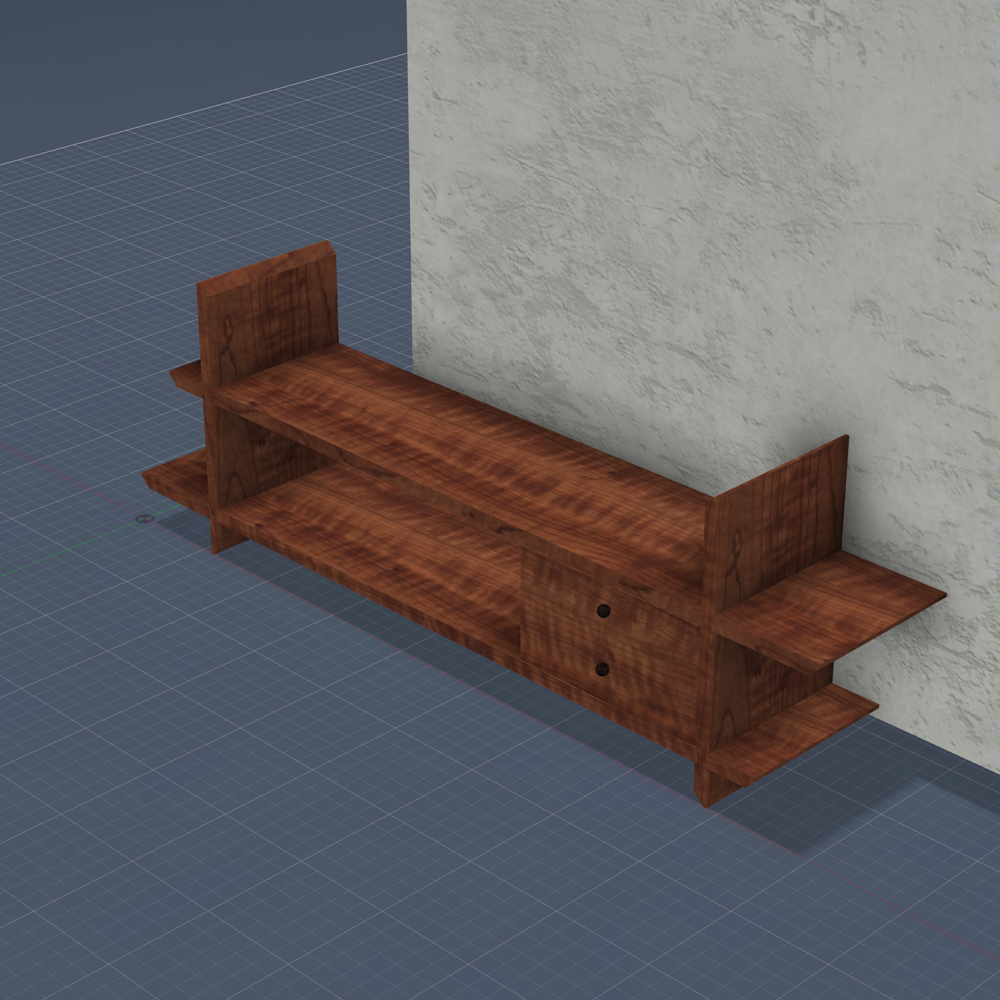
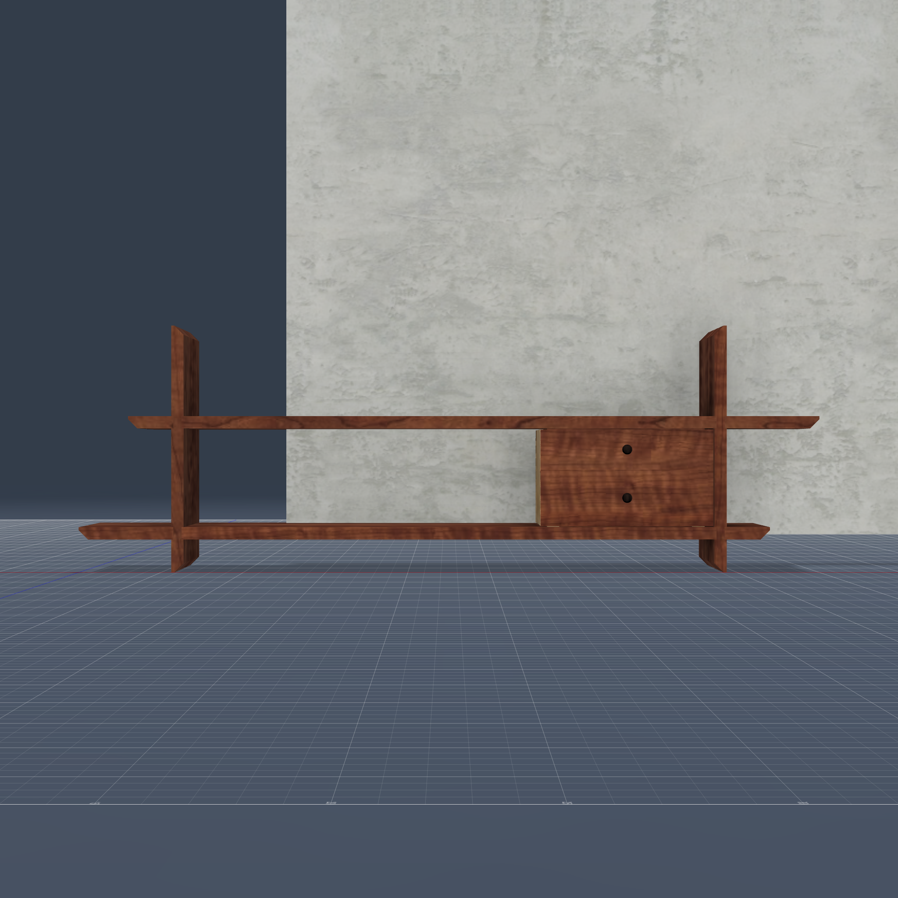
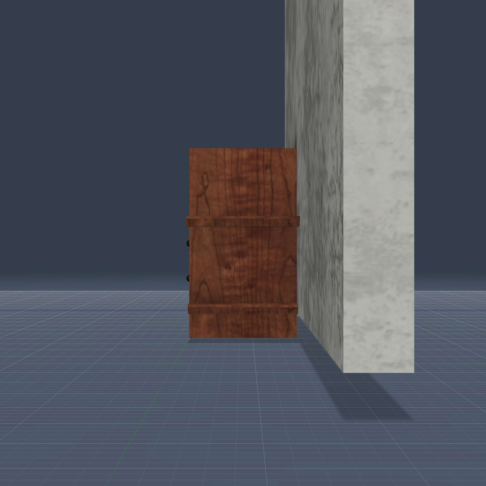
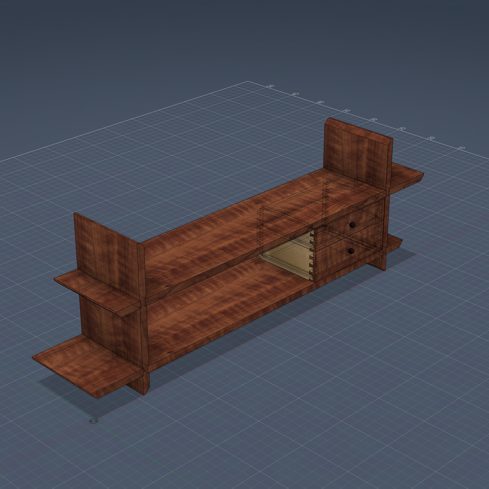
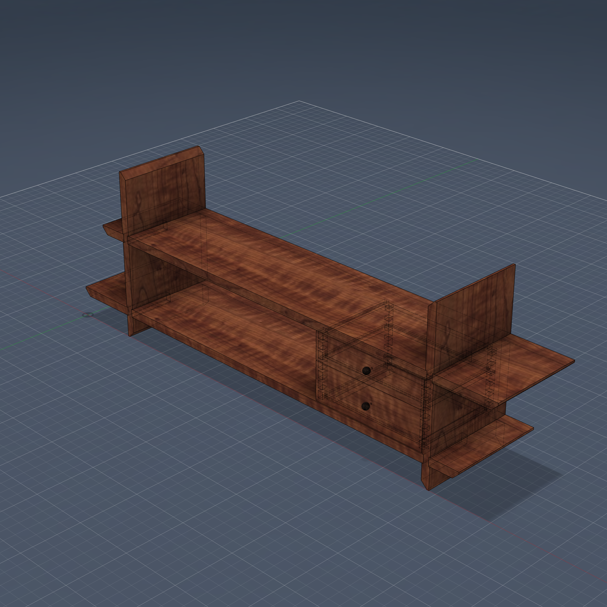

# Wall Shelf — inspired by Becksvoort (FWW #284)

Inspired by Christian Becksvoort's "Modern Wall Shelf" (*Fine Woodworking* #284) — an
interpretation, not an exact reproduction. An asymmetric
Shaker wall shelf, **~45"W × 8.5"D × 15"H**. Two vertical uprights and two long, unaligned
shelves interlock with **dadoed cross-laps**, and two **suspended dovetailed drawers** hang
on hidden cleats below the top shelf. Built in cherry with pine drawer boxes and rosewood
pulls.

  
  

### Transparent Views

  
  

---

**Script:** [`wall_shelf.py`](wall_shelf.py) — 20 furniture bodies (2 uprights, 2 shelves, 2
dovetailed drawers of 5 boards each + 2 runners, 2 cleats, 2 pulls), plus a presentation
**backdrop wall** (`WALL_back`, excluded from validation) so the product photos show the piece
mounted. Uses the `dovetailed_drawer` template; everything else is dimension-driven boxes,
mirrors, and combine cuts.

Coordinate system: X = length, **Y = depth (Y=0 front / viewer side)**, Z = height.

### Techniques

- **Dadoed cross-lap** (egg-crate) at the four upright/shelf crossings — not a plain lap.
  In the front half the upright keeps a central tongue with a 1/8" **dado on both faces**;
  the shelf rides it with a 1/2"-wide slot whose shoulders seat *into* the dadoes for
  support. In the back half the upright is fully notched and the shelf passes through. The
  joint opening faces front. ~98 cm² of contact per crossing.
- **Asymmetric layout** — both shelves are 42" but offset in opposite directions
  (`top_inset` 3" vs `bot_inset` 6"), so the top shelf overhangs right and the bottom
  overhangs left. Falls straight out of the two inset parameters; the uprights are a Mirror
  pair.
- **Two drawer-hanging systems:**
  - *Top drawer* hangs from a tongued cleat glued under the top shelf — the cleat's end
    tongues ride 1/4"×1/4" grooves in the drawer sides. The back is **relieved** (lowered
    below the full-width cleat, rear-top tails trimmed) so the drawer pulls out cleanly.
  - *Bottom drawer* straddles a center cleat beveled on its **downside**; pine runners with
    matching bevels hook under it (a sliding-dovetail guide). A **central notch** in the
    back's bottom clears the cleat as the drawer slides.
- **Dovetailed drawers** via the `dovetailed_drawer` template — half-blind dovetails at the
  cherry front (hidden), through dovetails at the pine back. Bottom panels are trimmed to
  notch cleanly around the tails.
- **Chamfered ends** cut with explicit wedge tools (deterministic 45° angle, sized to 3/4
  of the board): shelf ends raked on the bottom, upright top/bottom ends raked on the
  **inner** edge so they taper toward the centre.
- **Materials** — cherry primary (case + drawer fronts), pine secondary (drawer
  boxes/runners), rosewood pulls (resolves to the closest library appearance).

### Notes

- Validated: single connected cluster of 18 structural bodies (pulls excluded as surface
  hardware), 0 interference, no weak connections.
- No `model.json` — the piece is a co-defined parametric grid (uprights and shelves are both
  placed by the shared layout), so the sketches use layout-based positioning rather than a
  strict single-parent dependency tree. The structural checks are the meaningful ones.
- End chamfers and pulls are baked from build-time geometry (wedge / revolve), so re-run the
  script after large dimension changes rather than relying on live palette edits.
