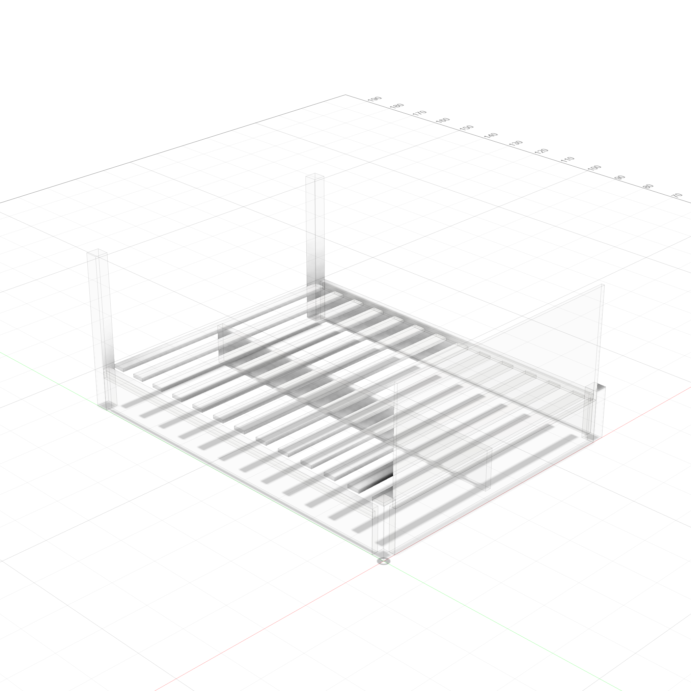
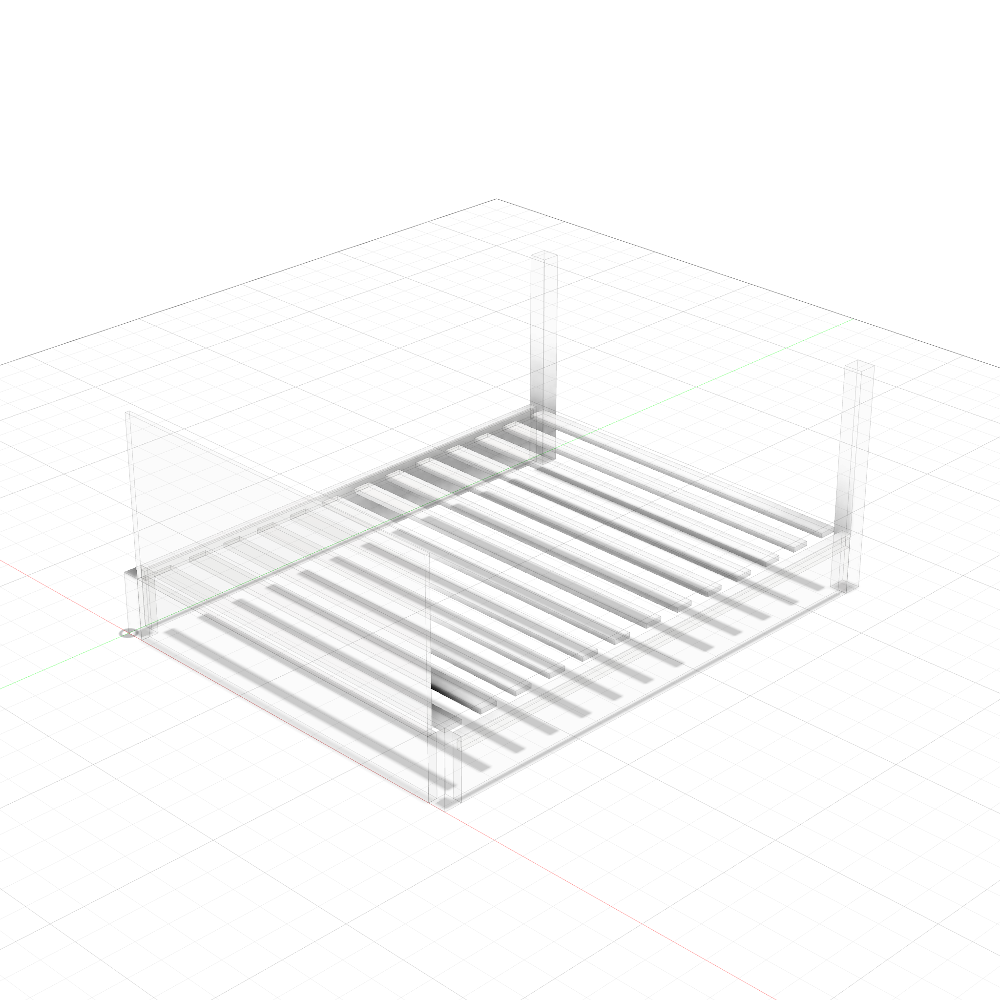
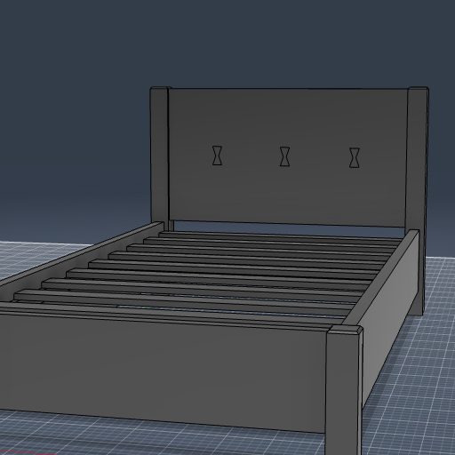

# Platform Bed Frame (Queen)

A parametric modern platform bed — Queen 60"W x 80"L, headboard to 36", slat system with ledger strips.

  
  

### Transparent Views

  
  

---

**Script:** [`bed_frame.py`](bed_frame.py) — 32 bodies (4 posts, 5 rails/ledgers, 7 headboard parts, 13 slats, 3 support). Framed headboard with 5 vertical slats, center beam with 2 legs, all domino-connected. Change `bed_w`/`bed_l` for Twin/King.

Key parameters: `leg_clearance` (4" — under-bed space), `mattress_recess` (1.5" — slat top below rail), `post_chamfer` (0.25" — rails align with chamfer bottom).

---

# Twin Bed — Live Edge Slab Headboard with Bowties

A Nakashima-inspired twin bed with a 2" thick slab headboard and 3 decorative bowtie (butterfly key) inlays spanning a horizontal crack.

---

**Script:** [`twin_live_edge.py`](twin_live_edge.py) — 24 bodies (4 posts, 5 rails/ledgers, 4 headboard/bowties, 10 slats). Uses the `bowtie` template for inlays.

**Style:** [Nakashima / Live Edge](../../woodworking/styles/nakashima.md)

### Key features
- **Live edge slab** — 2" thick, spanning between posts (notched around them), stops below post chamfer
- **3 bowtie inlays** — vertical orientation (perpendicular to horizontal crack/grain), evenly spaced at slab center height. Depth = 1/3 of slab thickness.
- **Bowtie template** — `from helpers.templates import bowtie` → `bowtie.row()` for reusable inlay placement
- **All joints connected** — dominos at every rail/slab-to-post connection, smaller 5mm dominos for thin ledger strips

### Bowtie parameters
| Parameter | Default | Notes |
|-----------|---------|-------|
| `bt_len` | 3 in | Bowtie length (perpendicular to crack) |
| `bt_end_w` | 1.5 in | Width at the wide ends |
| `bt_waist_w` | 0.5 in | Width at the narrow waist |
| `bt_depth` | 0.67 in | Inlay depth (~1/3 of 2" slab) |
| `n_bowties` | 3 | Number along crack line |
