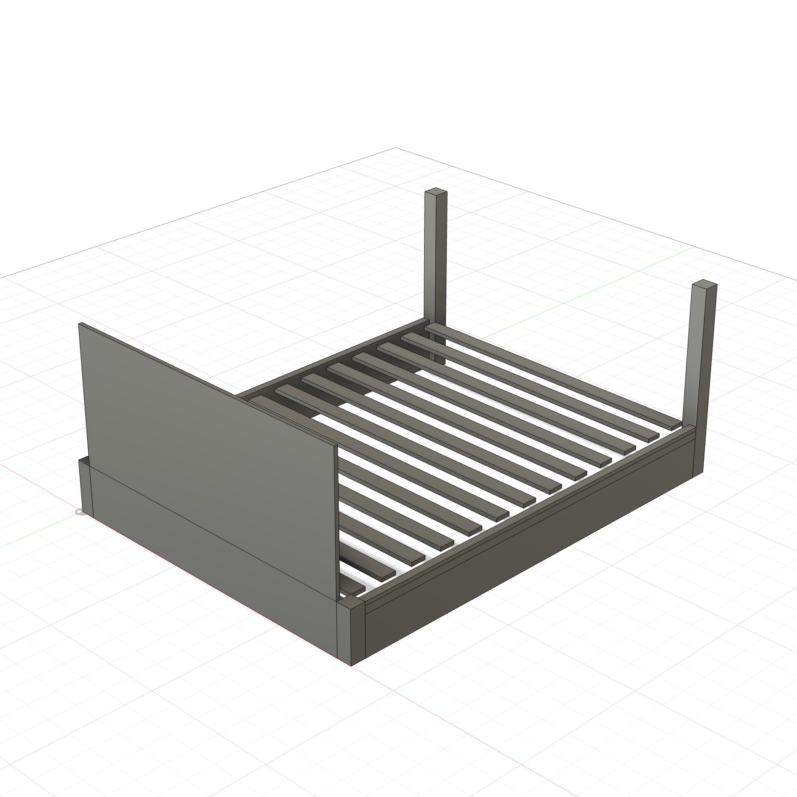
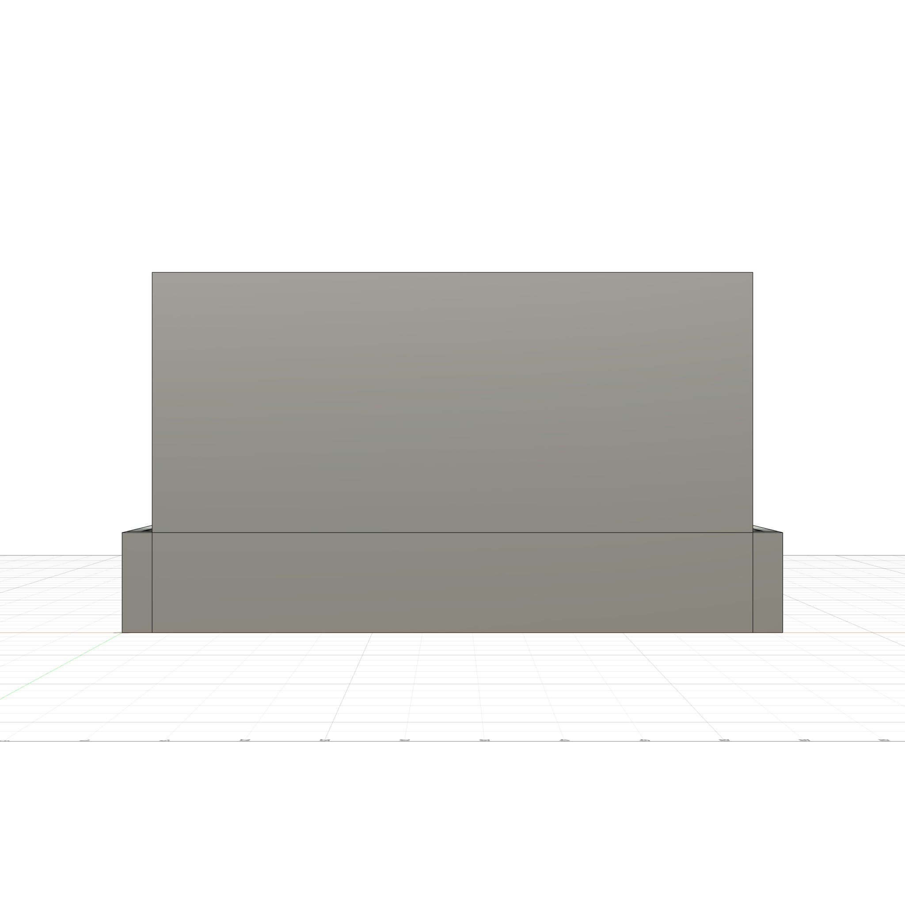
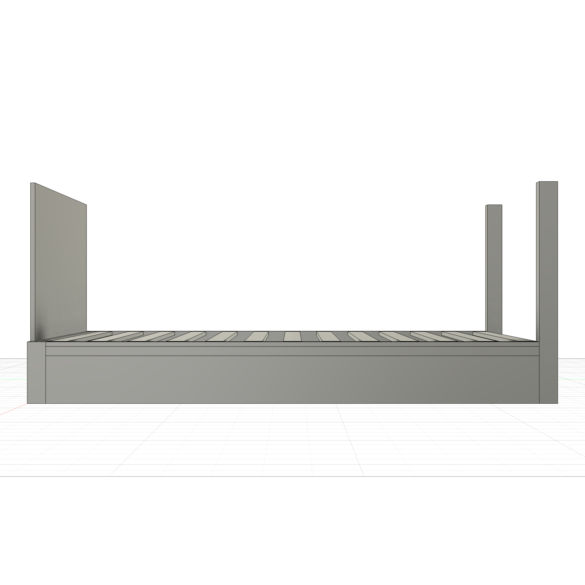

# Platform Bed Frame (Queen)

A parametric modern platform bed — Queen 60"W x 80"L, headboard to 36", slat system with ledger strips.

  
  

**Script:** [`bed_frame.py`](bed_frame.py) — 23 bodies (4 posts, 3 rails, 2 ledgers, headboard, 13 slats). Change `bed_w`/`bed_l` for Twin/King.
