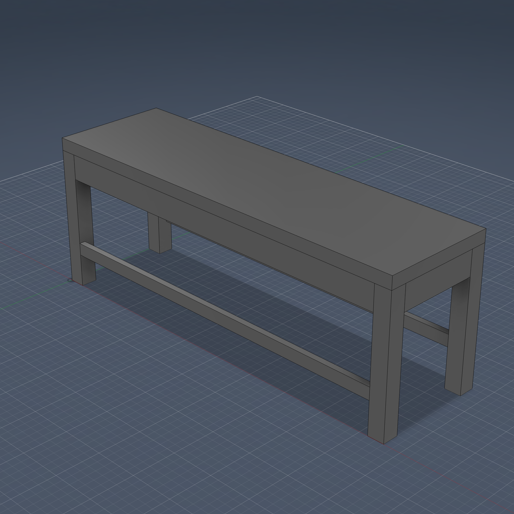
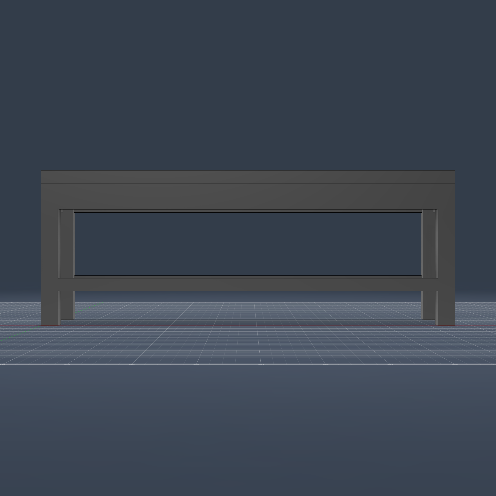
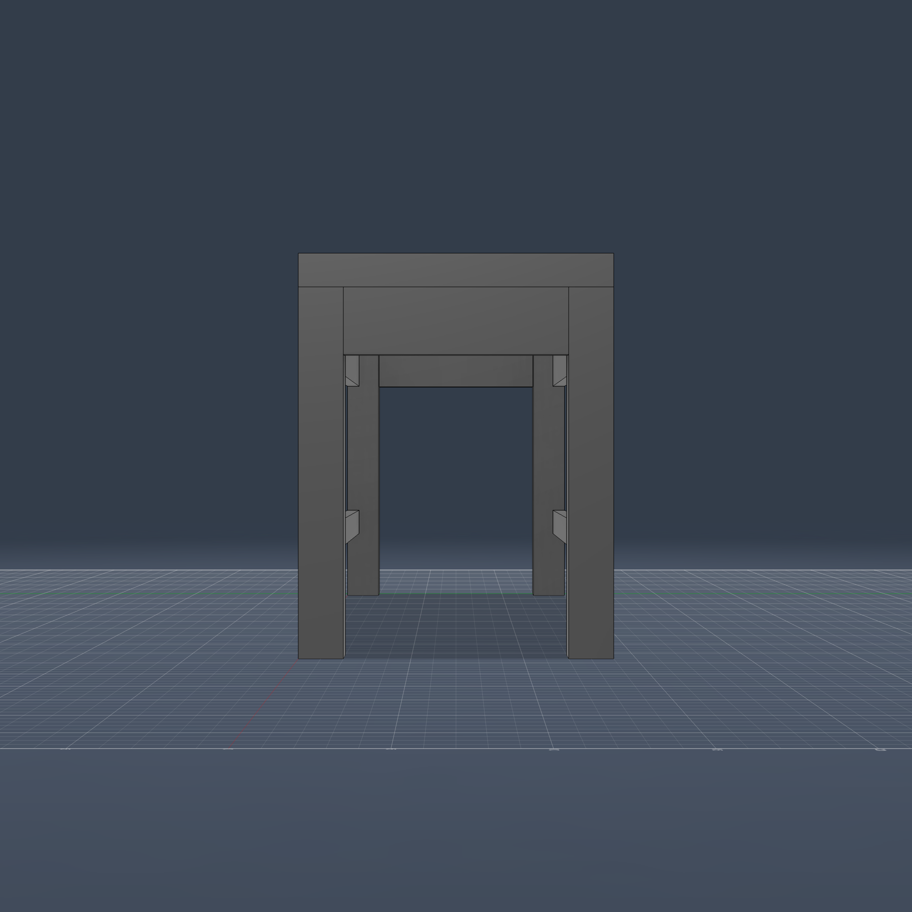

# Entryway Bench

A parametric modern entryway bench — 48"L x 14"W x 18"H with 1.5" thick seat, 2" square legs, apron frame, and front/back stretchers.



<p float="left">
  
  
</p>

## Example Prompt

```
/woodworking
Build a modern entryway bench: 48"L x 14"W x 18"H, thick seat,
square legs, apron frame, stretchers. All parametric.
```

---

**Script:** [`bench.py`](bench.py) — 11 bodies (4 legs, 4 aprons, 2 stretchers, seat). All parametric.
