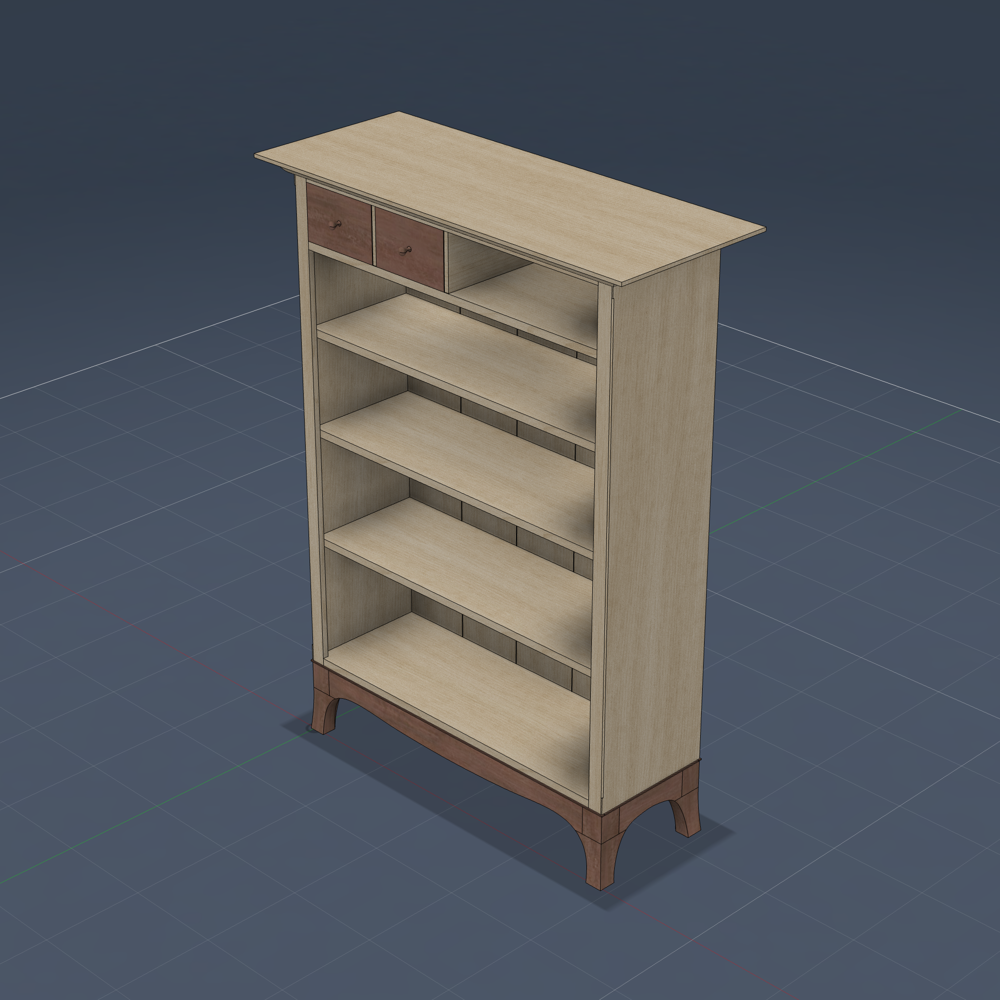
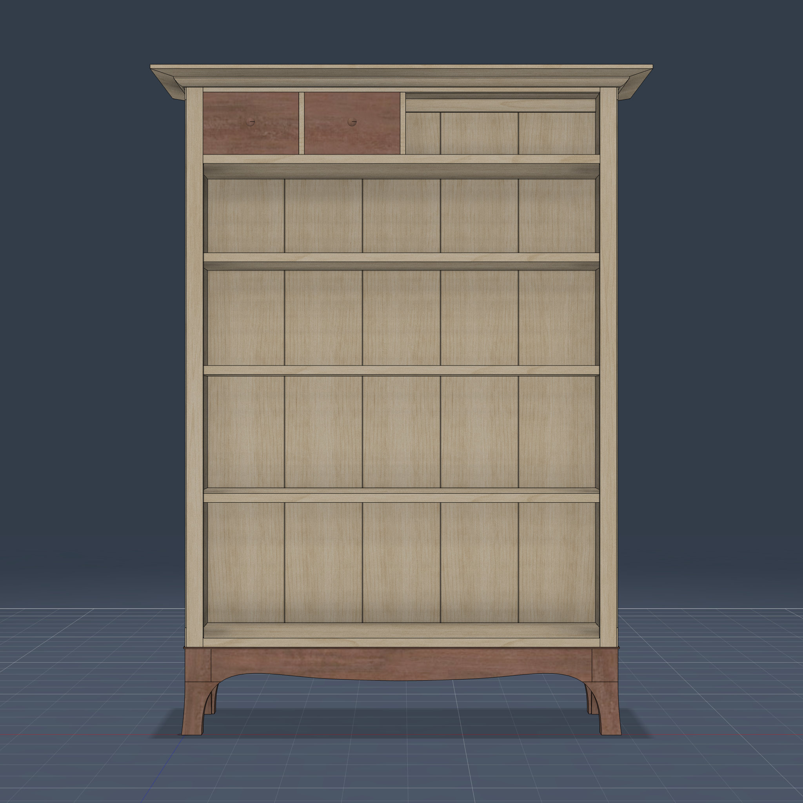
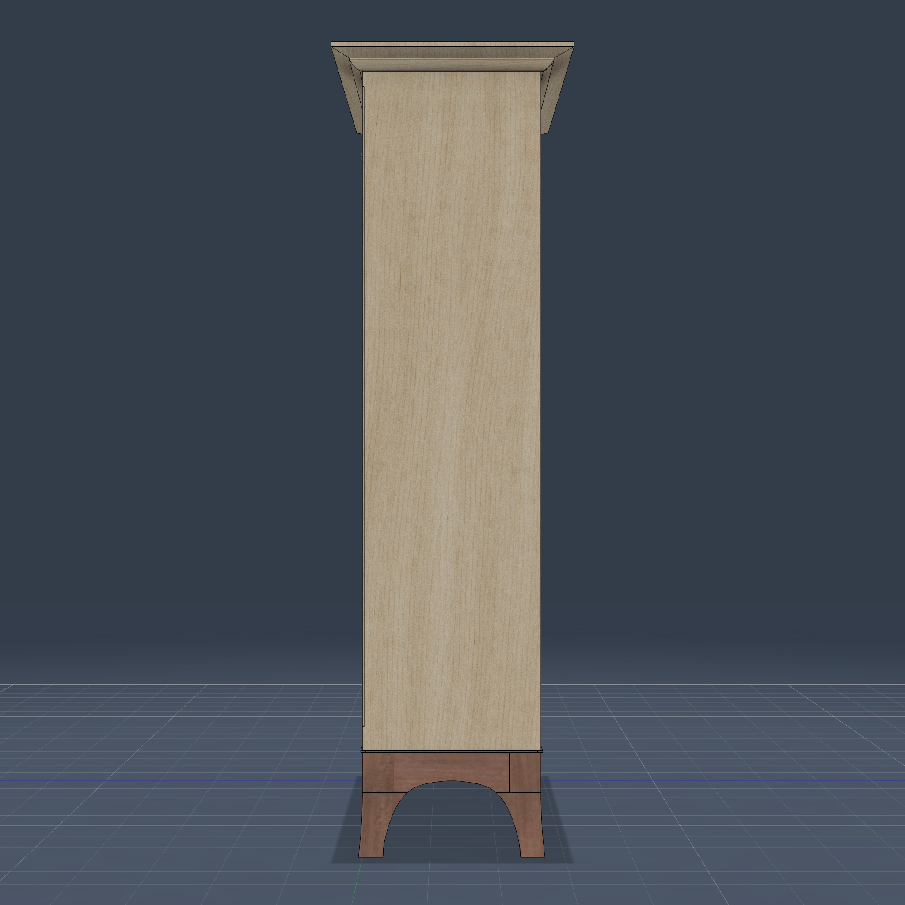

# Bookcase with Drawers

A parametric Fusion 360 model of **"Bookcase with Drawers"** by Mike Korsak
(Fine Woodworking digital plan #SU94, Taunton #065304, drawings by David
Richards) — a figured-maple bookcase on a bubinga base (sapele appearance
in-model) with two dovetailed drawers tucked under the top. 60"H × 44¾"W ×
17¾"D overall; the 39 × 13¼ × 51¼ case stands on a 7⅞" base whose
two-piece mitered legs have bandsawn, curved show faces — plumb across
the full apron band, raking out at 7° below it to the floor.

Built with **Claude (Fable 5)** in **13 prompts** — one to read the 9-page
plan PDF and build the full model, eleven review rounds (molding miter
orientation, drawer dovetail housings, domino-style slip tenons, the
sawn-flare legs, and the unified base curve refined toward the plan's
gentler front apron). 85 bodies in 5 components, every dimension taken from the
plan's cut list and detail pages; the dimension chains (opening stack,
interior width, back-board lengths, base apron lengths) all close exactly
against the materials list, and the finished envelope comes out at
precisely 44¾ × 17¾ × 60.

  
  

## Joinery & details

- **Half-blind dovetails** join the bottom to the sides (6 tails per end,
  11/16 deep behind a ⅛ lap) and the drawer fronts to the drawer sides
  (3 tails, ¼ lap).
- **Sliding half-dovetails** carry all four shelves — 5/16 deep × ¾ tall
  with a 1/16 locking taper on the underside, housed in the sides.
- **Flared two-piece legs** — one foot piece is built (pattern, two
  face-flare cuts, miter) and its mate is the mirror across the vertical
  45° miter plane. The show face stays plumb across the full apron band
  (flat foot-to-apron meeting) then rakes out at 7° below it, ~9/32"
  proud at the floor.
- **Unified base curve** — the inner leg cyma, the apron arch, and the
  opposite leg cyma are ONE continuous sculpted spline per elevation,
  used as a single cut tool across the feet and rail together (the same
  saw-after-glue-up idea as the face flares). Continuity from leg to
  apron is exact by construction. The curve was hand-dragged in the
  Fusion UI on one half, then mirrored about the span center and baked
  back into the script symmetric: the front/back a double-hump cyma with
  a center dip, the ends a single arch.
- **Round-ended (domino-style) slip tenons** everywhere the plan calls for
  loose tenons: paired ⅜ × ¾ × 2 tenons at all eight apron-to-leg joints
  (matching the oval mortises in the pattern), plus the front rail-to-stile
  and rear rail-to-side tenons.
- **Splined construction** — two drawer dividers splined to the drawer
  shelf; five shiplapped back boards with ⅛ × ⅝ splines, tongued into
  grooves in the sides, bottom, and rear top rail.
- **Stiles** glued into 11/16 × ⅝ rabbets on the side front edges, leaving
  a ⅛ reveal with a stopped chamfer; the drawer shelf and bottom are
  notched around them.
- **Drawers** — sliding-dovetail backs (5/16 × 5/32 vertical dadoes),
  bottoms with rabbeted tongues in 5/32 grooves, turned knobs (revolved
  profiles) with ⅜ × ⅝ tenons.
- **Beveled top** (underside bevels, ½ rise to the molding line) wrapped
  by mitered cove molding with corner returns, held by cleats in stopped
  grooves; bead strip in a rabbet around the base, ⅛ proud.

## Build notes

Built with the "if it fits, it cuts" discipline — every mortise, housing,
groove, notch, and rabbet is cut by the body that occupies it (the stiles
cut their own rabbets, the rails cut the divider notches, the drawer
bottoms cut their own grooves). Non-root sketches are anchored to projected
parent geometry with solver-drift self-checks; `validate_design` passes
connectivity (1 cluster), interference (0 across 85 bodies), and the
dependency-tree traceability checks. See `model.json` for the full
dependency tree and the script header for the few documented deviations
(omitted brass tabs/screws and foot-miter splines, butted beads).

## Files

- `bookcase_with_drawers.py` — the parametric build script
- `model.json` — dependency tree metadata
- `screenshots/` — product shots

## Example Prompt

> Take a look at the bookcase plan [FWW "Bookcase with Drawers" by Mike
> Korsak, plan #SU94]. Read all the dimensions and understand all the
> joineries, then build it in Fusion.

Follow-up review prompts refined the molding miters, the drawer dovetails,
the domino-style slip tenons, the sawn-flare legs and their curves, and the
leg-to-apron transitions. The base curves were ultimately unified into a
single continuous leg→apron→leg cut per elevation, dragged into shape by
the user in the Fusion UI (one half) and baked back into the script
mirrored and symmetric.
