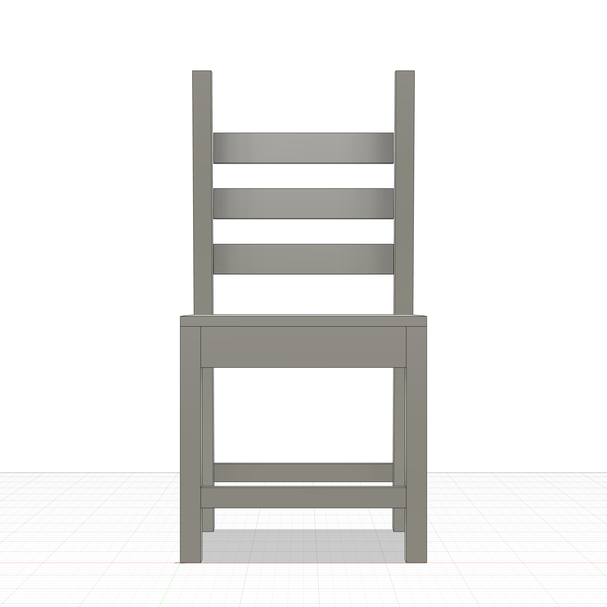
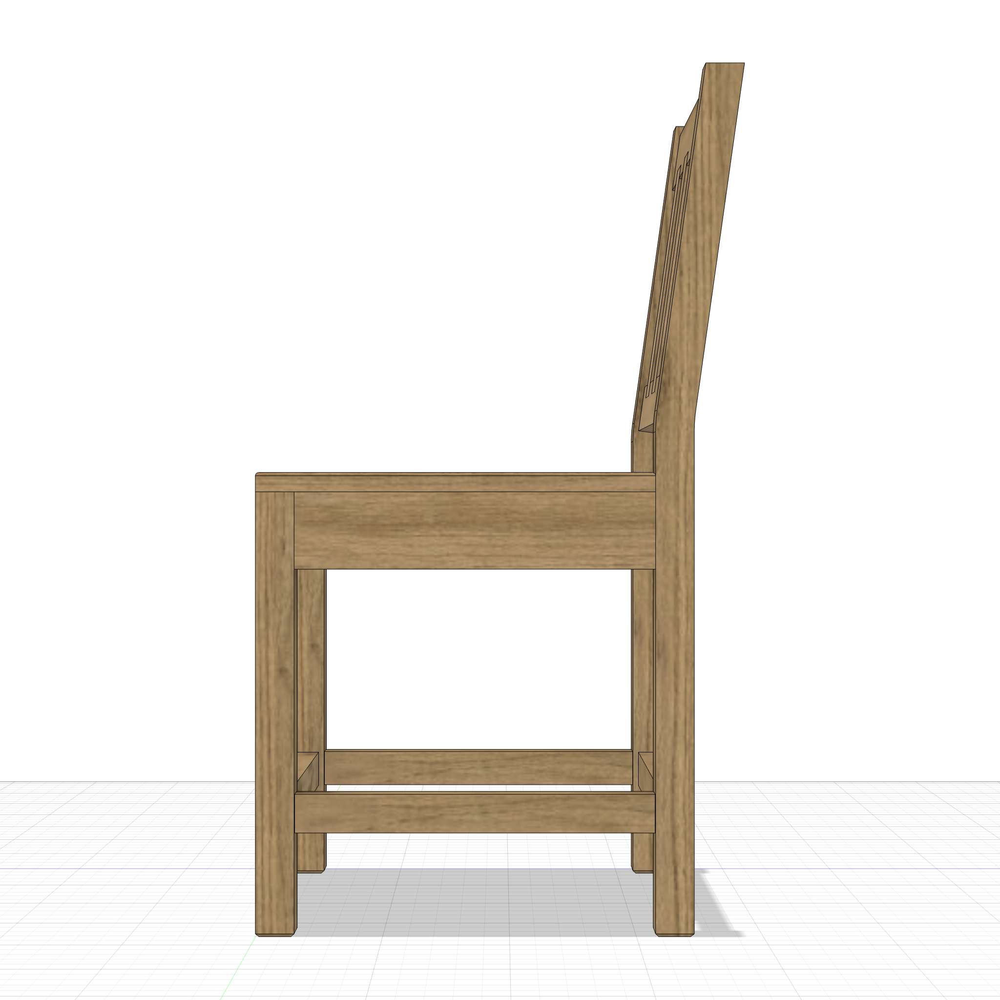
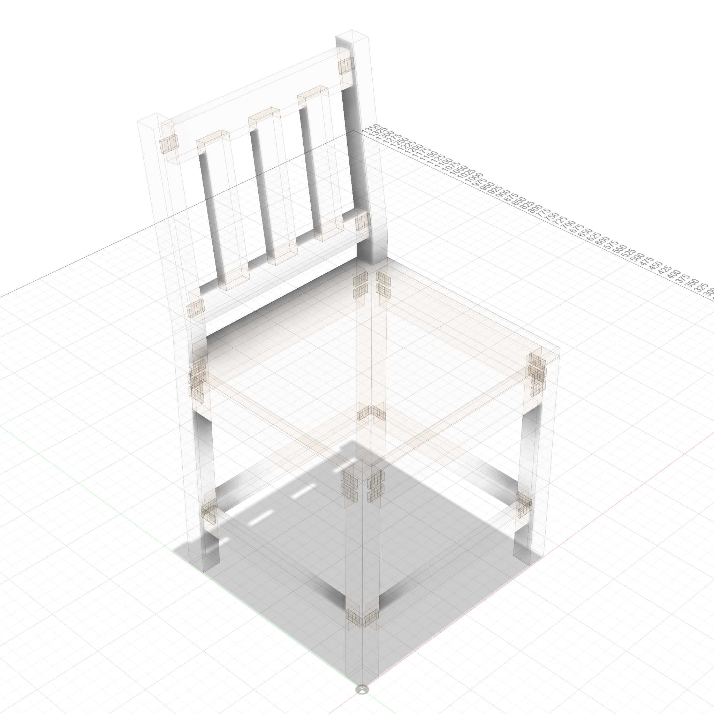

# Dining Chair

A parametric modern dining chair — 18"W x 16"D seat, 18"H seat height, 34"H total. Back legs extend up to support two back rest rails.

  
  

### Transparent Views

  
  

---

**Script:** [`chair.py`](chair.py) — 11 bodies (4 legs, 4 aprons, seat, 2 back rails). Back legs are taller than front legs.
