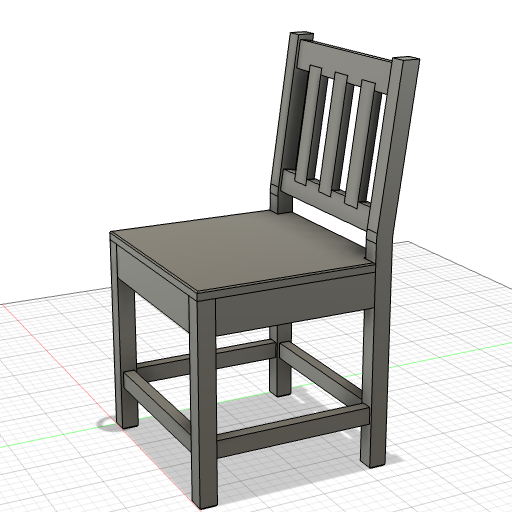

# Dining Chair (NORDVIKEN-inspired)

A parametric modern dining chair — 18"W x 17"D seat, 18"H seat height, 34"H total. Vertical back slats with top/bottom rails, bent-back legs with smooth fillet transition, box stretchers, full domino joinery.

---

**Script:** [`chair.py`](chair.py) — 18 structural bodies + 28 joinery voids. Zero interferences.

**Style:** Modern
**Type guide:** [`woodworking/types/chair.md`](../../woodworking/types/chair.md)

### Key features

- **Bent-back legs** — single profiled extrude (6-line closed shape: vertical bottom + angled top). 8° rake with 6" radius fillet at the bend point (2" above seat). Clean transition on both inner and outer faces.
- **Vertical slat backrest** (NORDVIKEN style) — top rail + bottom rail + 3 vertical slats. Rails connected to posts with tilted dominos (aligned with backrest cross-section). Slats have stub tenons into both rails.
- **Box stretchers** — 4 stretchers centered on legs (1" thick), domino at each end.
- **Every piece mechanically joined** — no floating parts. Dominos at all apron/stretcher/rail connections, stub-tenon slats, tilted dominos for angled joints.
- **Details** — leg bottom chamfers, seat top edge fillet, post chamfer alignment.

### Components

| Component | Bodies | Notes |
|-----------|--------|-------|
| Legs | 4 | Front vertical, back bent-back (profiled extrude + fillet) |
| Aprons | 4 | Front/back/left/right, back apron flush with outer face of back legs |
| Stretchers | 4 | Box stretchers centered on legs |
| Seat | 1 | Notched around back legs |
| Back | 5 | Top rail + bottom rail + 3 vertical slats |

### Key parameters

| Parameter | Default | Notes |
|-----------|---------|-------|
| `back_rake` | 8 deg | Backrest angle (5° barely visible, 8° comfortable) |
| `bend_above` | 2 in | Transition point above seat |
| `bend_r` | 6 in | Fillet radius at bend |
| `n_slats` | 3 | Vertical slats between rails |
| `top_rail_off` | 0.5 in | Top rail offset below post top ("ear" detail) |
| `rail_thick` | 1 in | Backrest rail depth (centered on leg) |
| `str_thick` | 1 in | Stretcher thickness (centered on leg) |
