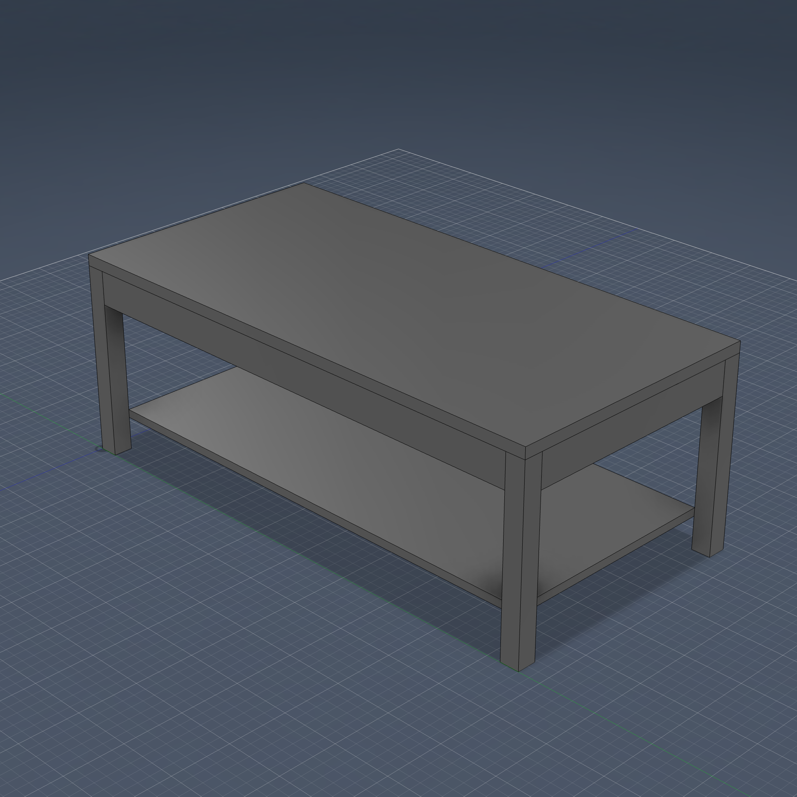
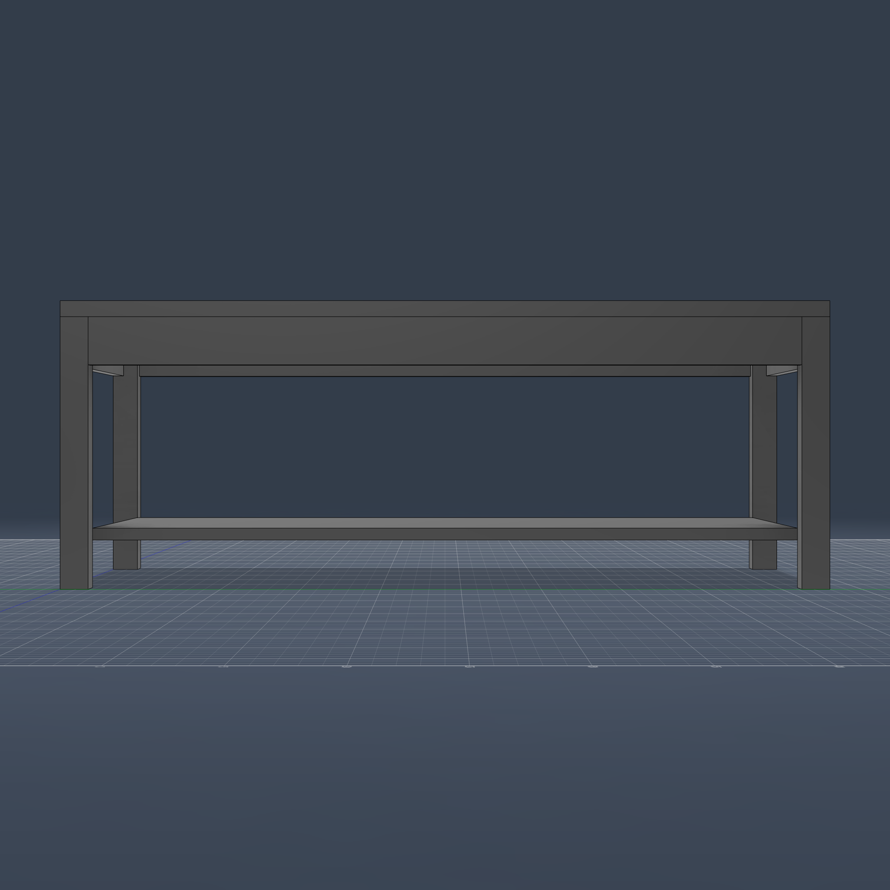
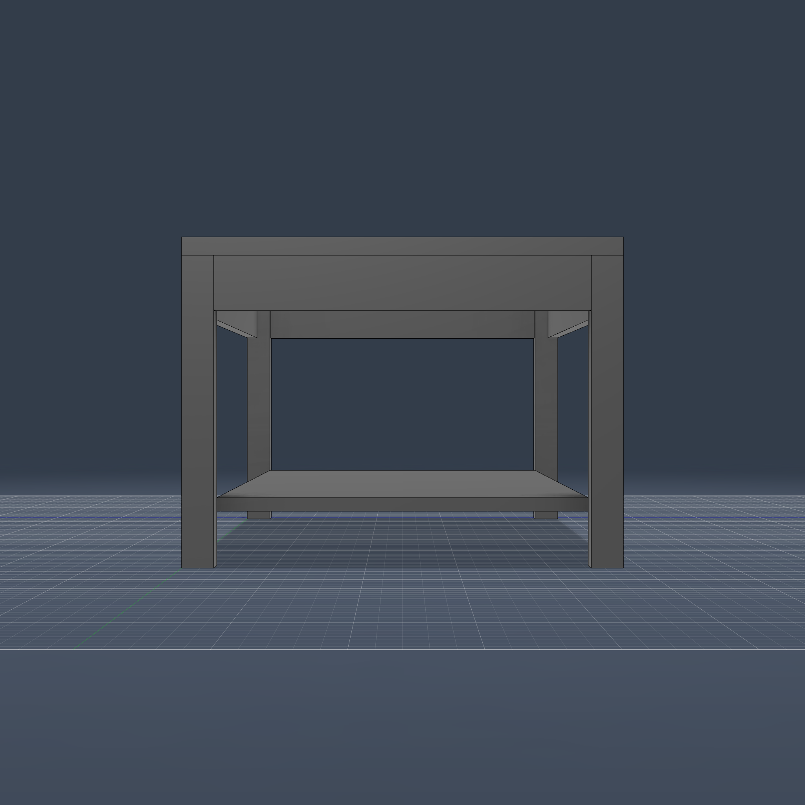

# Coffee Table

A parametric modern coffee table — 48"L x 24"W x 18"H with 1" thick top, 1.75" square legs, apron frame, and lower shelf. Clean modern lines.



<p float="left">
  
  
</p>

## Example Prompt

```
/woodworking
Build a modern coffee table: 48"L x 24"W x 18"H, 1" thick top,
1.75" square legs, apron frame, lower shelf. All parametric.
```

---

## How to Run

**Via MCP (recommended):** If you have the [Fusion 360 MCP add-in](../../mcp/README.md) configured, just ask Claude to run it.

**Manual:** Fusion 360 > Utilities > Scripts and Add-Ins > (+) > select this folder > Run

**Script:** [`coffee_table.py`](coffee_table.py)

---

## Dimensions

| Parameter | Default | Description |
|-----------|---------|-------------|
| `table_l` | 48 in | Overall length |
| `table_w` | 24 in | Overall width |
| `table_h` | 18 in | Overall height |
| `top_thick` | 1 in | Top board thickness |
| `leg_size` | 1.75 in | Leg cross-section |
| `apron_h` | 3 in | Apron height |
| `apron_thick` | 0.75 in | Apron thickness |
| `shelf_thick` | 0.75 in | Lower shelf thickness |
| `shelf_z` | 3 in | Shelf height from floor |

---

## Design

### Components (10 bodies)

| Component | Bodies | Features |
|-----------|--------|----------|
| **Legs** | 4 | FL, FR (mirror), BL (mirror), BR (mirror) |
| **Aprons** | 4 | Front, Back (mirror), Left, Right (mirror) |
| **Top** | 1 | Solid panel on leg frame |
| **Shelf** | 1 | Lower shelf between legs |
