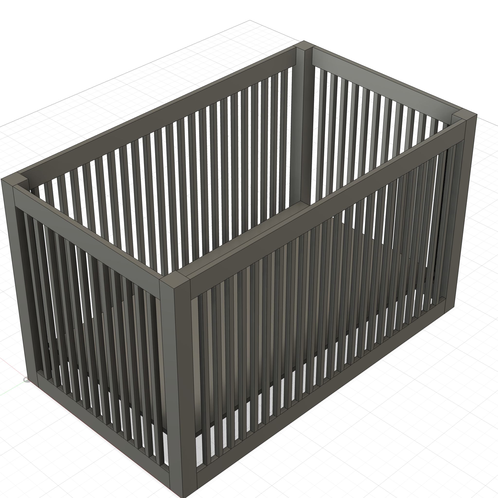
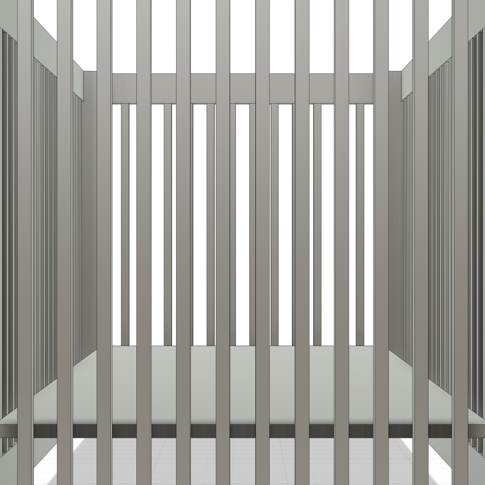
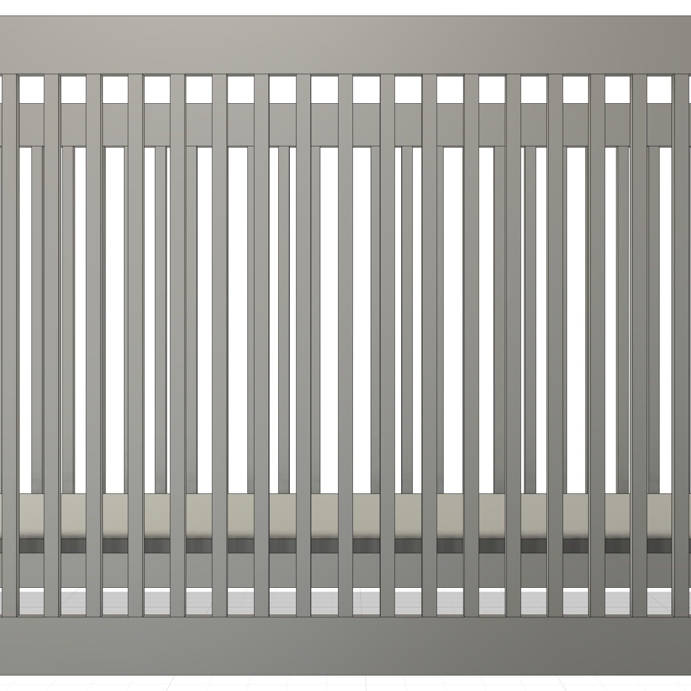
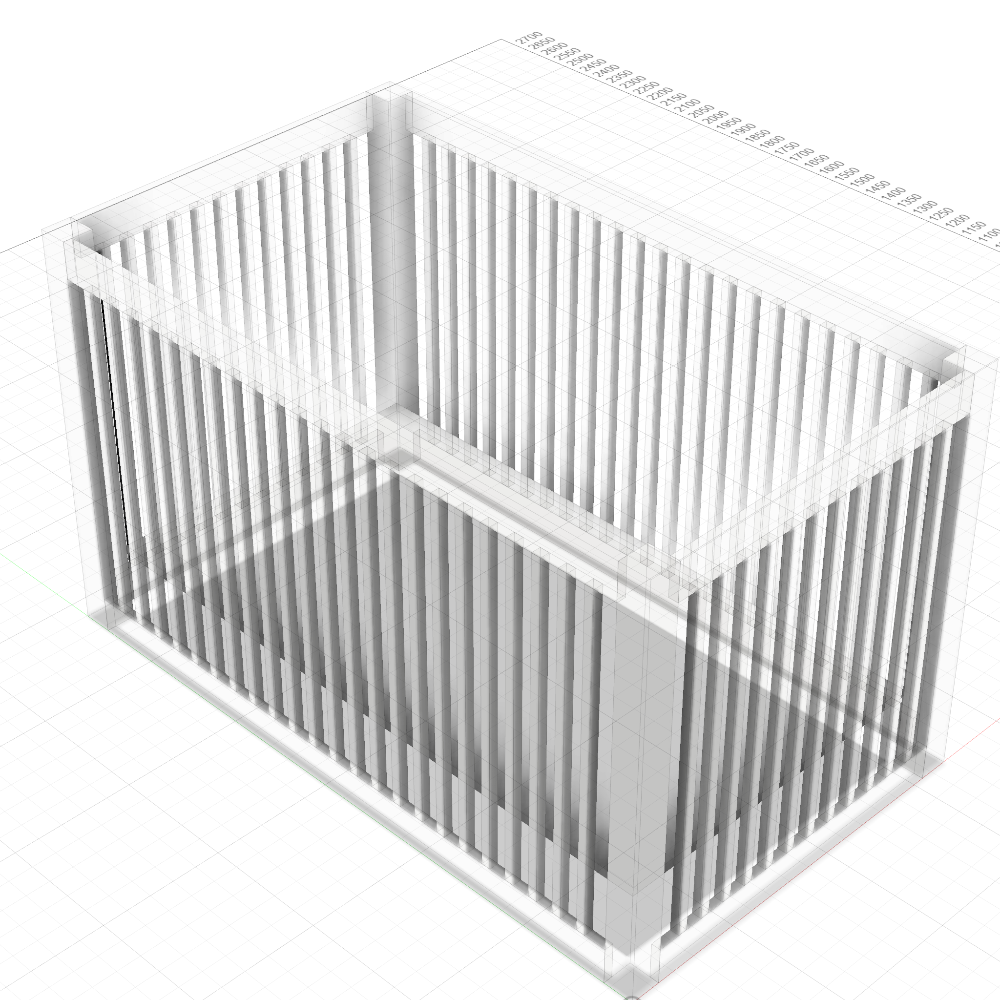
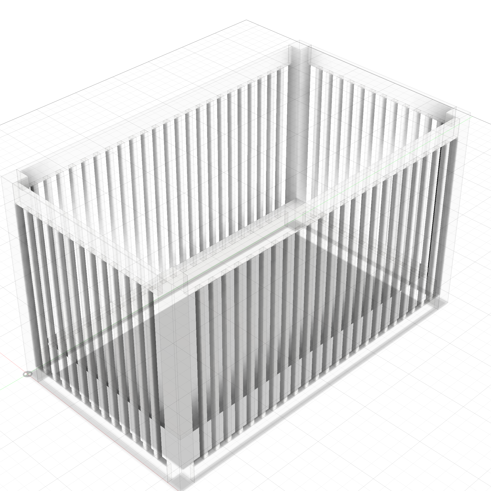

# Crib

A parametric modern crib — 52"L x 28"W interior, 34"H rail height. Safety-compliant spindle spacing (2.25" center-to-center). 4 corner posts, 8 rails, spindle panels on all 4 sides.



<p float="left">
  
  
</p>

### Transparent Views

<p float="left">
  
  
</p>

---

**Script:** [`crib.py`](crib.py) — 83 bodies (4 posts, 8 rails, ~70 spindles, mattress support). Spindle count parametric via `spindle_sp`.

### Appearance

```
apply_appearance(species="maple")
```
