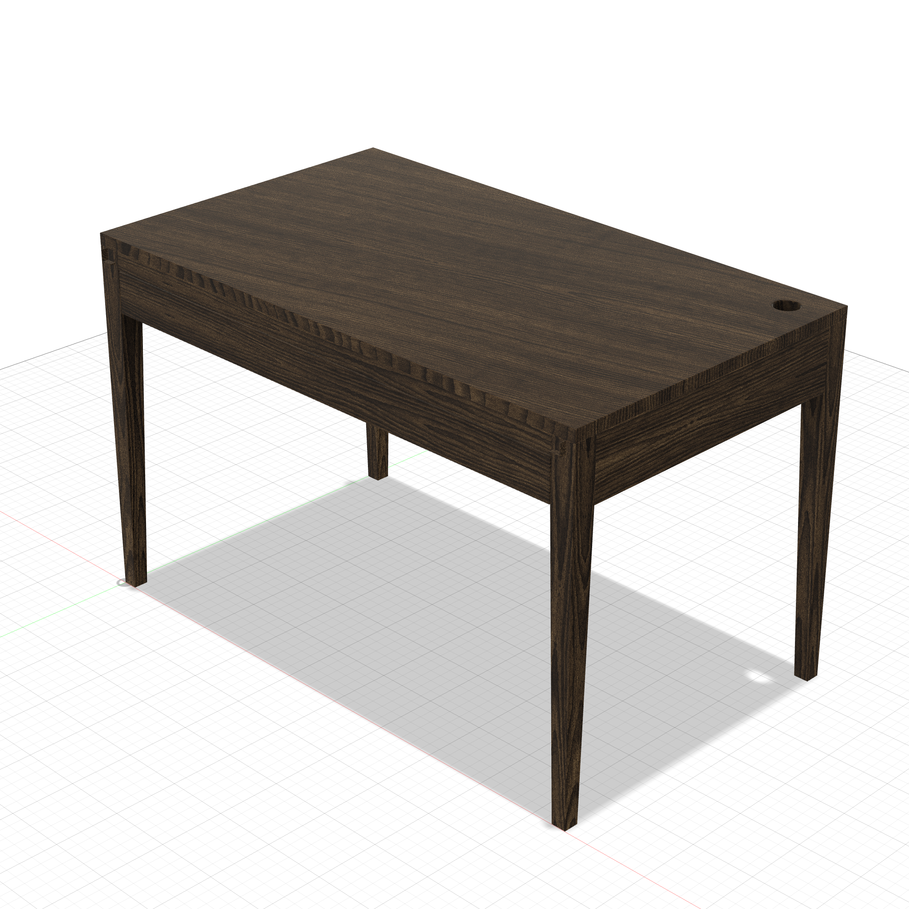
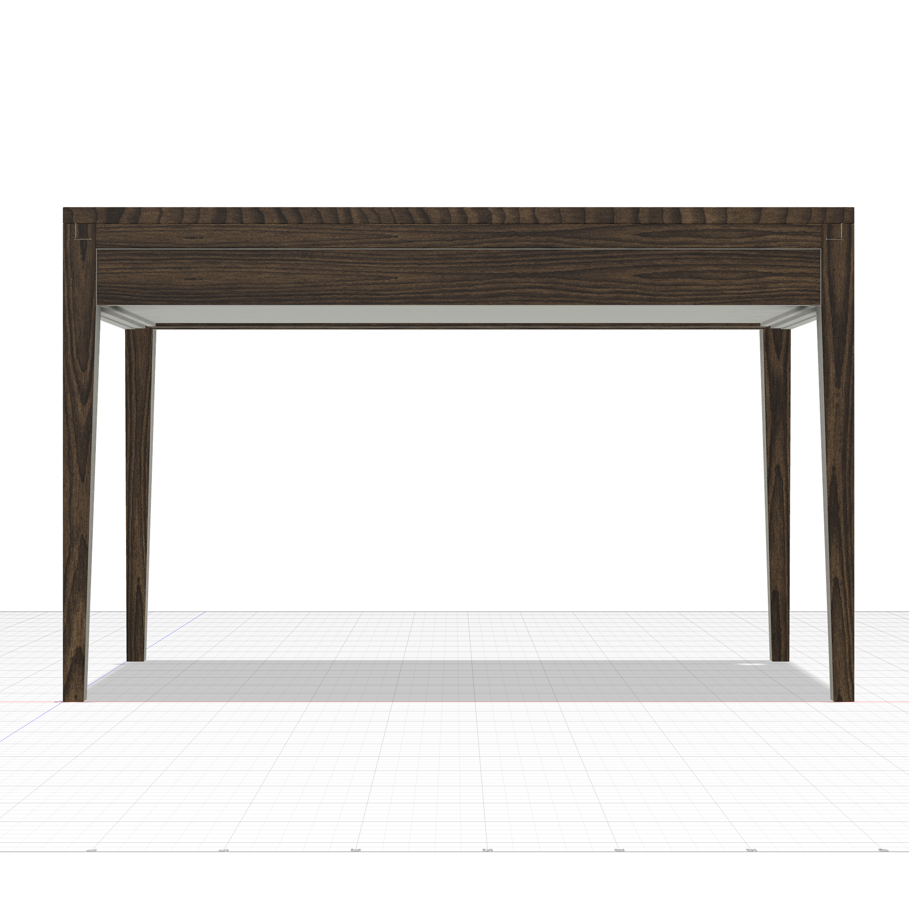
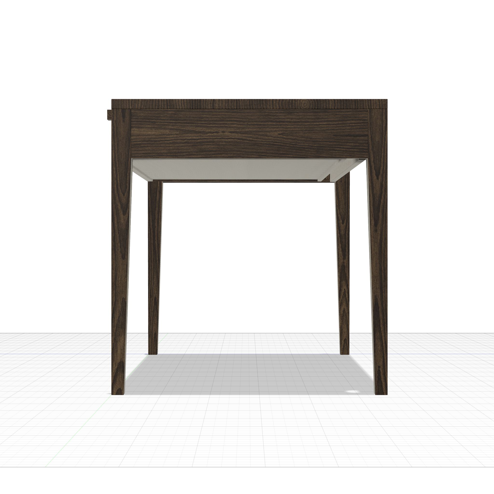
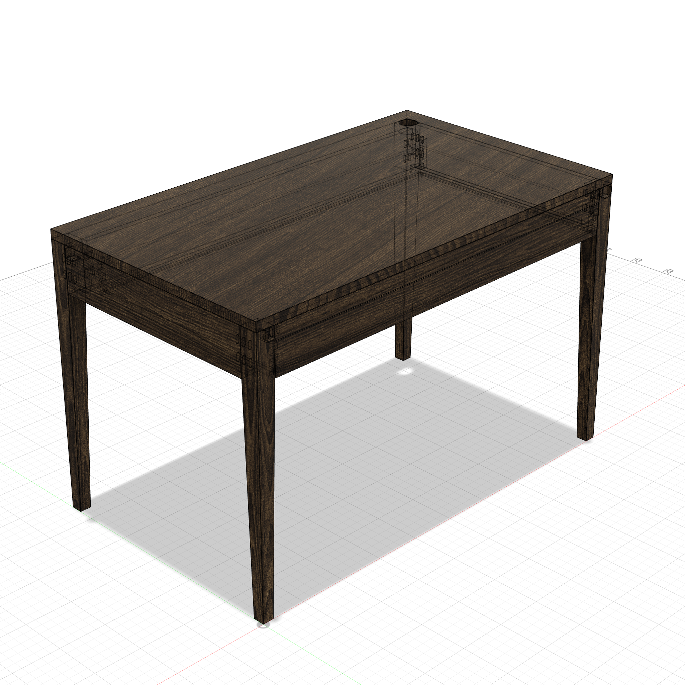

# Writing Desk

A parametric modern writing desk — 48"L × 28"W × 30"H with tapered legs, single dovetailed drawer with runners and stops, front rail above drawer, cable grommet, domino joinery throughout. Walnut appearance.



<p float="left">
  
  
</p>

### Transparent View

<p float="left">
  
</p>

---

**Script:** [`desk.py`](desk.py) — 25 structural bodies + 14 domino voids.

### Structure
- **4 tapered legs** — 2" square at top, taper to 1.25" at floor on inner faces
- **3 aprons** — back + 2 sides (no front apron — drawer front fills it)
- **Front rail** — 1.5" strip above drawer opening, domino'd to front legs
- **2 drawer runners** — wooden strips on side aprons for drawer slides
- **2 drawer stops** — blocks at back of runners preventing push-through
- **Top** — 1" thick with 2" cable grommet at back-right corner

### Drawer
- Dovetailed drawer box (half-blind front, through back)
- 5 bodies: front, back, 2 sides, bottom
- Slides on wooden runners, stopped by blocks at back

### Joinery
- **Aprons → legs:** 2 dominos per joint (6 apron joints)
- **Front rail → legs:** 1 domino each side (2 joints)
- **Top → aprons:** 7 L-brackets with slotted holes (allows cross-grain wood movement)
- **Drawer:** dovetails at all 4 corners

### Appearance

```
apply_appearance(species="walnut")
```
