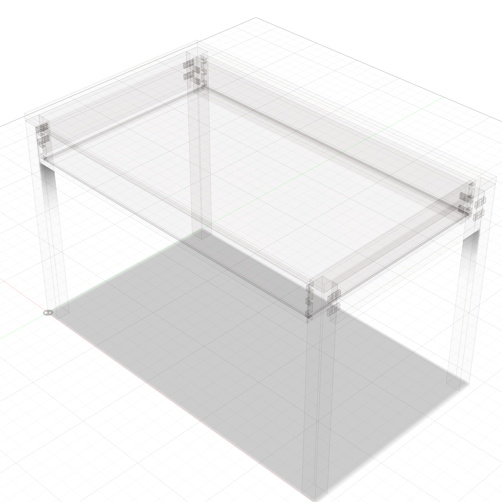

# Writing Desk

A parametric modern writing desk — 48"L x 28"W x 30"H with single dovetailed drawer, domino joinery at apron-to-leg connections. No front apron — drawer front fills the front face.


<p float="left">
  
  
</p>

### Transparent Views

<p float="left">
  
  
</p>

## Example Prompt

```
/woodworking
Build a modern writing desk: 48"L x 28"W x 30"H, 1" thick top,
single dovetailed drawer, domino joinery, square legs. All parametric.
```

### Appearance

```
apply_appearance(species="walnut")
```

---

**Script:** [`desk.py`](desk.py) — 13 structural bodies + 12 domino voids. Uses `dovetailed_drawer` template for half-blind front / through back dovetails. Domino grid at 6 apron-to-leg joints.
