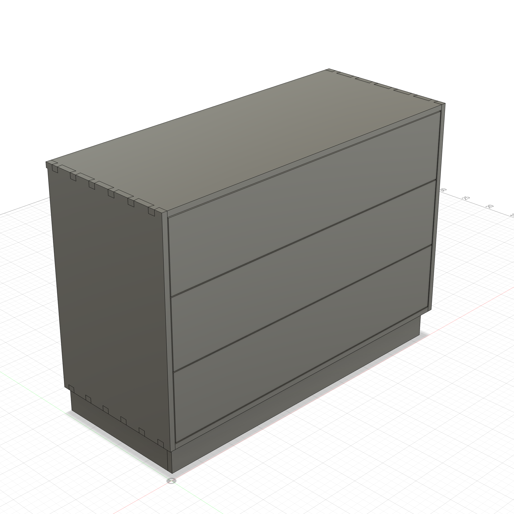
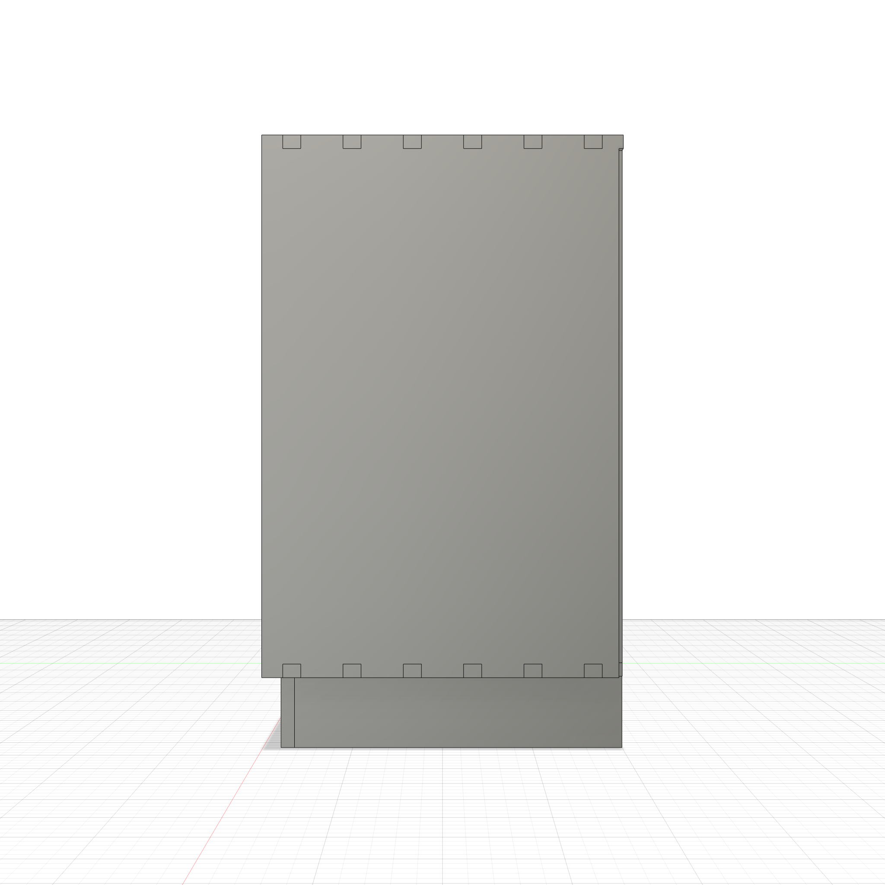

# 3-Drawer Solid Wood Dresser

A parametric solid wood dresser modeled in Fusion 360 via Python script. 48"W x 20"D x 34"H, 3/4" board stock. Through dovetail case joints, dovetailed drawer boxes with integrated lip/groove pulls, plinth kick base with Festool Domino joints, and a plywood back panel.




<p float="left">
  
  
</p>

## Example Prompt

```
/woodworking
Build a 3-drawer solid wood dresser: 48"W x 20"D x 34"H in 3/4" stock. Through dovetails
joining top and bottom to sides, 3 dovetailed drawer boxes with integrated lip/groove
pulls, plinth kick base with Festool Domino joints, and 1/4" plywood back. All joinery
fully parametric — changing n_drawers should produce any number of equal-height drawers.
```

---

## How to Run

**Via MCP (recommended):** If you have the [Fusion 360 MCP add-in](../../mcp/README.md) configured, just ask Claude to run it.

**Manual:** Fusion 360 > Utilities > Scripts and Add-Ins > (+) > select this folder > Run

**Script:** [`dresser.py`](dresser.py)

---

## Dimensions

All exposed as User Parameters (Modify > Change Parameters):

### Case

| Parameter | Default | Description |
|-----------|---------|-------------|
| `case_w` | 48 in | Overall case width (X) |
| `case_d` | 20 in | Overall case depth (Y) |
| `case_h` | 34 in | Overall case height (Z) |
| `board_thick` | 0.75 in | Side board thickness |
| `top_thick` | 0.75 in | Top board thickness |
| `bot_thick` | 0.75 in | Bottom board thickness |
| `kick_h` | 4 in | Kick board height |
| `kick_inset` | 1 in | Kick inset from case front |
| `back_thick` | 0.25 in | Back panel thickness |
| `top_overhang` | 0 in | Top overhang beyond sides |

### Case Dovetails

| Parameter | Default | Description |
|-----------|---------|-------------|
| `dt_angle` | 8 deg | Dovetail angle |
| `dt_tail_w` | 1 in | Dovetail tail width |
| `dt_tail_count` | 6 | Number of tails per corner |

### Drawers

| Parameter | Default | Description |
|-----------|---------|-------------|
| `n_drawers` | 3 | Number of drawers |
| `drawer_gap` | 0.125 in | Gap around each drawer |
| `drawer_front_thick` | 0.75 in | Drawer front board thickness |
| `drawer_side_thick` | 0.5 in | Drawer side board thickness |
| `drawer_bottom_thick` | 0.25 in | Drawer bottom thickness |
| `dd_tail_w` | 0.75 in | Drawer dovetail tail width |
| `dd_tail_count` | 5 | Drawer dovetail tails per corner |
| `pull_depth` | 0.375 in | Lip/groove pull depth |
| `pull_h` | 0.75 in | Pull groove height |
| `bg_depth` | 0.25 in | Bottom groove depth |
| `bg_up` | 0.25 in | Bottom groove offset from floor |

### Kick Dominos

| Parameter | Default | Description |
|-----------|---------|-------------|
| `dm_kc_d` | 12 mm | Kick corner domino depth per side |
| `dm_kc_h` | 1.5 in | Kick corner domino long dimension |
| `dm_kc_w` | 5 mm | Kick corner domino short dimension |
| `dm_kb_d` | 12 mm | Kick-to-bottom domino depth per side |
| `dm_kb_h` | 1.5 in | Kick-to-bottom domino long dimension |
| `dm_kb_w` | 5 mm | Kick-to-bottom domino short dimension |
| `dm_kb_f_count` | 3 | Front kick domino count |
| `dm_kb_s_count` | 2 | Side kick domino count |
| `dm_kb_b_count` | 3 | Back kick domino count |

### Key Derived Parameters

| Parameter | Expression | Description |
|-----------|------------|-------------|
| `inner_w` | `case_w - 2 * board_thick` | Interior width between sides |
| `usable_h` | `case_h - kick_h - bot_thick - top_thick` | Usable height for drawers |
| `drawer_h` | `(usable_h - (n_drawers + 1) * drawer_gap) / n_drawers` | Individual drawer height |
| `drawer_w` | `inner_w - 2 * drawer_gap` | Drawer box width |
| `drawer_d` | `case_d - back_thick - 2 * drawer_gap` | Drawer box depth |
| `dt_pin_w` | `case_d / dt_tail_count - dt_tail_w` | Case dovetail pin width |

---

## Design

### Components and Features

| Component | Features |
|-----------|----------|
| **Sides** | Left + right side panels (mirror) |
| **Top** | Top board with overhang |
| **Bottom** | Bottom board between sides at top of kick |
| **Back** | Plywood back panel |
| **Kick** | Front + left + right + back plinth boards, domino joints at corners and to bottom |
| **Drawers** | Each drawer built independently: front, back, left side, right side, bottom panel, bottom grooves, lip/groove pulls, through dovetails at all 4 corners |

### Build Phases

**Phase 1:** All boards positioned + kick dominos + kick-to-bottom dominos + drawer loop (boards, grooves, pulls, dovetails)

**Phase 2:** Case dovetails (top/bottom-to-sides) + back rabbet

### Key Techniques

- **Through dovetails** — independent construction at each of 4 case corners and 4 corners per drawer
- **Integrated lip/groove pulls** — groove CUT into drawer front top edge, no hardware needed
- **Parametric drawer count** — `n_drawers` parameter controls drawer height derivation; each drawer built in a Python loop with parametric expressions
- **Domino joinery** — loose tenon bodies span kick-to-kick and kick-to-bottom interfaces
- **Bottom panel grooves** — grooved into all 4 drawer boards before dovetails are cut

---

## Customization

Changing `n_drawers` produces any number of equal-height drawers. Each drawer's height, position, and dovetail layout adjusts automatically. Key constraint chains:

- `drawer_h = (usable_h - (n_drawers + 1) * drawer_gap) / n_drawers`
- `drawer_pitch = drawer_h + drawer_gap`
- Drawer dovetail pin width derives from `drawer_h / dd_tail_count - dd_tail_w`
