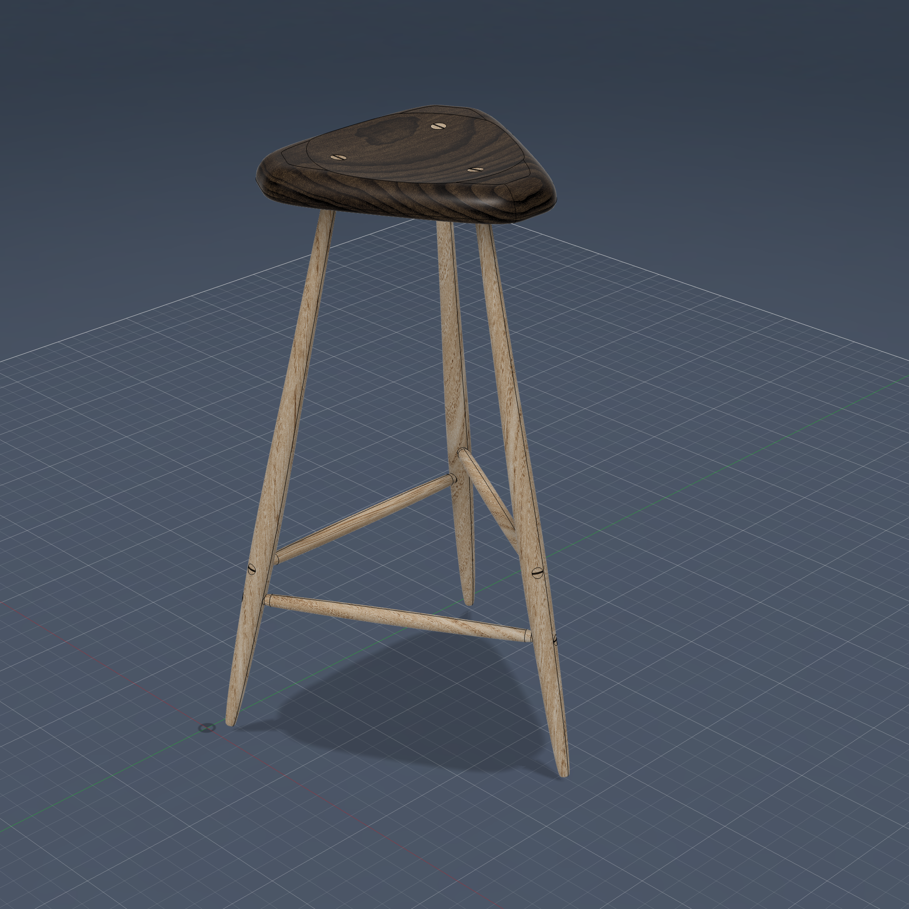
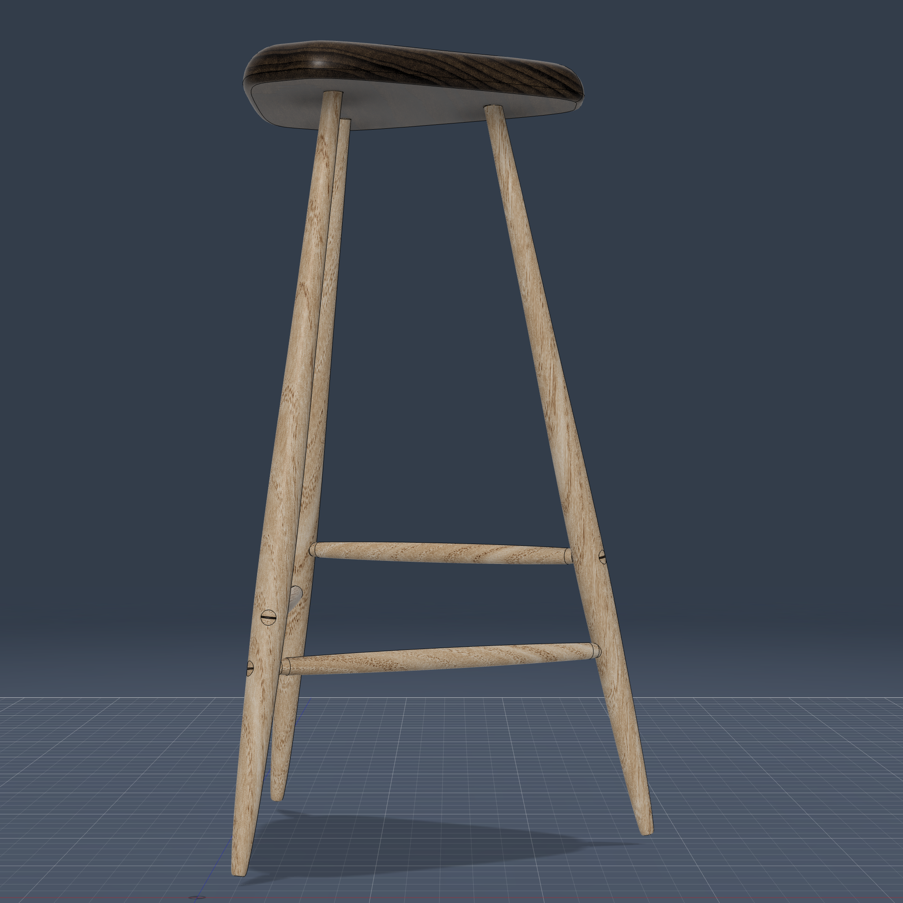
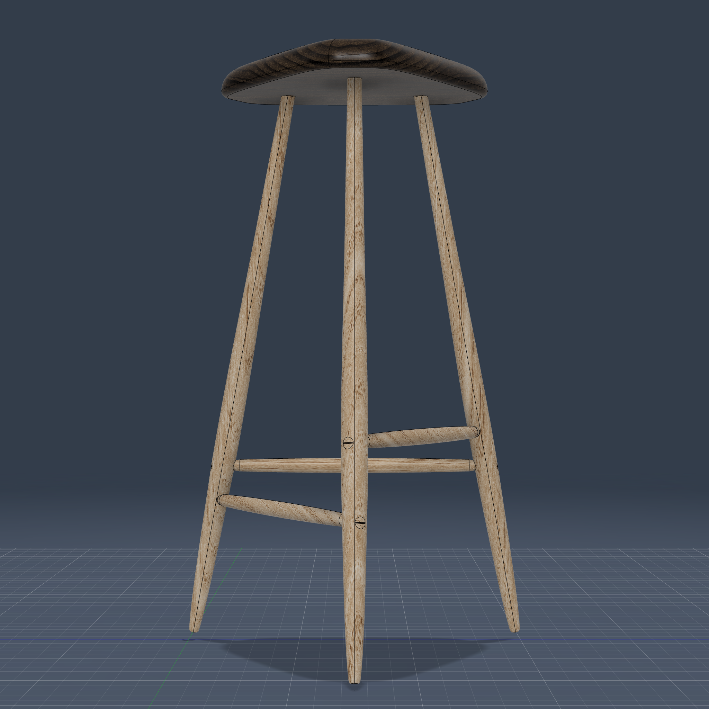
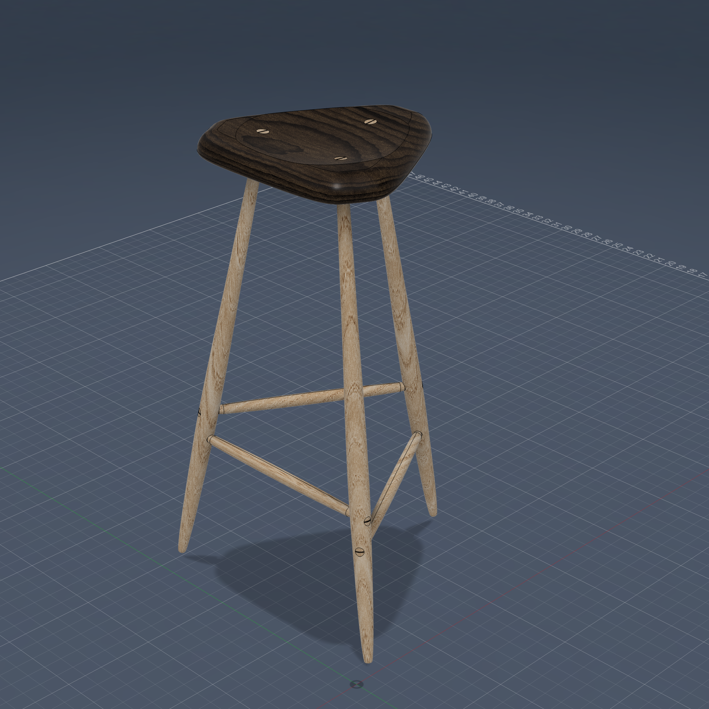

# Wharton Esherick Three-Legged Stool (1958 style)

## Description

Parametric approximation of a Wharton Esherick-inspired three-legged stool. Walnut seat with organic spline outline and subtle spherical scoop, ash turned legs with hand-tuned taper profile, barrel-profile turned stretchers at staggered heights, and wedged through-tenons on all joints.

This model is a close representation of an organic, hand-sculpted design — not a precise reproduction. ShopPrentice doesn't fully support true organic/free-form shapes yet, but can assist in building parametric approximations using spline profiles, spherical scoops, and revolved curves. The iterative workflow (agent builds approximate shape, user refines in Fusion UI, agent captures edits) bridges the gap between parametric modeling and organic design intent.

Reference: [Rago Arts Lot 568](https://www.ragoarts.com/auctions/2023/01/modern-design/568) — Wharton Esherick, 1958, walnut and ash.

| | |
|---|---|
|  |  |
|  |  |

## Key Techniques Demonstrated

- **Organic shapes** — closed spline seat outline, revolved spline leg profile, spherical scoop
- **Approximate-refine-capture workflow** — agent builds initial profile, user edits spline in Fusion UI, agent captures via `get_timeline_state` and updates script
- **Through-tenon trim** — SplitBody using entire receiving body as tool, `sp.body_side()` to classify fragments, remove excess, join interior
- **Spatial query helpers** — `sp.body_side()`, `sp.face_side()`, `sp.classify_bodies()` for fragment classification after split
- **Staggered stretchers** — three different heights (5.5", 7", 8.5") to avoid weakening legs at same point
- **Component organization** — Seat, Legs, Stretchers with cross-component CUTs in root timeline

## Build Order

1. Seat (spline hex outline + spherical scoop)
2. Legs (revolve + splay) — tenons protrude through seat
3. Wedge slots on leg tenons
4. SplitBody legs+wedges using seat body → remove above → join back
5. CUT seat mortise with trimmed legs
6. Stretchers (barrel profile, staggered heights)
7. Wedge slots on stretcher tenons
8. SplitBody stretchers+wedges using leg bodies → remove tips → join interior
9. CUT leg mortises with trimmed stretchers
10. CUT wedge mortises into receiving bodies
11. Fillets + appearance

## Parameters

| Parameter | Value | Description |
|-----------|-------|-------------|
| seat_w | 15 in | Seat max width (Y) |
| seat_d | 14 in | Seat max depth (X) |
| seat_t | 1.25 in | Seat thickness |
| scoop_depth | 0.3 in | Scoop depth |
| scoop_r | 30 in | Scoop sphere radius |
| leg_h | 24 in | Leg height floor to seat bottom |
| leg_mid_dia | 1.5 in | Leg max diameter at swell |
| leg_swell_ratio | 0.30 | Swell position from bottom |
| splay | 8 deg | Leg splay from vertical |
| tenon_dia | 0.75 in | Through-tenon diameter |
| str_h1/h2/h3 | 5.5/7/8.5 in | Staggered stretcher heights |
| ts_mid_dia | 0.75 in | Stretcher body diameter |
| ts_tenon_len | 1.5 in | Stretcher tenon length |
| leg_spread | 4 in | Leg distance from seat centroid |
