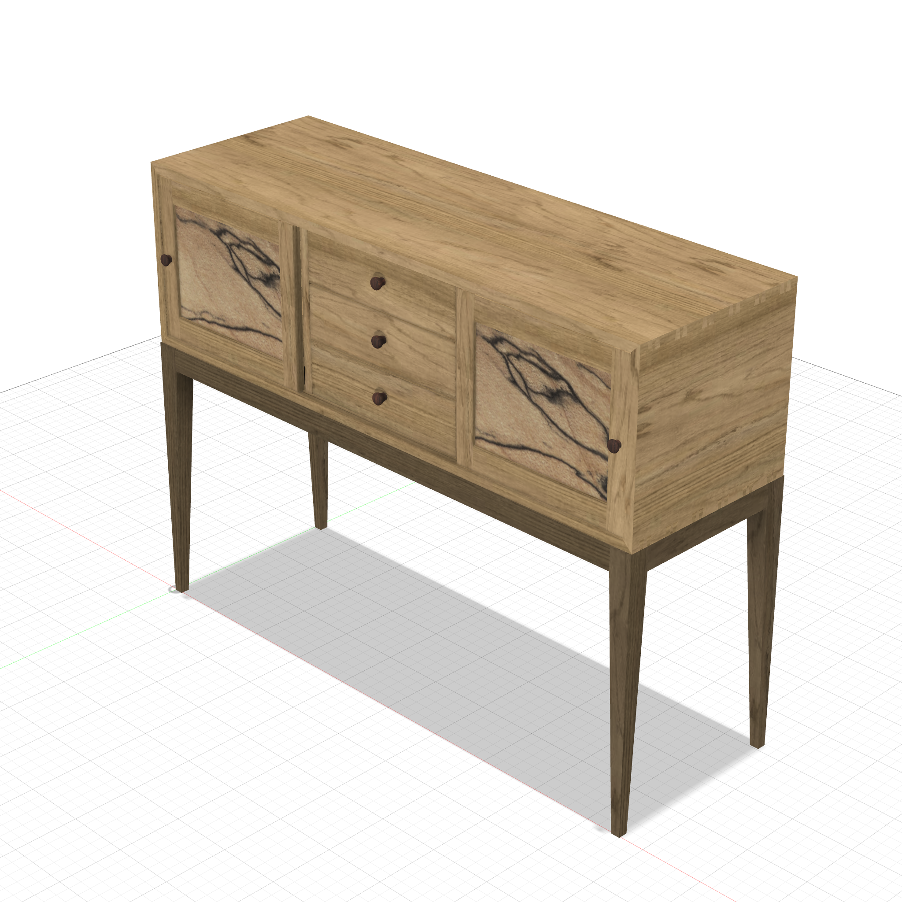
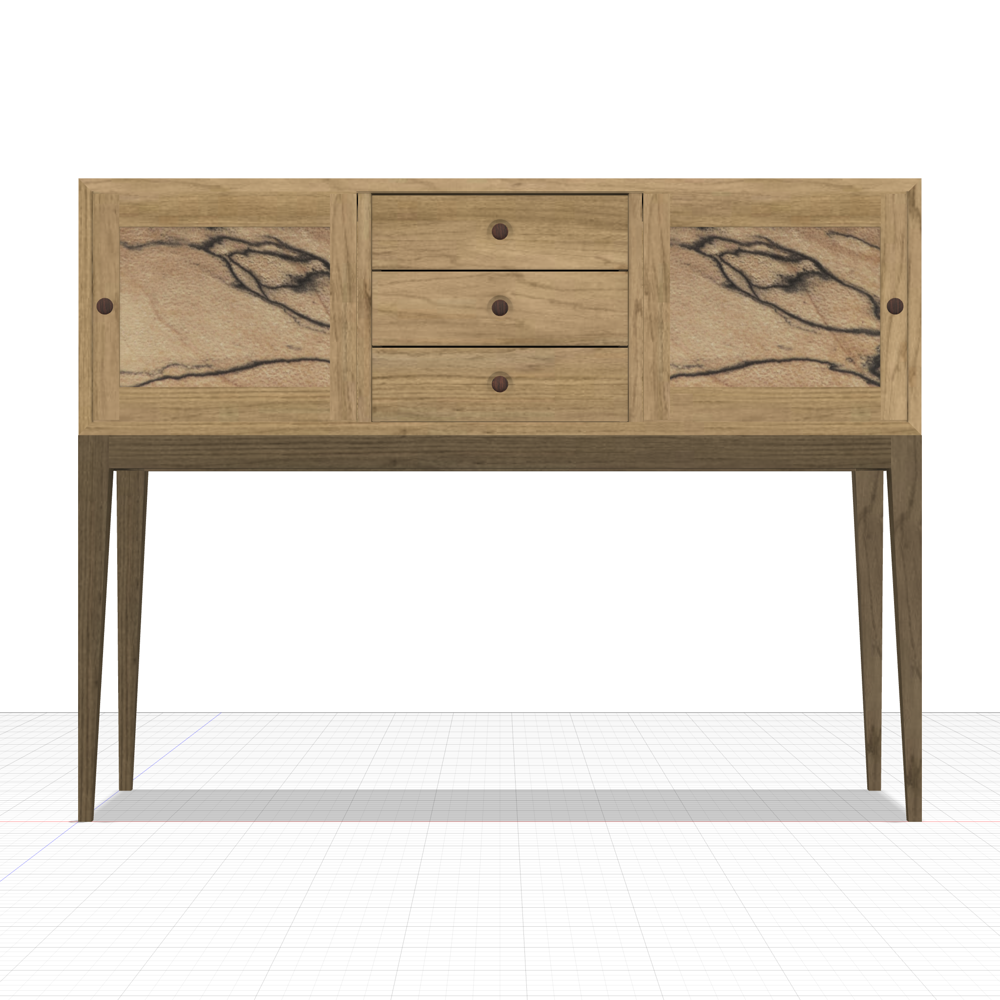
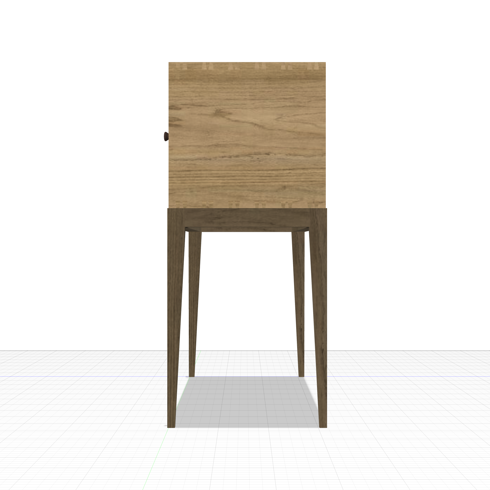
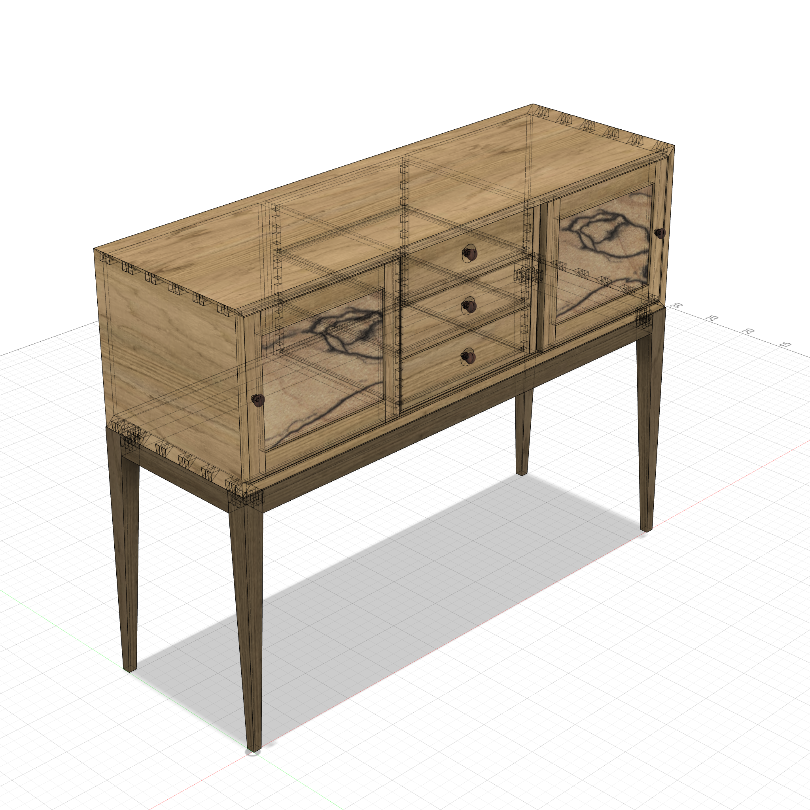
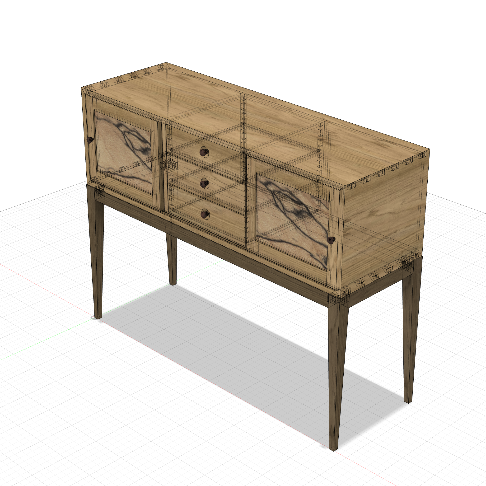

# Gochnour Sideboard (FWW #277)

Chris Gochnour's "Strong, Stunning Sideboard" from *Fine Woodworking* #277 — a contemporary
white-oak case piece, **48"W × 15-3/4"D × ~36-5/8"H**. Half-blind **mitered dovetails** join the
case (pins on the top/bottom boards, sockets in the sides, 45° miter at the show corners), a
**fumed-oak base** on tapered legs is doweled to the case, two **sliding frame-and-panel doors**
with seamless spalted-maple panels ride a grooved track, and a center bank of three **side-hung
dovetailed drawers** sits behind them.

  
  

### Transparent Views

  
  

---

**Script:** [`gochnour_sideboard.py`](gochnour_sideboard.py) — 68 bodies (4 legs, 4 rails, 16
loose-tenon dominoes, 9 case parts, 2 frame-and-panel doors + knobs/dowels, 3 dovetailed drawers +
knobs/dowels). Uses the `trapezoid_sketch` mitered-dovetail layout, `dovetailed_drawer`, `domino`,
and `dowel` templates.

### Techniques

- **Half-blind mitered dovetails** — one base pin pair per corner, JOIN'd then rectangular-patterned
  along the case depth (6 pairs/edge); 45° miters at the outer corners hide the end grain.
- **Double-domino leg↔rail joinery** — each of the 8 rail ends gets a pair of vertical loose tenons
  (wide face parallel to the show surface, per the grain rule), centered in the joint for strength.
  Built by mirroring: only the 4 front-left dominoes are modeled, then mirrored to the other corners,
  and a single leg is cut and mirrored so the mortises propagate.
- **Frame built in place** — the base stands `reveal` (1/8") proud of the case front & back; it's
  built directly at its final position (a `rect_far` helper dimensions the far corner so Fusion's
  unsigned distance dims don't flip the negative front edge) — no post-build Move.
- **Sliding-door track** — stopped grooves in the case top (deep) and bottom (shallow) with tongues
  on the door edges; the two coplanar doors slide in front of the recessed drawers.
- **Knob + dowel** — turned knobs only *contact* the surface (flush on the door stiles, ring-tangent
  to the drawers' spherical cove dishes); a separate dowel seats into both the knob and the board.
- **Wood appearances** — natural riftsawn white oak case; **fumed-oak** base (a copy of the library
  Oak, tinted + darkened via the bitmap RGB gain to mimic ammonia fuming); seamless spalted-maple
  door panels (real-size veneer, no tiling); rosewood knobs.

### Notes

- Build with `execute_script(clean=True)` — one document, reused each phase.
- `validate_design`: the carcase (legs + rails + case + captured doors) is one connected cluster;
  the three drawers are separate (removable). The only interferences are negligible numerical
  specks at the drawer bottom-groove (inherent to the drawer template).
