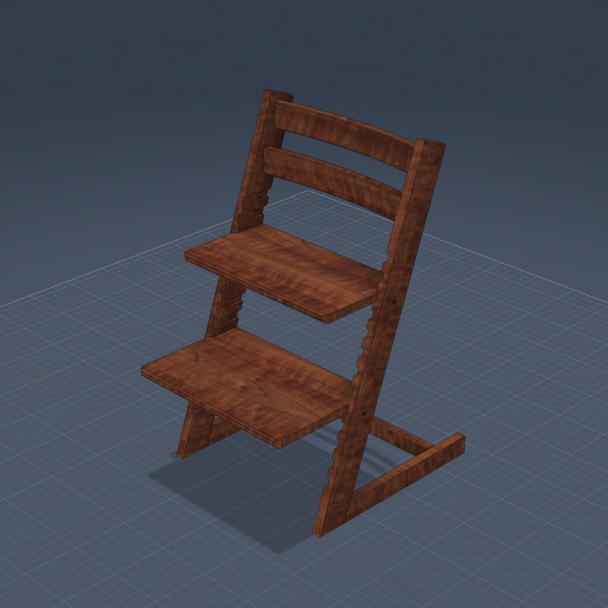
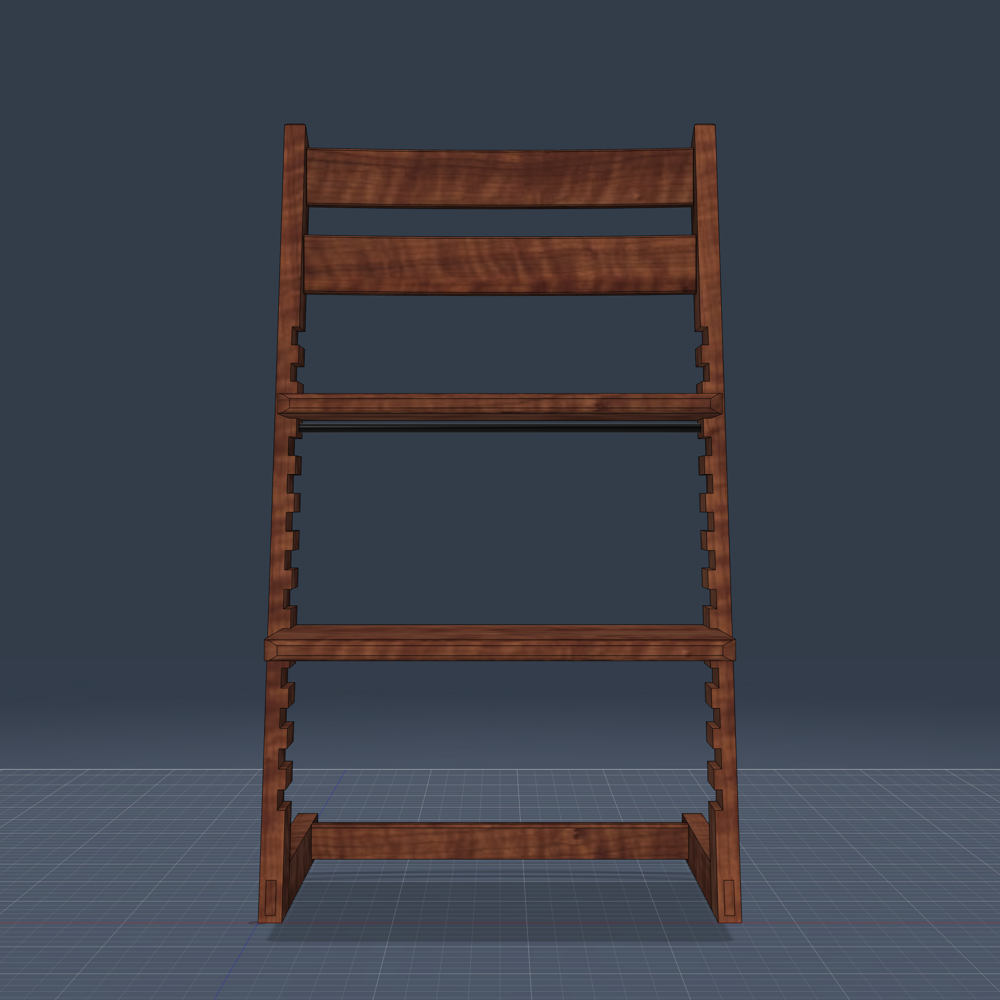
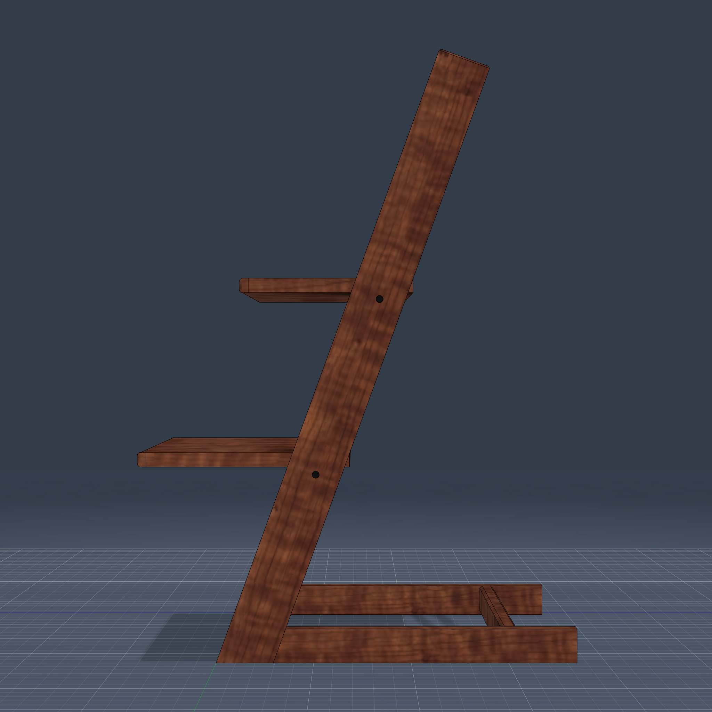

# Growth Chair — Tripp Trapp-Inspired Adjustable Children's Chair

Parametric adjustable kids chair inspired by the Stokke Tripp Trapp, built from
reference photos of a shop-made version.

## Design

Two leaning L-side frames carry everything: each frame is a leg board (leaning
20° from vertical, parallelogram profile with square-cut top) joined to a floor
runner by a **through mortise & tenon** whose end grain shows on the leg's
front edge. The runner is flush with the leg (`runner_thick = leg_thick`), so
no runner end grain is exposed at the joint.

Each leg's inner face carries a **13-slot horizontal dado ladder**, cut clear
through the leg's width so the notches show on both leg edges — the seat and
footrest are plain panels housed in any slot pair (`seat_slot` / `foot_slot`
parameters). Two gently curved back rails (thin-extruded centerline arc, blind
M&T into the legs, end mating faces centered on the leg at rail mid-height), a
floor stretcher (blind M&T into the runners, top flush with the runners, tenon
oriented wide-along-grain), and two black steel tie rods that cut their own
through-holes complete the chair.

| Front | Side |
|---|---|
|  |  |

## Validation

- `validate_design`: PASS — 1 connectivity cluster (9 structural bodies; the
  round tie rods are excluded), 0 interference, dependency tree PASS (every
  non-root sketch anchored to projected parent geometry), 8 declared
  mortise_tenon joints all pass the strength check.
- `validate_parametrics`: 37/38 leaf parameters robust at ±5%.
  **Exception: `n_slots`** — the ladder bulk-CUT's tool list is frozen at
  build time, so changing the slot count requires re-running the script
  (palette Rebuild), not a bare parameter recompute.

## Key Parameters (inches unless noted)

| Param | Value | Meaning |
|---|---|---|
| chair_h | 31.5 | overall height |
| leg_lean | 20 (deg) | leg lean from vertical |
| outer_w | 18 | width over runners |
| runner_len | 18.5 | floor runner length |
| n_slots / slot_pitch / ladder_z0 | 13 / 1.5 / 4 | slot ladder (rebuild on n_slots change) |
| seat_slot / foot_slot | 10 / 4 | 0-based slot index of each panel |
| seat_d / foot_d / panel_thick | 9 / 11 / 0.75 | panel sizes |
| groove_d | 0.3 | ladder dado depth |
| rail_h / rail_thick / rail_sag | 2.4 / 0.8 / 0.75 | curved back rails |
| rod_dia | 0.375 | steel tie rods |

Derived-for-alignment (change the driver, the follower stays flush):
`runner_thick = leg_thick`, `str_h = runner_h - str_z0`,
`rail1_yc = (rail1_z + rail_h/2) * lean_t + leg_run/2`.

## Build Notes (hard-won)

- **Face sketches auto-project the face boundary as SOLID lines** — the ladder
  slot rect on the leg's inner face was fragmented and the extrude grabbed the
  wrong fragment (slots 0–5 partially uncut). Fix: `sp.refs_to_construction(sk)`
  after `sketch_rect_model` on a BRepFace, then re-grab the profile.
- **Curved rail arcs**: constraining a drawn 3-point arc after the fact
  (concentric/radius/endpoint dims) repeatedly flipped it to the major arc.
  Robust recipe: pin three standalone sketch points first (2 dims each, drawn
  exactly at target), create the arc **on** those SketchPoints
  (`addByThreePoints(ptS, mid, ptE)` accepts SketchPoints), then one
  point-on-curve snap for the mid.
- **Thin extrude**: `setThinExtrude` is a no-op if `isThinExtrude=True` was set
  first (returns False; you silently get a 1cm default wall). Call
  `setThinExtrude(Center, thickness)` on a fresh input. Wall ends are square to
  the curve, so overlap the arc 0.05" into the legs and trim flush with a leg
  CUT (keepTool).
- **Thin-extrude wall side is NOT stable across rebuilds** (follows the arc's
  internal orientation). The script draws the rail arc on the CENTERLINE,
  measures which side the wall actually grew after the extrude, and if
  one-sided, parametrically shifts the pinned-point dims by rail_thick/2 to
  re-center — deterministic on every rebuild.
- Both rails + their tenons are ONE pattern along the leg-lean direction (a
  projected leg-front-face sketch line is a valid `directionOneEntity`); the
  runtime checks the first instance's z and flips the spacing sign if needed.
  Same trick patterns the two tie rods.
- Footrest cantilevers ahead of the legs → its `y0` expression is negative;
  anchored-mode offset dims need `abs(...)` or the panel flips to +y.
- With the runner flush, the legs' outer faces sit at x=0 — anchored sketches
  must anchor to the leg's bottom-REAR corner (a (0,0) anchor projects onto
  the sketch origin and is silently excluded → parts flip).
- Runner tenon at 0.5" thick gutted 57% of the 0.875" leg section
  (strength-gate WARNING) — 0.375 × 1.25 passes.
- Stretcher tenon oriented **wide along Y** (0.55 × 0.45) so the runner mortise
  runs with the runner's grain.

## Files

- `growth_chair.py` — full build script (`execute_script(clean=True)` with
  `script_path` set for palette sync)
- `model.json` — dependency tree + 8 declared mortise_tenon joints
