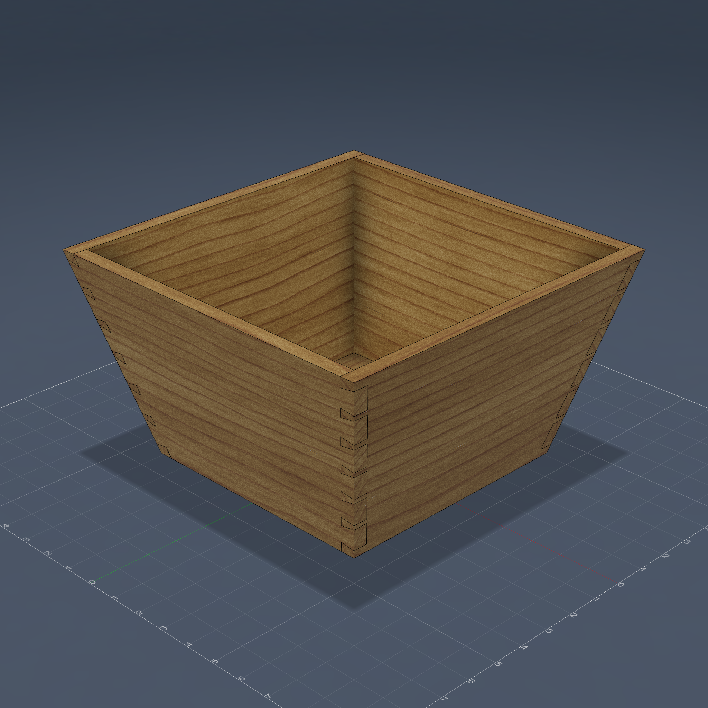
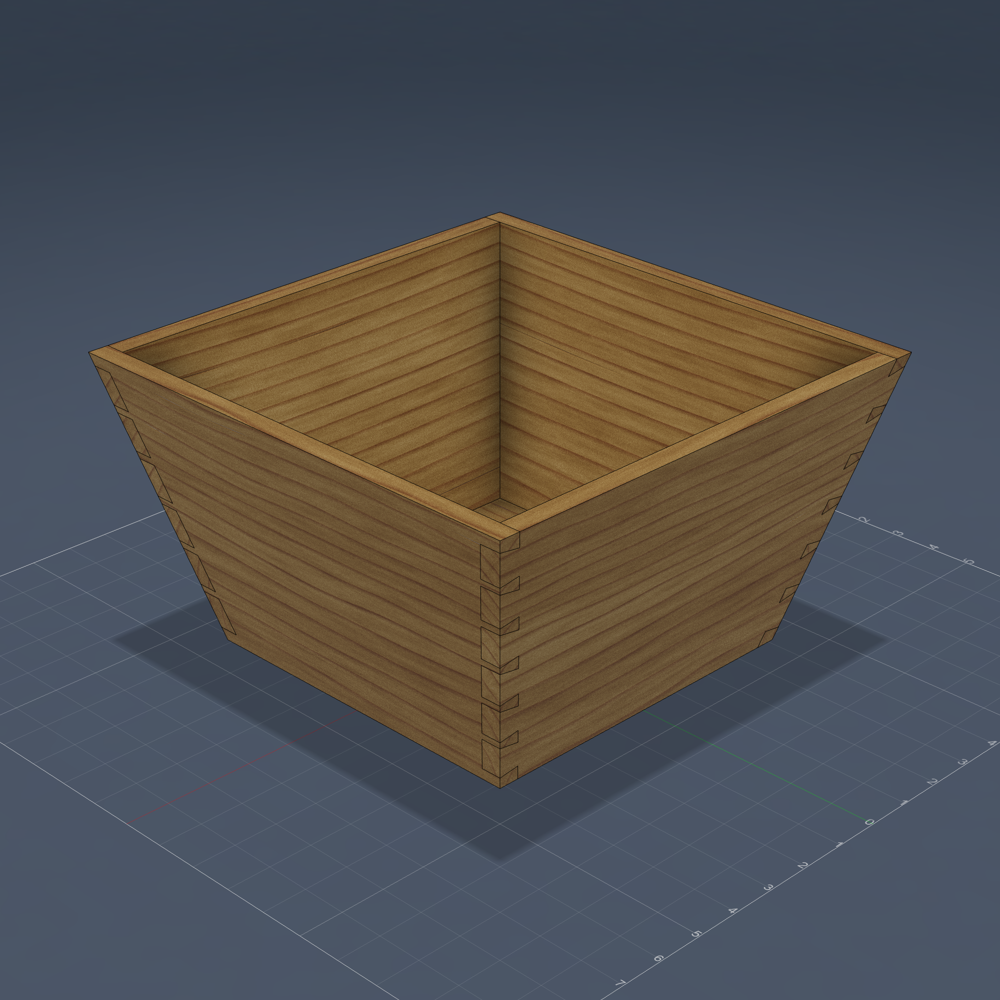
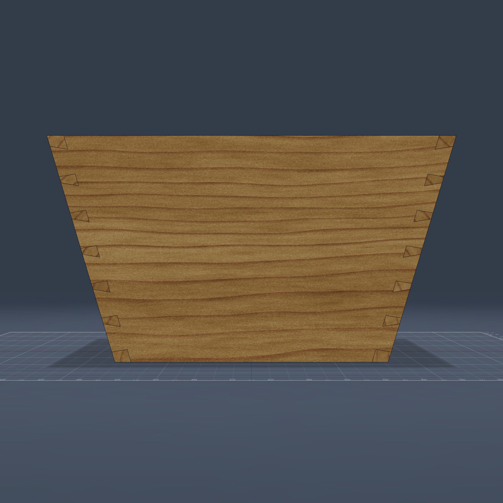

# Midou (米斗) — Tapered Through-Dovetail Rice Measure

A traditional Chinese rice measure modeled from a reference photo: a lidless
square frustum — 30×30 cm at the rim, 21×21 cm at the foot, 17 cm tall — with
**through dovetails on all four splayed corners** and a rabbeted bottom panel.
Every side leans outward 14.8°, so nothing about this joint is square: the
tail baselines follow the tilted shoulder line (each tail's two flanks have
different lengths), and the pins run horizontally with the side boards' grain.

> Built with **Claude Fable 5** in **3 prompts**: (1) the initial build from
> the reference photo, (2) joinery refinements — grain-parallel pins, edge
> padding, rabbeted bottom — and (3) making the whole model survive live
> parameter edits after `top_w 30→25` broke the first construction.



<p float="left">
  
  
</p>

## Example Prompt

```
/woodworking
参考图片设计一个米斗，本质上是一个没有盖子的燕尾盒子，但是上端和下端的宽度不同，
上端边长30cm下端边长21cm。侧边纤维为水平，侧边的两端不垂直侧边的上下边，但是做
燕尾的时候每一个燕尾方向还是平行于侧边纤维方向 … 注意不要单独做每一个燕尾，用
pattern复制。复制燕尾的时候需要考虑侧边角度，沿着侧边线做pattern。
```

(Design a rice measure from the photo — a lidless dovetail box whose top and
bottom widths differ; grain horizontal; each tail parallel to the grain even
though the board ends aren't square; replicate tails with a pattern that
follows the slanted edge.)

Follow-up prompts refined the joint (pins swept along the pin board's fiber
direction, `dt_pad` edge padding, a tilted-shoulder rabbet under the bottom
panel) and rebuilt the construction to be fully recompute-safe.

---

## How to Run

**Via MCP (recommended):** If you have the [Fusion 360 MCP add-in](../../mcp/README.md) configured, just ask Claude to run it.

**Manual:** Fusion 360 > Utilities > Scripts and Add-Ins > (+) > select this folder > Run

**Script:** [`midou.py`](midou.py)

> This construction is now packaged as the reusable
> [`splayed_dovetail` template](../../woodworking/templates/splayed_dovetail.py)
> (`frame()` / `boards()` / `corners()`) — see
> [`docs/joinery/splayed-dovetail.md`](../../docs/joinery/splayed-dovetail.md).

---

## Why this build is interesting

**Splayed-corner dovetails, fully parametric.** This is the "compound splay"
case the anchoring docs flag as hard: every joint sits on a tilted interface.
The trick that makes it tractable — and live-editable — is that the
horizontal X/Y directions lie *inside* every mating plane (shoulder planes,
face planes, box-corner planes). So:

- **Every board is one exact oblique sweep** — its outer-face outline swept
  along a horizontal axis. End faces land flush on the mating planes *by
  construction*: zero SplitBody, zero trim features. Note the tail boards
  (Front/Back, ending at the shoulder planes) and pin boards (Left/Right,
  spanning the full outer width to the box corner lines) are **different
  shapes** — two sweeps + two mirrors, not a circular pattern.
- **One dovetail drawn, the rest patterned**: the fan trapezoid's base sits
  on the slanted shoulder reference line (unequal flank lengths fall out of
  the coincident + angular constraints), its tip corners sit on the box
  corner line (flush tip, no trim), and a **body pattern along the slanted
  shoulder line** replicates it — translation along the interface line maps
  every mating plane onto itself.
- **Pins parallel to their grain**: the tail block is *swept* along the pin
  board's fiber direction (±Y) instead of extruded along the tail board's
  face normal, so pins and sockets run with the wood.
- **Rabbeted bottom with tilted shoulders**: the panel's lower half is
  taper-extruded at exactly `tilt`, so the rabbet shoulder mates flush
  against the leaning inner walls; only the upper half enters the grooves —
  which the panel cuts for itself.

Change `top_w`, `bot_w`, `box_h`, `board_t`, `dt_pad`, `dt_tail_w` or the
panel parameters in **Modify → Change Parameters** and the whole joint
recomputes — verified live at `top_w` 25↔30 and `box_h` 17↔20.
(`dt_count` still needs a script re-run: mirrors capture a fixed body set.)

## Dimensions

All exposed as User Parameters (Modify > Change Parameters):

| Parameter | Default | Description |
|-----------|---------|-------------|
| `top_w` | 30 cm | Outer edge length at the rim |
| `bot_w` | 21 cm | Outer edge length at the foot |
| `box_h` | 17 cm | Vertical height (`tilt` derived: ≈14.8°) |
| `board_t` | 1.2 cm | Board thickness ⊥ face |
| `dt_count` | 6 | Tails per corner (re-run script after changing) |
| `dt_tail_w` | 1.9 cm | Tail base width along the joint line |
| `dt_angle` | 10 deg | Dovetail flank angle |
| `dt_pad` | 0.6 cm | Edge padding beyond the half-pin at both joint ends |
| `panel_t` | 0.8 cm | Bottom panel thickness (upper half housed) |
| `panel_z0` | 1.0 cm | Panel underside height |
| `groove_d` | 0.5 cm | Panel housing depth into the boards |

## Hard-won API notes

- Angular dimensions can measure the **supplement** when a projected
  reference line comes back direction-reversed — read the as-drawn value and
  assign `expr` or `180° − expr` (`set_ang` in the script).
- `feature.bodies` on pattern/mirror features **includes the inputs** —
  dedupe by `entityToken` before building CUT/JOIN tool lists.
- A pattern template's sketch must **not project edges of bodies that later
  get cut** by the patterned copies — the pattern recomputes mid-timeline and
  replays its history, spawning ghost bodies. Anchor template sketches to
  base-sketch construction geometry instead.
