# Classic Ming-Style Side Table (平头案)

A parametric side table inspired by classical Chinese Ming-dynasty furniture, modeled in Fusion 360 via Python script. 28"L x 13.75"D x 30.875"H. Round splayed legs and a traditional joinery vocabulary throughout: a **格角榫 mitered mortise-and-tenon** top frame (concealed tenon, clean mitered corners), **hidden full-blind dovetails** at the apron corners, **mitered mortise-and-tenons** that meet inside the round legs at the shelf, floating frame-and-panel surfaces with sliding-dovetail battens, and carved spandrel brackets — almost every joint is concealed, reading as clean miters from the outside.

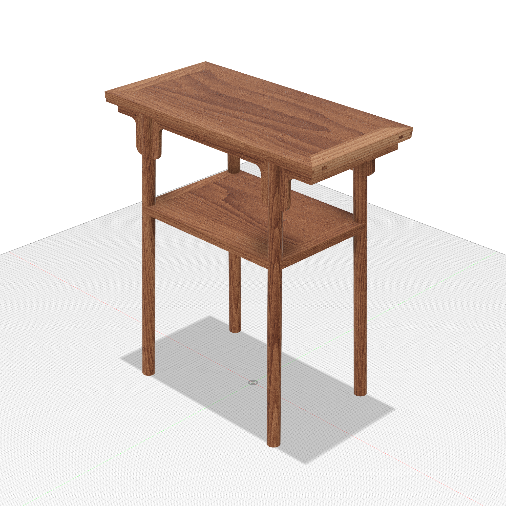

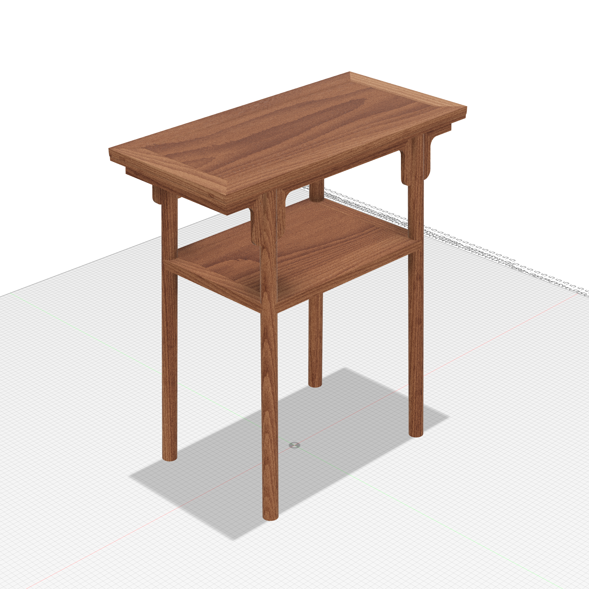

<p float="left">
  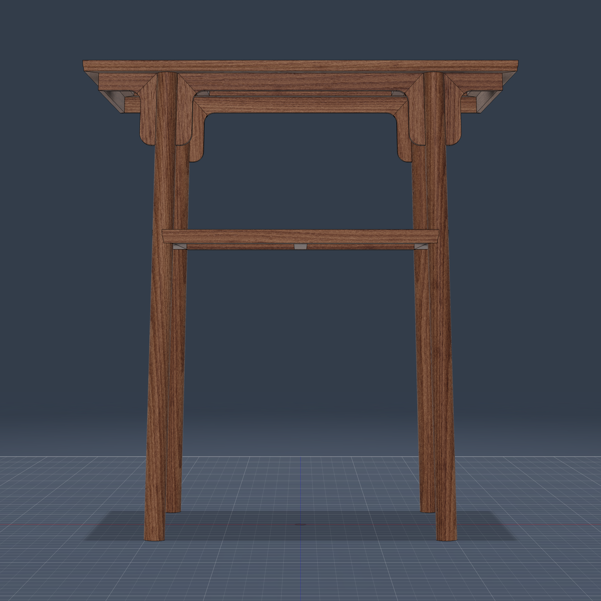
  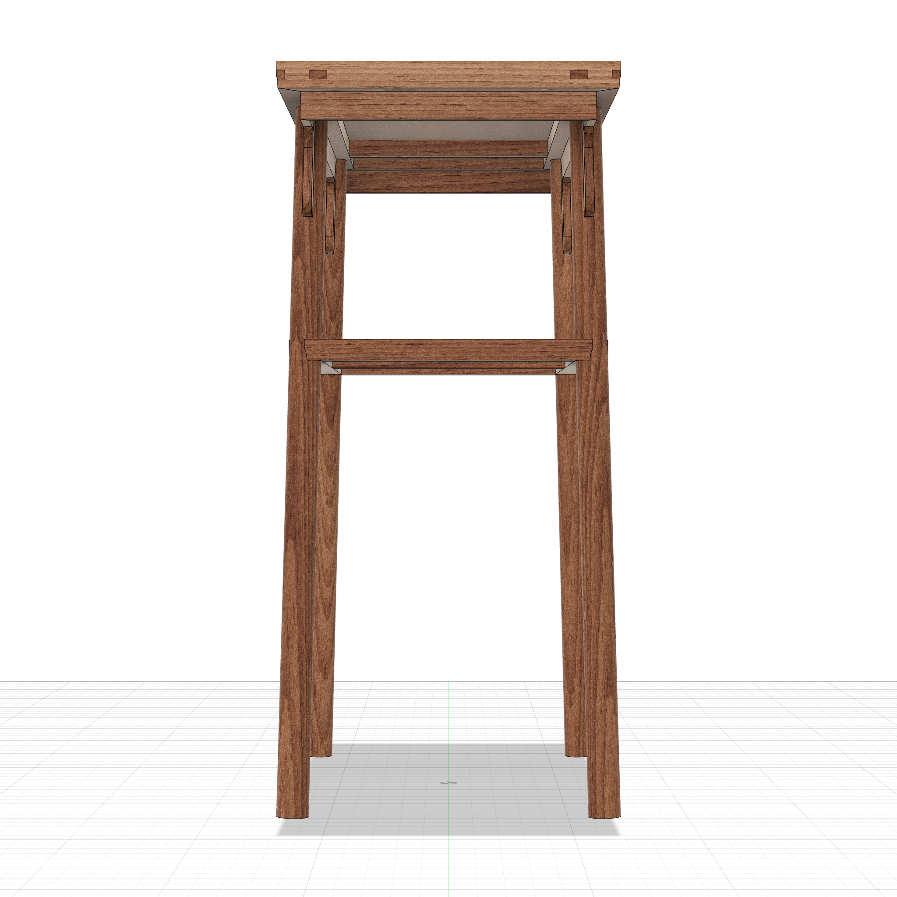
</p>

## Example Prompt

```
/woodworking
Build a classic Ming-style side table, 28"L x 13.75"D x 30.875"H, with round 1-3/8"
legs splayed 1.5 degrees. Top: a floating frame-and-panel with sliding-dovetail battens
and 格角榫 mitered mortise-and-tenon corners (concealed tenon, mitered outside) plus a
hollow spline edge molding. Aprons: a band with carved spandrel brackets, joined corner
to corner with hidden full-blind dovetails. Shelf: a floating frame-and-panel whose rails
are coped to the round legs with full-height mitered tenons that meet inside each leg.
Fully parametric.
```

### Appearance

```
apply_appearance(species="cherry")
```

---

## How to Run

**Via MCP (recommended):** If you have the [Fusion 360 MCP add-in](../../mcp/README.md) configured, just ask Claude to run it.

**Manual:** Fusion 360 > Utilities > Scripts and Add-Ins > (+) > select this folder > Run

**Script:** [`ming_table.py`](ming_table.py)

---

## Dimensions

All exposed as User Parameters (Modify > Change Parameters):

| Parameter | Default | Description |
|-----------|---------|-------------|
| `table_l` | 28 in | Overall table length (X) |
| `table_d` | 13.75 in | Overall table depth (Y) |
| `table_h` | 30.875 in | Overall height, floor to top surface |
| `splay` | 1.5 deg | Leg splay/rake angle from vertical, per axis |
| `tf_t` | 1 1/16 in | Top-frame stock thickness (vertical) |
| `tf_w` | 2 in | Top-frame member width |
| `panel_t` | 0.3125 in | Top-panel thickness |
| `tongue_ov` | 0.25 in | Panel tongue protrusion into the frame groove |
| `tf_cham_d` | 0.104 in | Top-frame edge-profile depth (inward from outer face) |
| `tf_cham_h` | tf_t | Top-frame edge-profile height (up from bottom face) |
| `tf_tn_d` | tf_w·1.5/3.5 | 格角榫 tenon depth into the stile (template ratio) |
| `tf_tn_st` | tf_w·1.2/3.5 | 格角榫 tenon shoulder at the inner edge |
| `tf_tn_sb` | tf_w·0.6/3.5 | 格角榫 tenon shoulder at the outer edge |
| `leg_dia` | 1.375 in | Leg diameter (round leg) |
| `leg_setback_x` | 5.375 in | Distance each leg is set in from the table END (X) |
| `leg_setback_y` | 1.125 in | Distance each leg is set in from the table SIDE (Y) |
| `leg_embed` | 0.5 in | How far the leg top embeds up into the frame |
| `apron_t` | 0.375 in | Apron stock thickness |
| `apron_w` | 1.125 in | Apron height (band width) |
| `fbd_lip` | 0.1 in | Hidden-dovetail lip thickness |
| `fbd_pad` | 0.1 in | Hidden-dovetail end padding |
| `fbd_angle` | 10 deg | Hidden-dovetail flank angle |
| `fbd_tail_w` | 0.225 in | Dovetail tail width at the wide face |
| `fbd_tail_count` | 2 | Number of dovetail tails per corner |
| `spandrel_depth` | 3 9/16 in | Spandrel vertical extent below the apron |
| `shelf_z` | 20 in | Shelf top height above the floor |
| `sf_t` | 0.875 in | Shelf-frame stock thickness |
| `sf_w` | 1.375 in | Shelf-frame member width |
| `sp_panel_t` | 0.3125 in | Shelf-panel thickness |
| `tenon_w` | 0.5 in | Shelf-rail tenon width |
| `sf_tn_h` | sf_t | Shelf-rail tenon height (full thickness, reaches top + bottom) |
| `bt_w` | 0.875 in | Top-batten width |
| `bt_off` | 7 in | Top-batten offset from center (+/-) |
| `bt_dt_base` | 0.5 in | Batten dovetail base width (narrow side) |
| `bt_dt_top` | 0.75 in | Batten dovetail top width (wide side) |

### Derived Parameters

| Parameter | Expression | Description |
|-----------|------------|-------------|
| `tf_bot` | `table_h - tf_t` | Z of the frame underside |
| `ltx` | `table_l / 2 - leg_setback_x` | Leg half-spread in X (legs at ±ltx) |
| `lty` | `table_d / 2 - leg_setback_y` | Leg half-spread in Y (legs at ±lty) |
| `leg_tip_z` | `tf_bot + leg_embed` | Z of the leg top |
| `fbd_socket` | `apron_t - fbd_lip` | Tail penetration depth into the long apron |
| `fbd_narrow_w` | `fbd_tail_w - 2 * fbd_socket * tan(fbd_angle)` | Tail narrow width |
| `fbd_pitch` | `(apron_w - 2 * fbd_pad) / fbd_tail_count` | Tail pitch (centered field) |

---

## Design

### Components and Features

| Component | Features |
|-----------|----------|
| **Legs** | FL round leg swept with 1.5° splay, top let into the frame; mirror to all 4 |
| **Top** | Frame-and-panel: long rails + short stiles joined with **格角榫 mitered mortise-and-tenons** (concealed tenon, 45° miter outside), grooved for a floating panel with one-shoulder tongues, two sliding-dovetail battens underneath; hollow spline edge molding on all 4 outer bottom edges |
| **Aprons** | Long-apron band + carved spandrel brackets joined via internal 1/8" tongues; short aprons lofted between the long-apron miter faces; **hidden full-blind dovetails** at all 4 corners |
| **Shelf** | Frame-and-panel mid shelf; rails coped (rounded shoulder) to the round legs with **full-height mitered tenons that meet inside each leg** and tenon into the long rail; floating panel with a sliding-dovetail batten |

### Key Techniques

- **格角榫 (mitered mortise-and-tenon)** — the top-frame corners (ported from the `chinese_frame_and_panel` template). Each long rail is a full box; the **top and bottom thirds** of its thickness get a 45° miter, while the **middle third** keeps a shouldered tenon. The stiles are then CUT by the shaped rails, inheriting the mating miter + mortise. Outside reads as a clean miter; the tenon is concealed.
- **Hidden (full-blind) dovetail** — the apron corners. Tails on the short aprons drop into sockets in the long aprons behind a concealing end lip, so nothing shows from outside. Built once on the front-left corner and **mirrored to all four**.
- **Mitered tenons into a round leg** — at the shelf, the long- and short-rail tenons are coped to the round leg and **mitered on the leg-center diagonal so they meet face-to-face inside the leg** (instead of colliding). The short rail is coped to the long rail *before* its tenon is built, then the tenon cuts its own mortise into the long rail — so the long rail's cope never trims the tenon.
- **Splayed round legs** — each leg is swept along a raked centerline (1.5° per axis); apron and shelf positions are derived so they track the lean parametrically.
- **Floating frame-and-panel** (top and shelf) — grooved frames with one-shoulder panel tongues; sliding-dovetail battens (穿带) keep the panels flat while allowing wood movement.
- **Spandrel brackets** — carved brackets under the apron, joined to the band with internal tongues so the apron + spandrels act as one member at each corner.
- **Spline edge molding** — a custom fitted-spline cutter sweeps a hollow molding along the top-frame outer bottom edge; cut on every member so it wraps the corners and trims the through-tenons flush.
- **Mirror-based replication** — symmetric parts (legs, frame members, aprons, shelf rails, battens, dovetails) are built once and mirrored, so the whole piece rebuilds from a single corner's geometry.

### Joinery names (傳統榫卯)

| Location | Joint | Chinese term | What it is |
|----------|-------|--------------|------------|
| Top-frame corners | Mitered mortise-and-tenon | 格角榫 | 45° miter shows outside; the tenon is concealed in the middle third of the thickness. |
| Apron corners | Full-blind (secret mitered) dovetail | 闷齿斗角榫 | Tails on the short apron hide in sockets in the long apron behind a lip — invisible outside. |
| Apron → leg | Forked/slotted leg clamping the apron | 格角牙夹头榫 | The leg is slotted to "clamp" the apron; a mitered spandrel fills the corner. |
| Shelf rails → round legs | Round-wraps-round, coped + mitered tenons | 圆包圆内榫格 | Rails coped to wrap the round leg; full-height tenons miter together inside the leg. |
| Panel → frame | Groove-and-tongue | 舌榫（簧） | One-shoulder tongue riding in the frame groove. |
| Battens under panels | Sliding-dovetail batten | 穿带 | Tapered dovetail batten slid into a groove across the panel underside; keeps it flat. |
| Top & shelf fields | Frame-and-floating-panel | 攒边打槽装板 | Grooved frame captures a panel that floats for wood movement. |
| Spandrel brackets | Carved bracket (part) | 牙子 / 角牙 | Carved brackets joined to the apron band by internal 1/8" tongues. |

### See-through views

Because nearly every joint is concealed, here are transparent renders (the obscuring member made see-through, edge lines kept) that reveal the hidden joinery — two angles per joint.

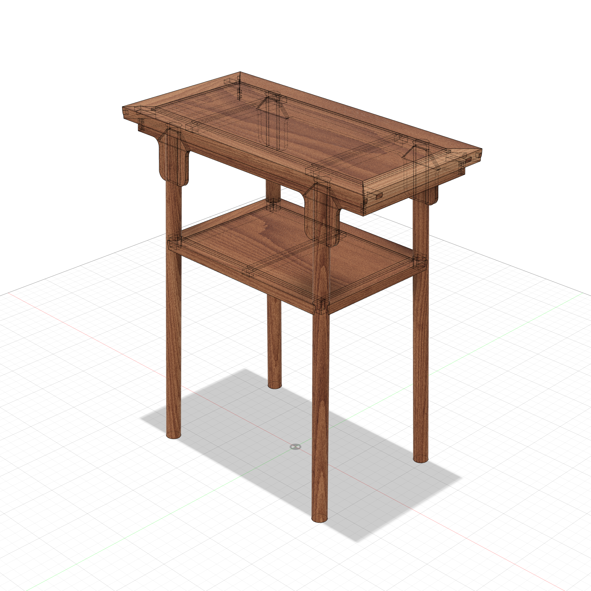

#### 格角榫 — top-frame mitered mortise-and-tenon

The rail's concealed tenon and the 45° miter, seen through the transparent stile.

<p float="left">
  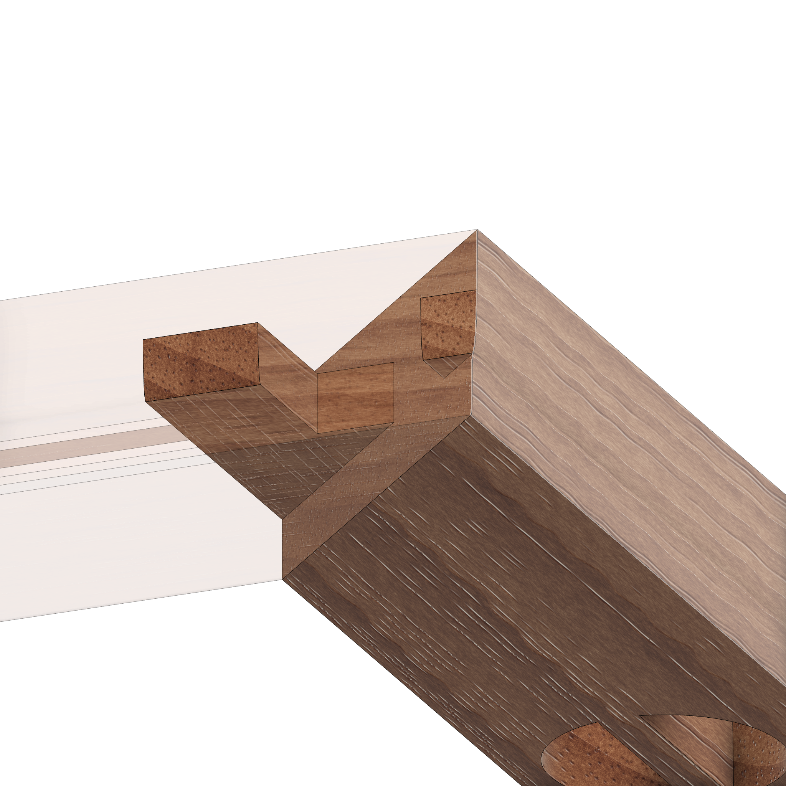
  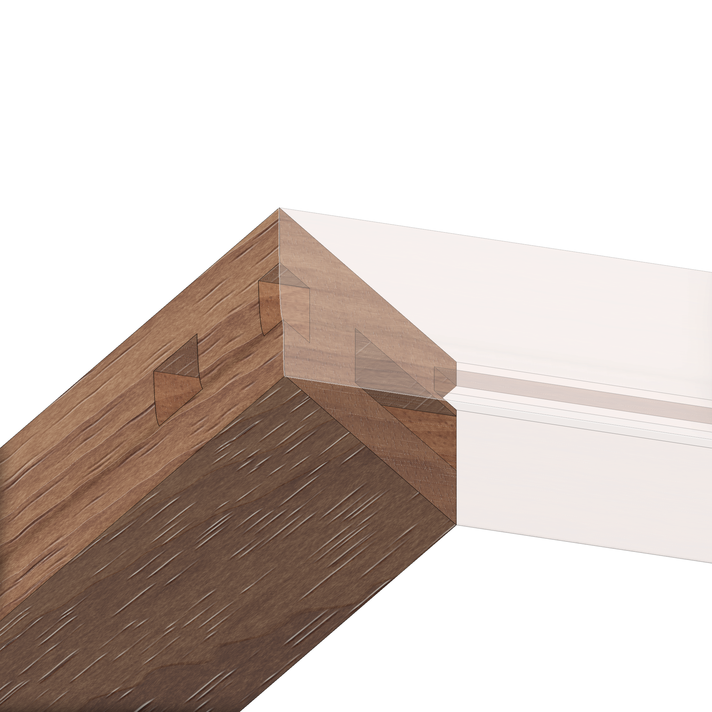
</p>

#### 闷齿斗角榫 — apron full-blind dovetail

The short apron's tails through the transparent long apron; then the long apron's sockets through the transparent short apron.

<p float="left">
  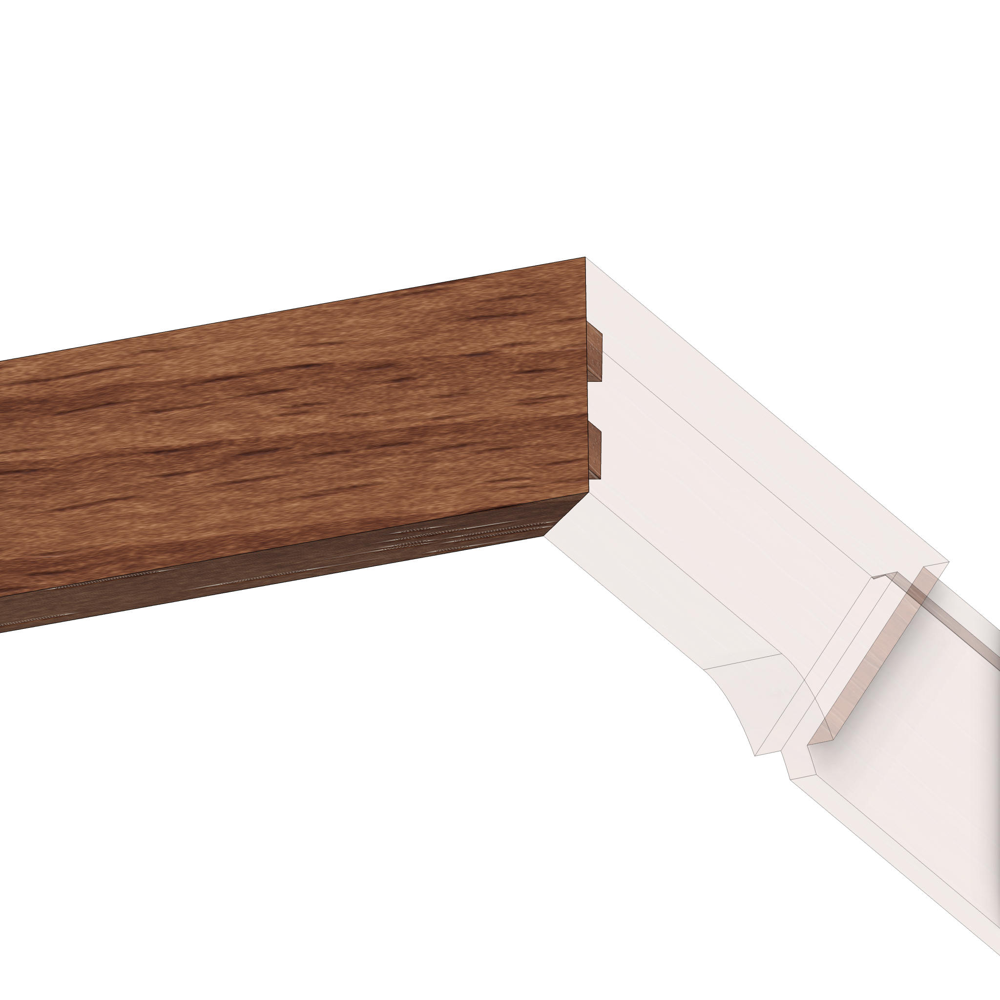
  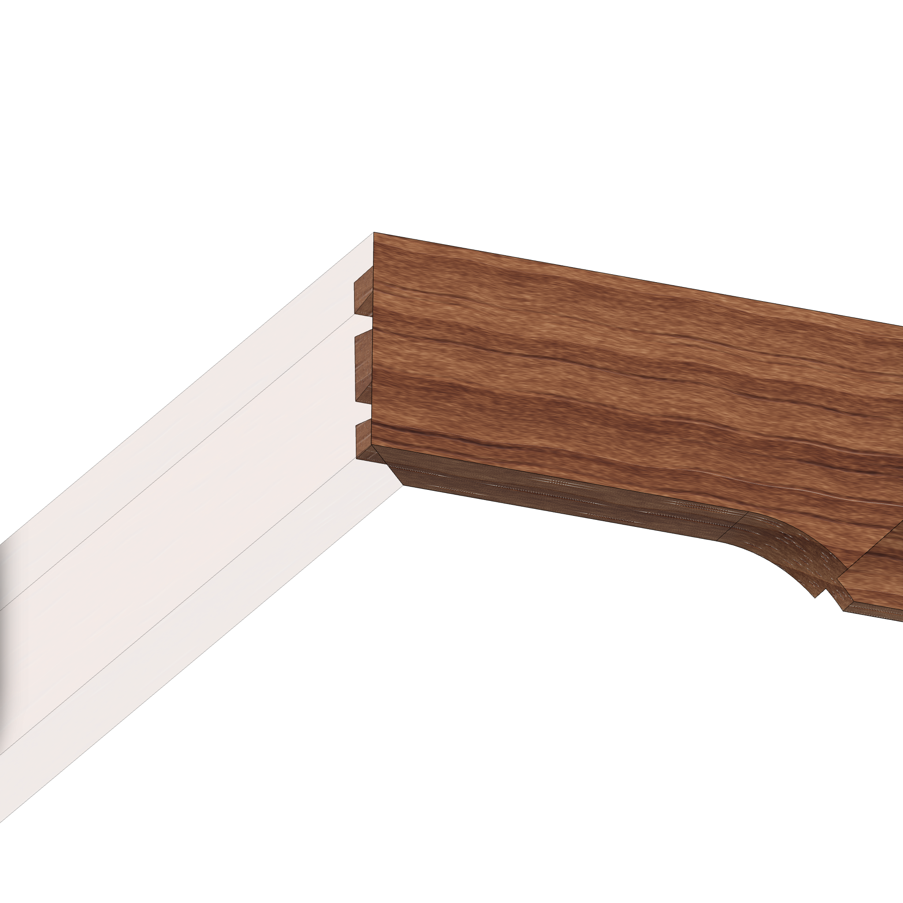
</p>

#### 格角牙夹头榫 — apron clamped by the leg

The long apron passing through the transparent leg; then the apron + mitered spandrel ghosted against the solid leg.

<p float="left">
  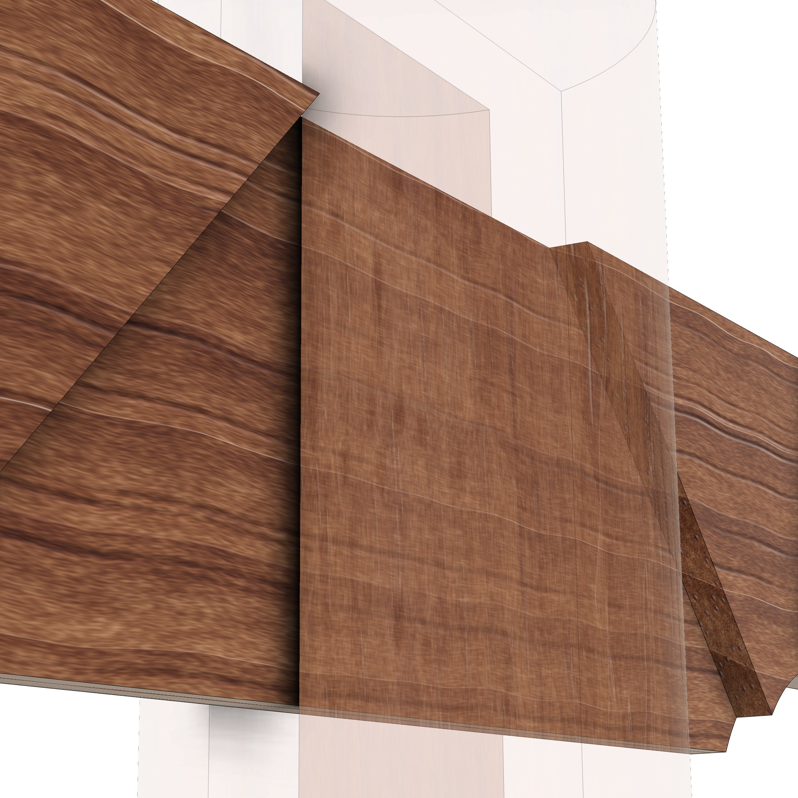
  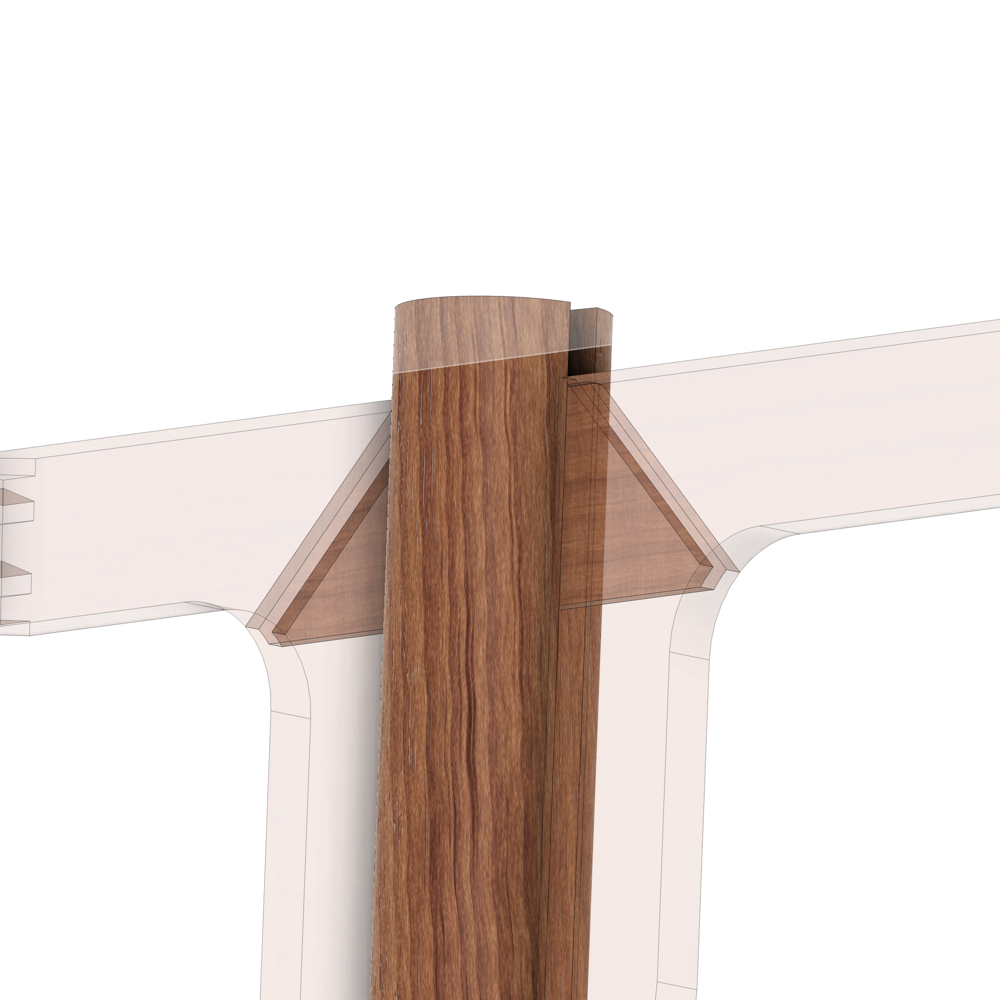
</p>

#### 圆包圆内榫格 — shelf rails mitered inside the round leg

The two full-height rail tenons mitering together inside the transparent leg.

<p float="left">
  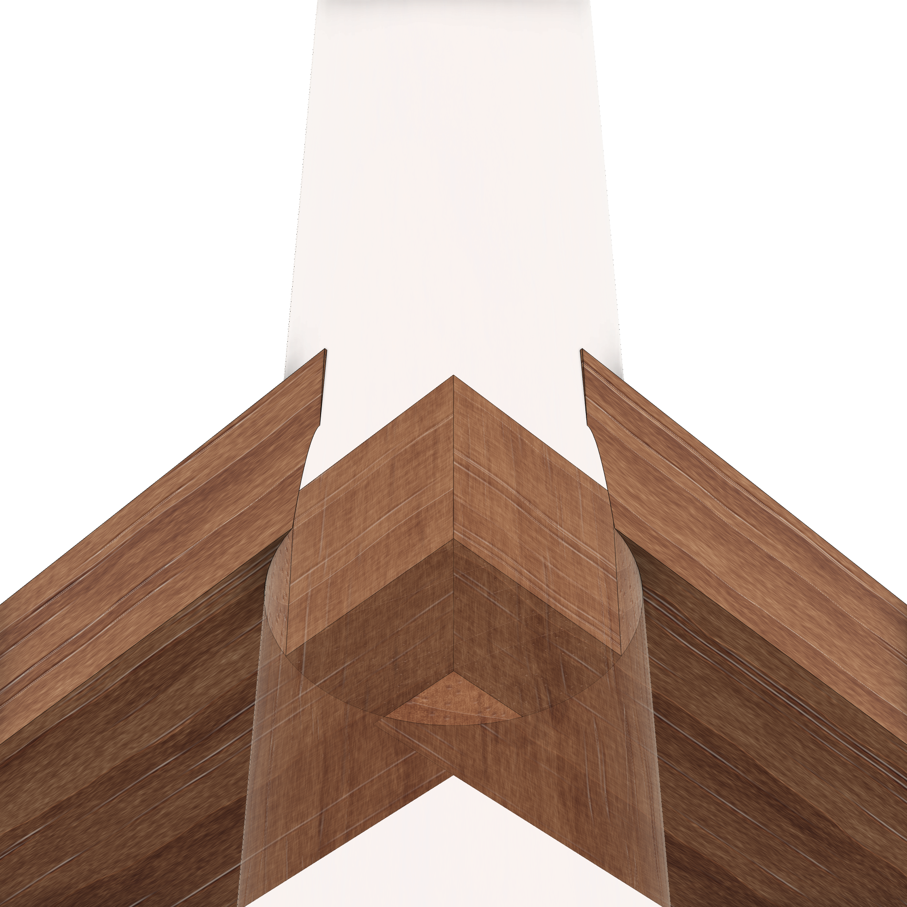
  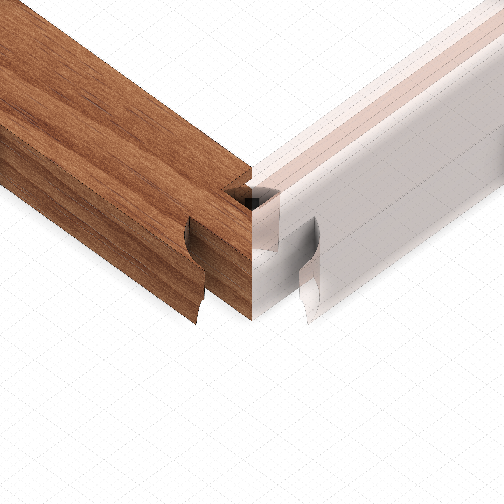
</p>

---

## Customization

Change any parameter in Fusion 360's Change Parameters dialog. Key relationships:

- `ltx = table_l / 2 - leg_setback_x` and `lty = table_d / 2 - leg_setback_y` — leg spread tracks the overall size and setbacks automatically.
- `fbd_socket = apron_t - fbd_lip` — tail depth follows apron thickness so the lip always conceals the joint.
- `fbd_pitch = (apron_w - 2 * fbd_pad) / fbd_tail_count` — the dovetail field stays centered in the apron height; change `fbd_tail_count` to add or remove tails.
- `leg_tip_z = tf_bot + leg_embed` — the leg top embeds a fixed amount into the frame regardless of height.

Changing `splay` re-rakes the legs and the derived apron/shelf positions follow. Changing `leg_dia`, `apron_w`, or `fbd_tail_count` updates the joinery proportions automatically.
