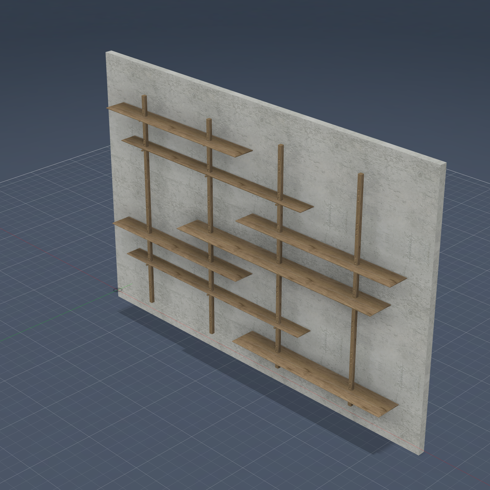
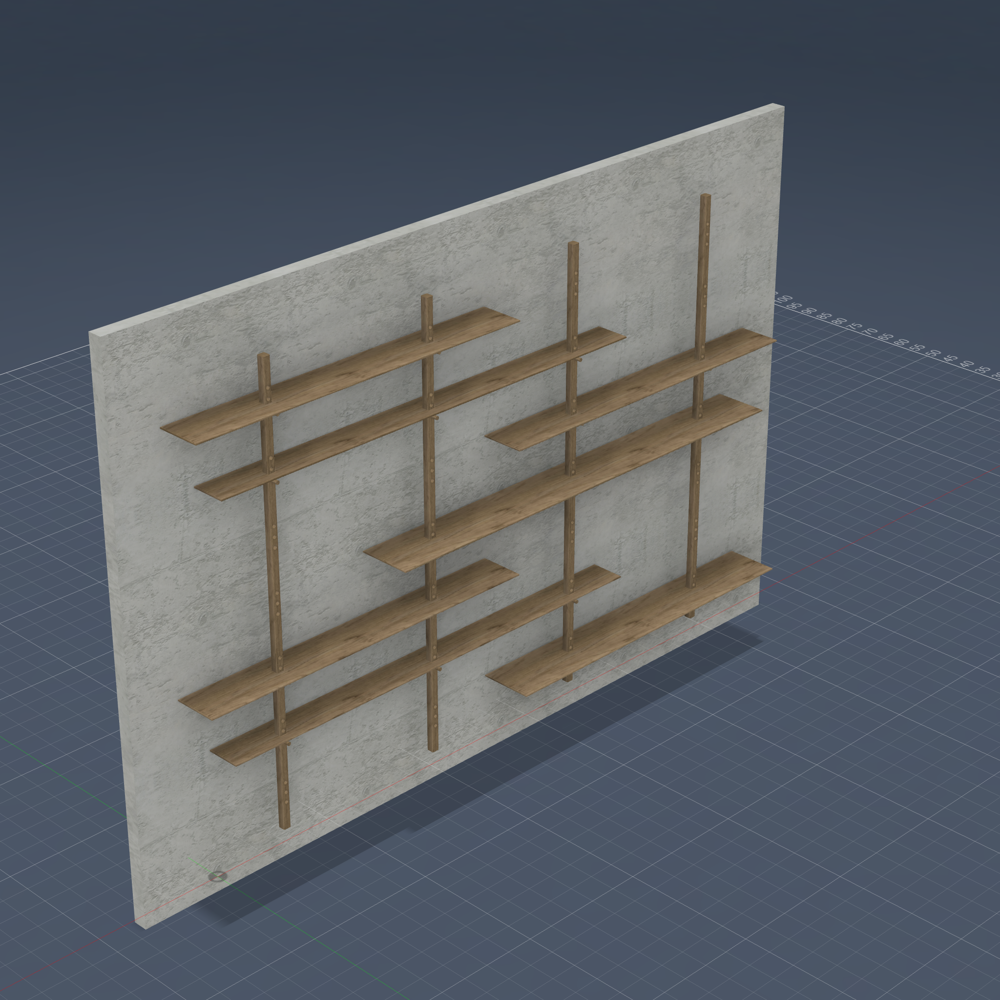
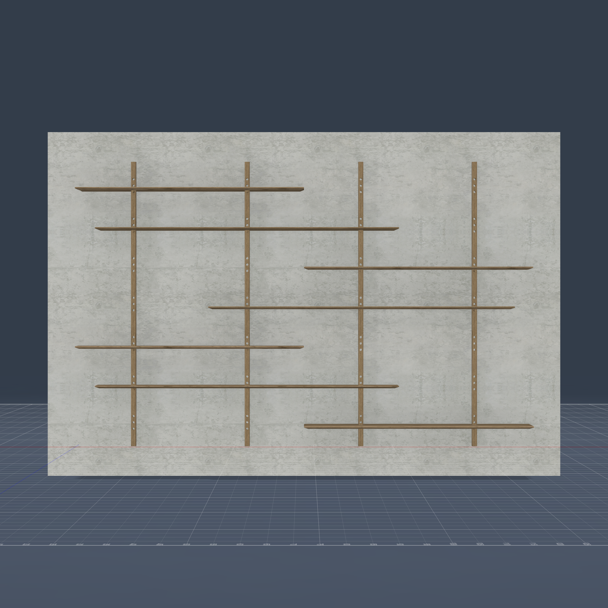

# Modular Wall Shelf System

Inspired by the **Modular Shelf System** by Charlie Peterson (*Fine Woodworking*,
Jan/Feb 2025) — an interpretation, not an exact reproduction. An adjustable, knock-down
wall unit. Hardwood posts carry the load to
the floor, staggered shelves slide over the posts through square through-mortises, and
thick dowel pegs set in trios of holes hold each shelf at its height.

> **Built in a single prompt.** This entire model — 4 posts, 7 staggered shelves, 17
> pegs, every peg hole, mortise, roundover and underbevel — was generated from one
> natural-language request ("build this modular wall shelf… reuse features, pattern them
> instead of create from scratch"), iterating autonomously through the build/validate
> loop with no hand-editing of the geometry.

  
  
  

## Highlights

- **Pattern-driven throughout** (the design brief): nothing repeated is hand-built.
  - Posts: build one, `body_pattern` ×4 along the 36" grid.
  - Peg holes: one tool cylinder → nested body patterns (trio ×3 @ 2" → trios ×7 @ 12.5"
    → posts ×4 = 84 tools) → one bulk CUT per post. 21 holes per post.
  - Mortises: one snug square tool per shelf, patterned along its posts, bulk CUT.
  - Pegs: one per shelf, patterned along its posts.
- **Snug through-mortises** sized to the post cross-section make real face contact with
  the posts — that is what carries the structural connectivity.
- **Staggered shelf array** (matching the article's suggested layout): 72"-long shelves
  engage 2 posts, 96"-long engage 3, alternating left/right up the wall.
- **Edge treatments:** ¼" roundovers on post corners + shelf top edges; 1¼"×½"
  underbevels on the shelf bottoms.

## Validation

- **Interference: 0** across all 28 bodies.
- **Connectivity: 1 cluster** — all 4 posts bridged by the 7 shelves (snug-mortise face
  contact, no weak joints). Pegs are seated dowels (round contact isn't planar, so
  they're excluded from the planar connectivity check).

## Components (28 bodies)

| Component | Bodies | Notes |
|-----------|--------|-------|
| Posts     | 4  | 1-9/16" sq × 90", 36" grid. 21 peg holes each (7 trios of 3). |
| Shelves   | 7  | 7/8" thick, staggered. Through-mortises 4-1/2" from back. |
| Pegs      | 17 | 3/4" dowels — 11 long (6"), 6 short (4-1/2", on the 7"-wide shelves). |

### Shelf array (bottom → top)
| # | Width | Length | Posts | Bottom Z |
|---|-------|--------|-------|----------|
| 1 | 11" | 72" | 0,1   | 5.875"  |
| 2 | 7"  | 96" | 1,2,3 | 18.375" |
| 3 | 9"  | 72" | 2,3   | 30.875" |
| 4 | 11" | 96" | 0,1,2 | 43.375" |
| 5 | 9"  | 72" | 0,1   | 55.875" |
| 6 | 7"  | 96" | 1,2,3 | 68.375" |
| 7 | 9"  | 72" | 2,3   | 80.875" |

## Parameters

Every dimension is parametric — change one in *Modify → Change Parameters* and the whole
unit recomputes: `post_size`, `post_len`, `post_spacing`, `n_posts`, `shelf_thick`,
`peg_dia`, `trio_pitch`/`peg_pitch`, `roundover`, `bevel_w`×`bevel_h`, and the shelf
width/length presets.

## Build notes

- **Positive coordinate space by design** — `sketch_rect_model`'s position dims take
  absolute distance and reflect negative coordinates to the +side; keeping everything ≥ 0
  avoids silent mis-alignment.
- **Tool-bodies + bulk CUT for repeated voids** — patterning an extrude-cut fails with
  `NO_TARGET_BODY` even with `AdjustPatternCompute`; patterning plain tool bodies and
  bulk-cutting is robust. Parts are patterned *before* their holes are cut.
- **Pegs slightly undersize** (peg_dia − 1/64") so they seat with zero interference.

## Not modeled
- Hidden steel wall angle-brackets (out of sight in the original).
- Hand-planed peg facets (a cosmetic hand-tool detail).

## Presentation backdrop
The build script adds a **concrete backdrop wall** (`WALL_back`) sized off the
furniture bounding box and centered behind the unit, so the product shots read as a
wall-hung installation. It's a separate `Backdrop` component, excluded from validation
by its `WALL_` prefix.

## Files
- `modular_wall_shelf.py` — parametric build script (run via `execute_script`, clean rebuild).
- `model.json` — dependency tree.
- `product_*.png` — rendered product shots (with the centered backdrop wall).
