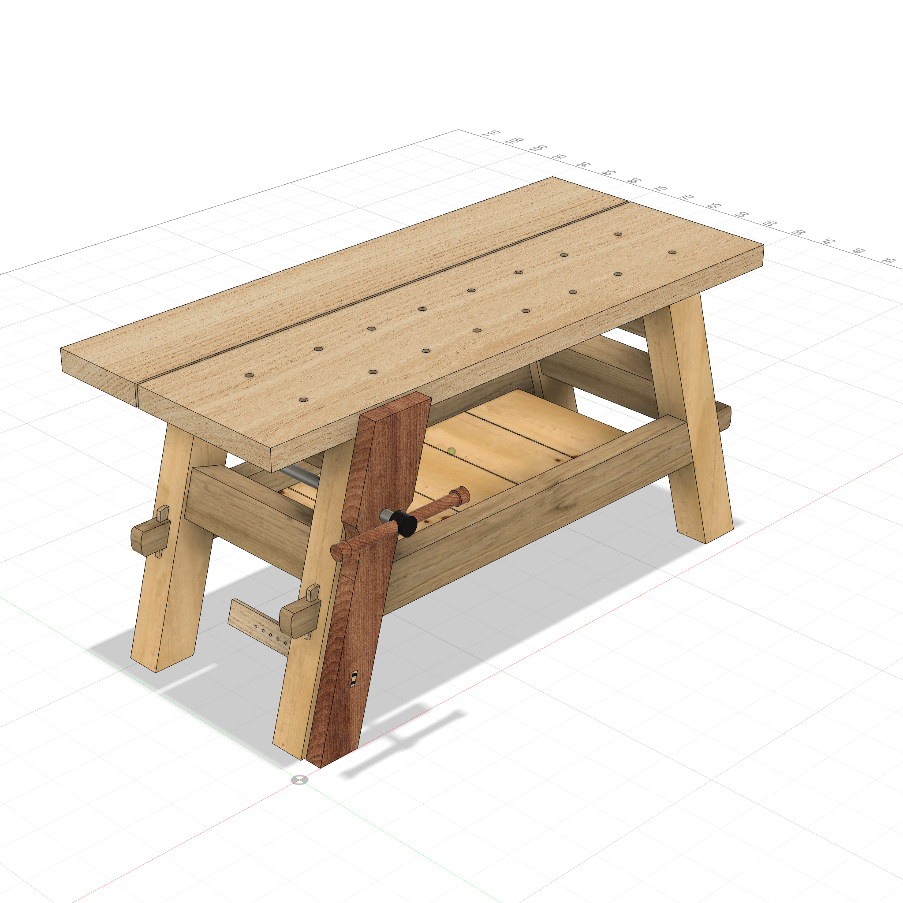
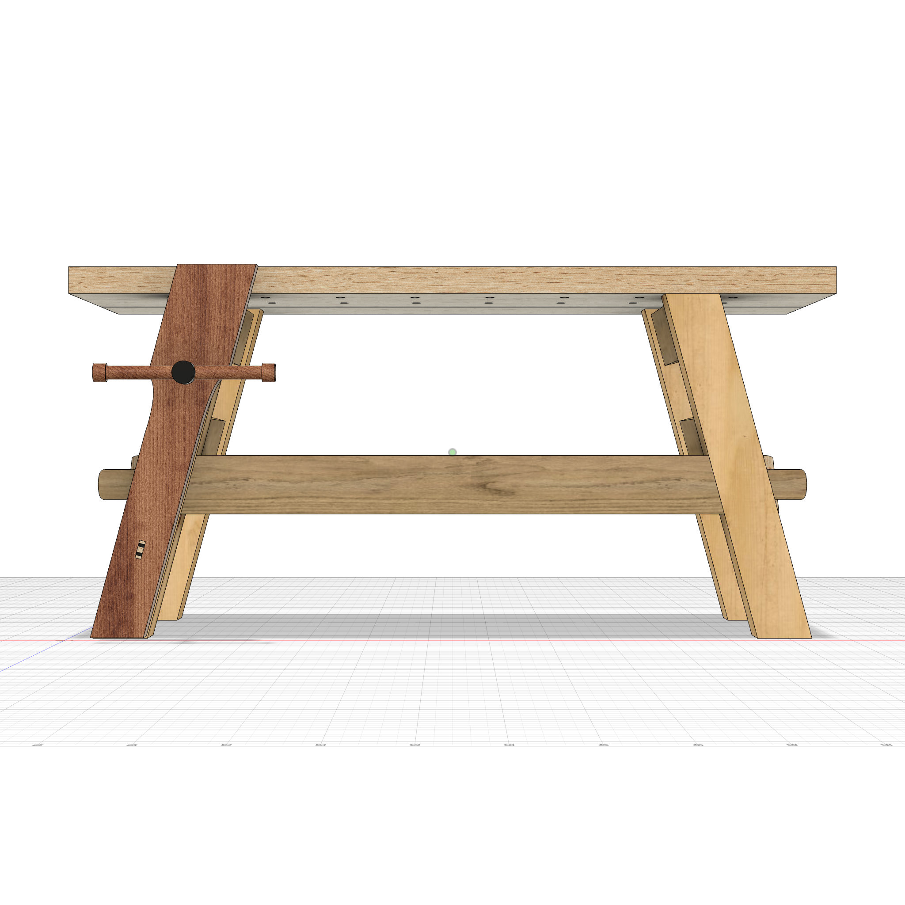
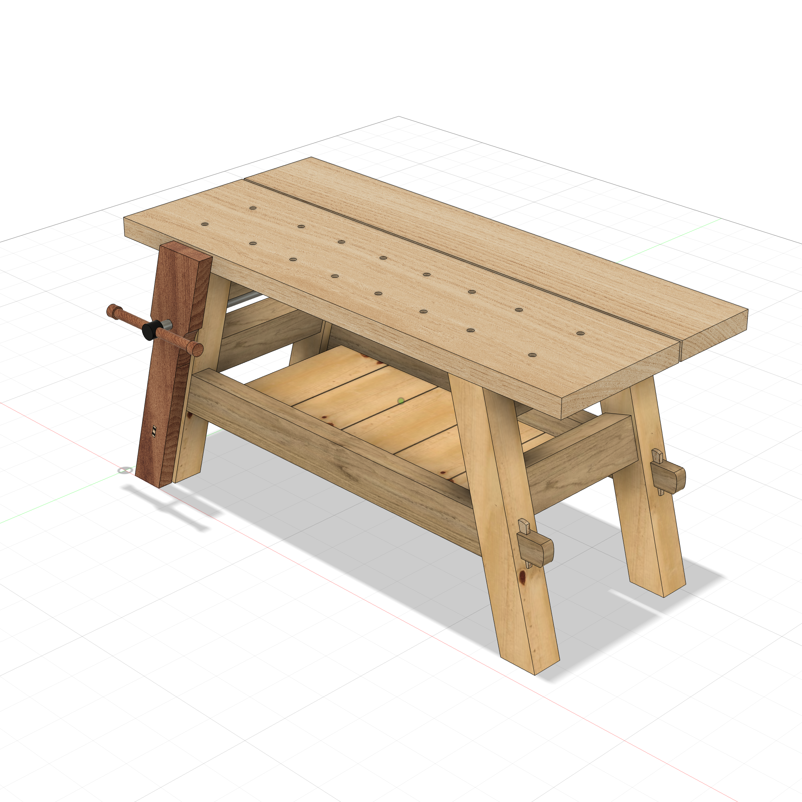
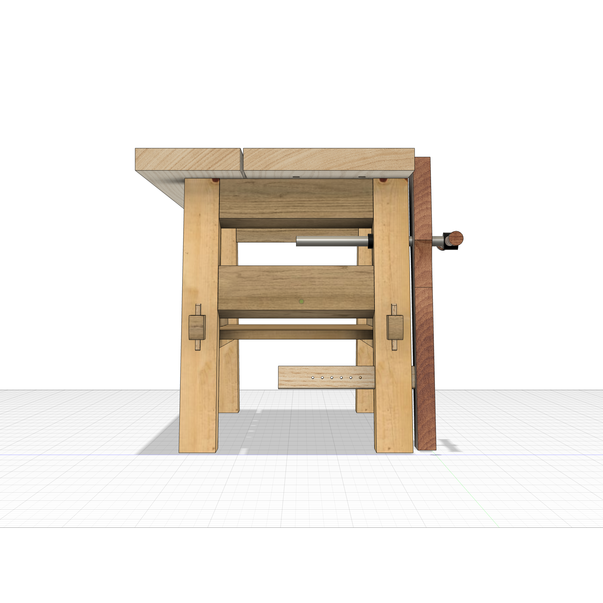

# Moravian Workbench

64"L x 28-1/4"W x 31"H. Parametric model inspired by Barry NM Dima's knock-down workbench
from *Fine Woodworking* #293 (Tools & Shops 2022) — a heavy, portable trestle
bench that marries Moravian splayed legs with Roubo proportions and timber-framing
knockdown joinery.

## Features

- **4 splayed legs** — angled 15° along the length (parallelogram-section bodies).
  Built as one template + mirrors to the four corners.
- **4 short stretchers** (upper + lower per trestle), front-to-back with bareface
  tenons into stopped leg mortises. Each is **tilted 15° about its long axis** so
  its faces run parallel to the leaning legs; the upper pair is beveled flush to
  the benchtop underside.
- **2 long stretchers** (front/back) — the knock-down joint: a beam with shoulders
  trimmed to the leaning leg faces and a reduced **through-tenon locked by a
  tapered tusk key**. The key's bearing edge follows the 15° splay so driving it
  down pulls the stretcher tight; rounded tenon nose + crowned key. Back row is an
  exact mirror.
- **Split benchtop** — front (17-5/16") + rear (10-5/8") boards, 5/16" gap. Two
  rows of 3/4" dog holes: a **rectangular pattern** between the trestles plus a
  column at **each cantilevered end** (16 holes), cut with a direction-proof
  symmetric extrude so a holdfast always drops into open space.
- **Lower shelf** — five boards on cleats glued to the long-stretcher inner faces.
- **Leg vise** on the front-left leg, **built directly in the leg-parallel
  orientation** (every sketch references the leaning leg centerline — no
  build-then-rotate):
  - **Curved chop** (wide 6-1/2" clamping head necking to a leg-width shaft via
    draggable spline coves), leaning collinear with the leg, top level with the
    benchtop and foot 1/4" off the floor.
  - **Parallel guide** — a **separate** on-edge body with a true rectangular
    cross-section rotated to the splay, joined to the chop by a **wedged
    through-tenon** (fox-wedge style): a reduced tenon trimmed flush at the
    clamping face, locked by **two black wedges** that follow the tenon's tilt.
    Runs back through a leg mortise with a row of drift-pin holes.
  - **Vise screw hardware** after the article's **Lee Valley 70G0152 tail-vise
    screw** (1-1/8" Acme): a steel rod, a front hub, a turned cross-handle (tommy
    bar) with end knobs, and a back collar — with **per-face appearances** (cherry
    handle matching the chop, satin-steel rod, black powder-coat hub + collar).
- **Fully parametric** — every dimension is a parameter expression; change one in
  the palette (or Modify ▸ Change Parameters) and the whole bench recomputes.

## Views

| Iso (vise side) | Front |
|:---:|:---:|
|  |  |

| Iso (back-right) | Left (vise end) |
|:---:|:---:|
|  |  |

## Key Parameters

| Parameter | Default | Description |
|-----------|---------|-------------|
| `bench_l` | 64 in | Overall length |
| `bench_h` | 31 in | Overall height |
| `depth` | 28-1/4 in | Top depth (front 17-5/16 + 5/16 gap + rear 10-5/8) |
| `splay` | 15 deg | Leg splay from vertical (in length) |
| `leg_w` × `leg_thick` | 4-3/8 × 3-3/4 in | Leg cross-section |
| `top_thick` | 2-1/4 in | Benchtop thickness |
| `ls_bot_z` | 10-3/8 in | Long-stretcher height off floor |
| `ss_lower_zc` | 16-1/2 in | Lower short-stretcher height |
| `screw_z` | 22 in | Vise-screw height |
| `guide_z` | 7-1/2 in | Parallel-guide height (low on the chop) |
| `n_dog` / `dog_end` | 6 / 8 in | Dog-hole columns between trestles / end-hole inset |

## Bodies (28)

| Component | Bodies |
|-----------|--------|
| Legs | Leg_LF, Leg_LB, Leg_RF, Leg_RB |
| ShortStretchers | SS_LU, SS_LL, SS_RU, SS_RL (tilted 15°, tenoned into legs) |
| LongStretchers | LS_F, LS_B (reduced through-tenons) |
| Wedges | Wedge_FL, Wedge_FR, Wedge_BL, Wedge_BR (tusk keys) |
| Top | Top_Front (16 dog holes), Top_Rear |
| Shelf | Cleat_F, Cleat_B, Shelf_Board_1 ×5 |
| LegVise | Vise_Chop, Vise_Screw (hardware), Parallel_Guide, Guide_Wedge_1, Guide_Wedge_2 |

`validate_design` → PASS: 1 connected cluster, 0 interferences, dependency tree
clean. (`Vise_Screw`, `Parallel_Guide`, and the two `Guide_Wedge_*` are untracked
in `model.json` — advisory only; all connect by real face contact.)

## Notes

- **Build leaning parts directly parallel to the reference** (slanted sketch
  against the leg centerline `lx(z)`), not axis-aligned + a Move — keeps the chop,
  guide, and hardware fully parametric in `splay`.
- **Wedged tenon vs tusk tenon** — the long stretchers use a *tusk* (crosswise key
  through a protruding tenon); the parallel guide uses a *fox-wedged* tenon (kerfs
  in the tenon end spread by driven wedges). Both are in the model.
- **One body, multiple materials** — `Vise_Screw` carries three appearances
  assigned at the face level (no body split), since `apply_appearance` is wood-only
  and body-level.

## Script

[moravian_workbench.py](moravian_workbench.py) · [model.json](model.json)
