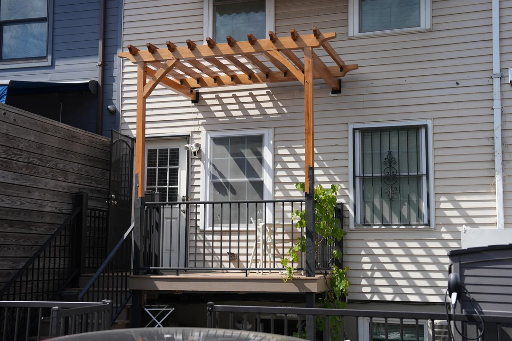
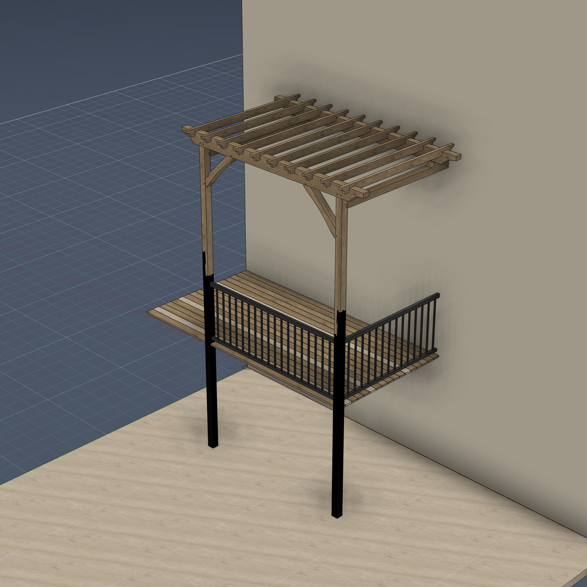
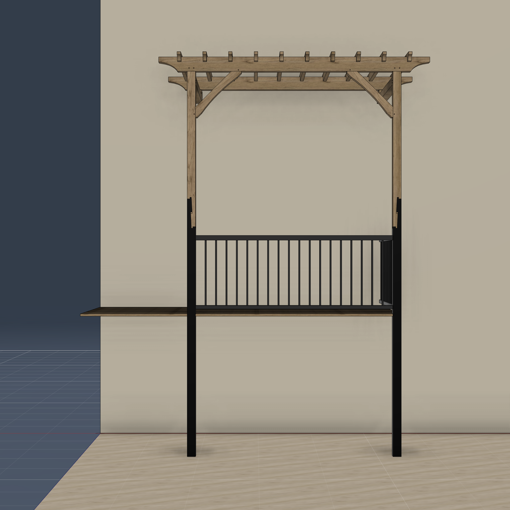
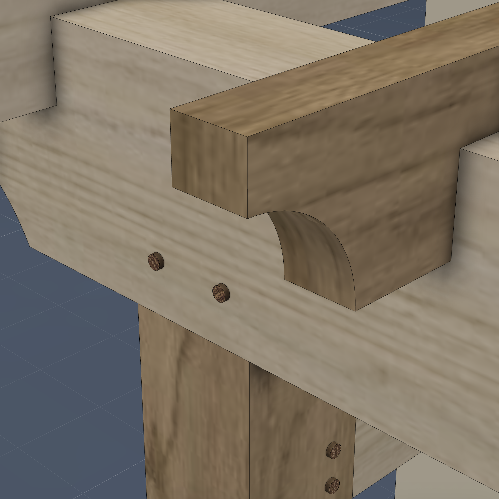

# Pergola with Attached Deck (Rebuild + Drawbore Joinery)

A parametric pergola and deck structure modeled in Fusion 360. 90"W x 60"D pergola at 168" height, with an attached 135"W x 70"D elevated deck, diagonal braces, scarf-jointed posts, and 10 rafters. The customized build adds teak drawbore mortise-and-tenon joinery, a black-aluminum deck railing, matte-black lower posts, and a model-tied joint-strength check.

**The actual build, by the maker** — a cedar pergola over a railed deck, attached to the house:



Modeled in Fusion 360 (joinery-detailed reconstruction):







## Customized build — drawbore joinery, railing, strength check

Beyond the bare rebuild ([`pergola.py`](pergola.py)), [`pergola_custom.py`](pergola_custom.py)
layers on a fully detailed, structurally-checked variant:

- **Drawbore mortise-and-tenon joinery** (teak pins, ⅜", 1/8" proud), placed with the
  `drawbore` template's rule — each pin runs *perpendicular through the mortise cheeks* at
  **1/3 of the tenon depth from the shoulder**, two per joint: post↔beam (×2),
  stretcher↔post (×2), plus a pin at each brace foot/head.
- **Black-aluminum deck railing** ([`pergola_railing.py`](pergola_railing.py)) — slim
  top/bottom rails + thin balusters, tied into the posts' inner faces.
- **Finishes** — white-oak frame, matte-black lower posts, beige clapboard backdrop.
- **Clean model** — every body named (`beam_front`, `stretcher_L`, `deck_board_01`, …);
  all sketches + construction geometry hidden.

Run it the same way as the base (Fusion's script runner sets `__file__`, so it `exec`s
`pergola.py` for the frame and resolves the sibling scripts automatically).

### Joinery registry + strength check

[`model.json`](model.json) declares every joint in a `joints` array (members, tenon
w×t×depth, species, peg count/dia). [`strength_check.py`](strength_check.py) reads it and
runs the [`joint_strength.py`](joint_strength.py) estimator — pure Python, no Fusion:

```bash
python3 strength_check.py
```

**Strength results** (white oak; ⅜" teak pins estimated as hardwood; first-order
engineering estimates, not a code-stamped analysis):

| Joint | Tenon (in) | Shear (gravity) | Bending | Drawbore pull-out (uplift) |
|-------|-----------|-----------------|---------|----------------------------|
| post ↔ beam (×2) | 3.5 × 1.0 × 4.0 | 7,000 lbf | 8,867 in-lbf | **795 lbf** (peg-shear-limited) |
| stretcher ↔ post (×2) | 2.0 × 1.0 × 2.5 | 4,000 lbf | 2,229 in-lbf | **795 lbf** |

The joints are loaded mostly in compression/shear (gravity), where they're very strong;
wind uplift is carried by the drawbore pins at ~795 lbf/joint. No relish/brittleness flags —
the pins sit 1/3 from the shoulder, well past the 4×diameter tear-out threshold.

**Geometry validation:** `check_interference` → 4 overlaps, all the base example's "let-in"
diagonal braces (inherent to the source design); no new interference from the joinery or
railing. `check_connectivity` → the frame is one connected cluster (deck boards are gapped
and round pins read as singletons — expected).

## Regenerated Model

Unlike the other examples in this repo, **this script was not hand-written or AI-generated from a prompt.** It was **reverse-engineered from an existing Fusion 360 design** using the capture-and-rebuild pipeline:

1. **Capture** — `capture_design` read the full design state: user parameters, component tree with body geometry, and all 97 timeline features (sketches, extrudes, mirrors, patterns, combines, etc.)
2. **Ground truth** — `get_timeline_state` captured per-body volumes at each timeline position for validation
3. **Search build** — `search_build.py` rebuilt the model feature-by-feature on a scratch document, using breadth-first search over ambiguous reconstructions (sketch projection methods, extrude directions, profile selections) and validating each step against ground truth volumes and bounding boxes
4. **Result** — 43/43 bodies match at 0.000% volume tolerance in a 3,922-line fully parametric script

This demonstrates that ShopPrentice can faithfully reproduce complex multi-component designs purely from introspection data, without access to the original modeling steps.

### Pipeline

```
Saved Design ──capture_design──> capture.json
                                     │
Saved Design ──get_timeline_state──> ground_truth.json
                                     │
capture.json + ground_truth.json ──search_build.py──> pergola.py
                                     │
                        (per-feature execute + validate loop)
```

```bash
# Capture from live Fusion 360 document (read-only)
# capture_design → /tmp/pergola_capture.json

# Collect ground truth volumes at each timeline step
# get_timeline_state(index=0..N) → /tmp/pergola_gt.json

# Rebuild with search
python dev/search_build.py \
    --capture /tmp/pergola_capture.json \
    --ground-truth /tmp/pergola_gt.json \
    -v --no-stop
```

---

## How to Run

**Via MCP (recommended):** If you have the [Fusion 360 MCP add-in](../../mcp/README.md) configured, ask Claude to run it.

**Manual:** Fusion 360 > Utilities > Scripts and Add-Ins > (+) > select this folder > Run

**Script:** [`pergola.py`](pergola.py)

### Appearance

```
apply_appearance(species="white oak")
```

---

## Dimensions

All exposed as User Parameters (Modify > Change Parameters):

### Structure

| Parameter | Default | Description |
|-----------|---------|-------------|
| `yard_w` | 240 in | Yard width |
| `yard_d` | 240 in | Yard depth |
| `perg_x` | 45 in | X position of the pergola |
| `perg_w` | 90 in | Pergola width |
| `perg_d` | 60 in | Pergola depth |
| `perg_height` | 168 in | Pergola height |
| `deck_d` | 70 in | Deck depth |
| `deck_height` | 60 in | Deck height |
| `deck_w` | perg_w + perg_x | Deck width (derived) |

### Posts and Beams

| Parameter | Default | Description |
|-----------|---------|-------------|
| `post_w` | 3.5 in | Post width (square section) |
| `post_height` | perg_height - top_beam_height | Post height (derived) |
| `top_beam_height` | 6 in | Top beam height |
| `top_beam_width` | 3.5 in | Top beam width |
| `top_beam_length` | perg_w | Top beam length (derived) |
| `top_beam_side` | 12 in | Top beam side extrusion |
| `beam_recess` | 50 mm | Beam recess into post |

### Stretchers

| Parameter | Default | Description |
|-----------|---------|-------------|
| `stretcher_w` | post_w | Stretcher width (derived) |
| `stretcher_h` | 5.5 in | Stretcher height |
| `stretcher_offset` | 0.1 in | Gap from stretcher to top beam |
| `stretcher_height` | post_height - stretcher_w - stretcher_offset | Stretcher Z position (derived) |
| `stretcher_length` | deck_w | Stretcher length (derived) |

### Rafters

| Parameter | Default | Description |
|-----------|---------|-------------|
| `rafter_w` | 1.5 in | Rafter width |
| `rafter_h` | 3.5 in | Rafter height |
| `rafter_count` | 10 | Number of rafters |
| `rafter_offset` | 2 in | Rafter notch depth into stretcher |
| `rafter_length` | (perg_d + post_w) * 1.15 | Rafter length (derived) |
| `rafter_x_offset` | 8 in | Distance of first rafter from edge |

### Deck and Braces

| Parameter | Default | Description |
|-----------|---------|-------------|
| `floor_width` | 4 in | Deck board width |
| `floor_thickness` | 1 in | Deck board thickness |
| `floor_gap` | 0.1 in | Gap between deck boards |
| `brace_dist` | 15 in | Diagonal brace distance |

### Scarf Joint

| Parameter | Default | Description |
|-----------|---------|-------------|
| `scarf_length` | 13 in | Scarf joint length |
| `scarf_notch` | (5/8) * 1 in | Scarf joint notch depth |
| `scarf_tilt` | asin(scarf_notch / scarf_length) | Scarf tilt angle (derived) |
| `post_e_length` | 70 in | Post extension length |

---

## Design

### Components (43 bodies total)

| Component | Bodies | Description |
|-----------|--------|-------------|
| **Surranding** | 2 | Wall and ground planes |
| **posts** | 6 | 2 posts (split at scarf joint) + 2 upper extensions + 2 wedges |
| **beam** | 6 | Top beams with scarf joints and notches |
| **deck5** | 17 | Deck boards (rectangular pattern) |
| **rafts (1)** | 10 | Rafters (rectangular pattern + mirrors) |
| **braces** | 2 | Left and right diagonal braces |

### Timeline (97 features)

| Type | Count |
|------|-------|
| Sketch | 17 |
| Extrude | 26 |
| Combine | 20 |
| Mirror | 9 |
| ConstructionPlane | 8 |
| ComponentCreation | 6 |
| Move | 5 |
| RectangularPattern | 2 |
| SplitBody | 2 |
| CopyPasteBody | 1 |
| Fillet | 1 |

### Key Techniques

- **Scarf joints** — posts split at an angled plane, with wedge tenons for alignment
- **Rafter notching** — rafters CUT into stretchers via offset + rafter_offset
- **Rectangular patterns** — deck boards and rafters distributed via parametric patterns
- **Diagonal braces** — angled construction planes + mirror for symmetry
- **Multi-component assembly** — 6 components with occurrence transforms
