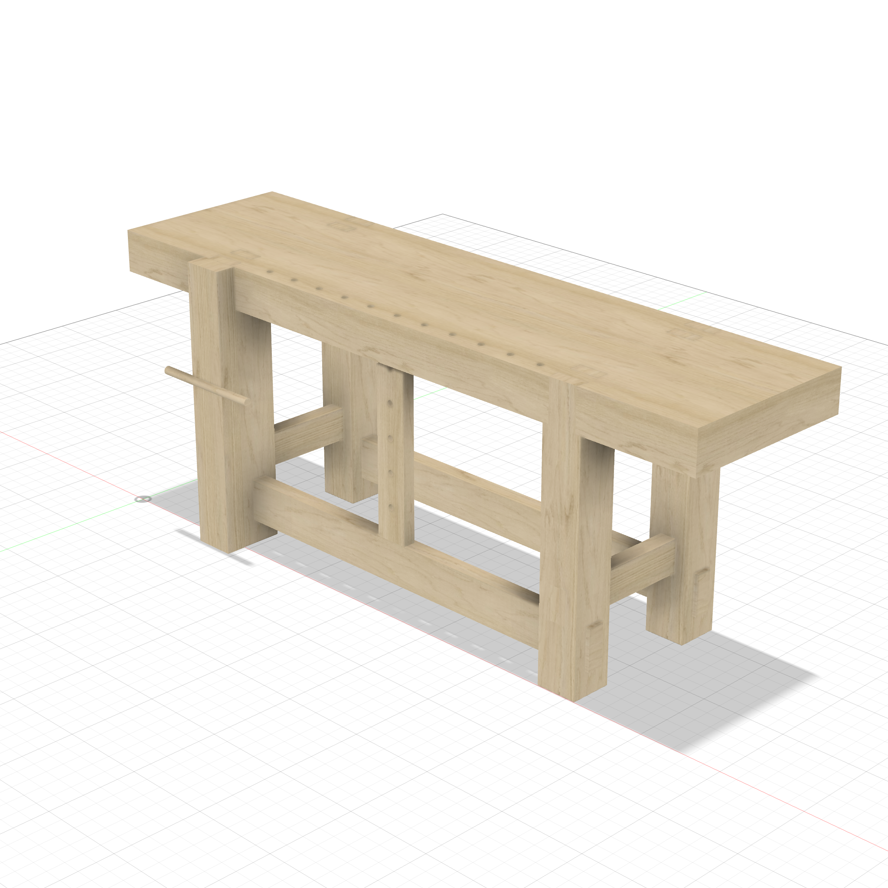
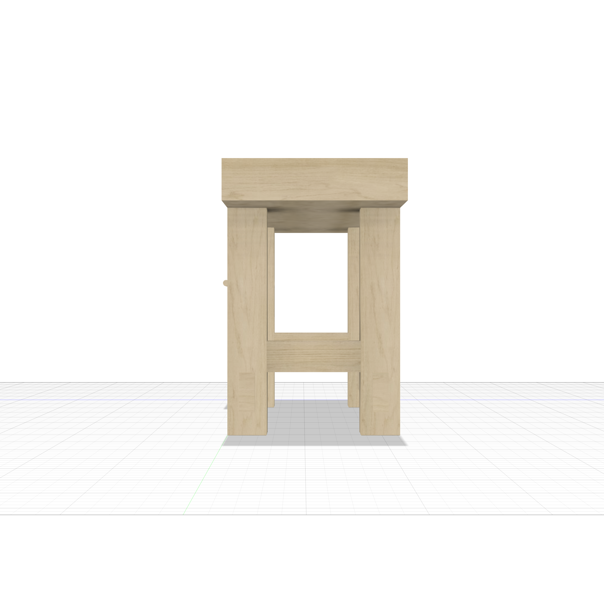
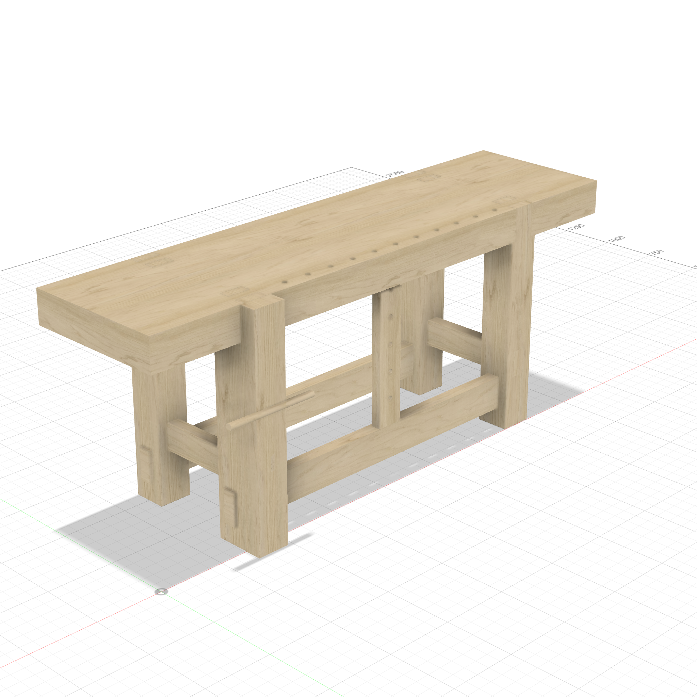

# Roubo Workbench

84"L x 22"W x 34"H. Classic Andre Roubo French workbench with a massive 5" slab top, heavy legs flush with front/back edges, through-tenon joinery, low stretchers, sliding deadman, dog holes, and a traditional leg vise.

## Features

- **5" slab top** with through-tenon mortises and a row of dog holes along the front edge
- **Dovetail + tenon paired joint** — each leg has a trapezoidal dovetail tenon (wider on the inside) and a rectangular tenon, both extruding through the top
- **Leg vise** on the front-left leg with chop, screw, handle, and parallel guide board
- **Sliding deadman** with vertical dog holes, flush with the front stretcher
- **Through-tenon stretchers** — front/back long stretchers pass through all four legs
- **Short stretchers** raised above the long stretchers to avoid mortise conflicts in the legs
- **Fully parametric** — every dimension uses parameter expressions

## Views

| Front | Right |
|:---:|:---:|
|  |  |

| Front-right iso | Front-left iso |
|:---:|:---:|
|  |  |

## Key Parameters

| Parameter | Default | Description |
|-----------|---------|-------------|
| `bench_l` | 84 in | Overall length |
| `bench_w` | 22 in | Overall width/depth |
| `bench_h` | 34 in | Overall height |
| `top_thick` | 5 in | Slab top thickness |
| `leg_w` / `leg_d` | 5 in | Leg cross-section |
| `leg_setback` | 14 in | Leg setback from each end |
| `dt_angle` | 7 deg | Dovetail taper angle |
| `dog_dia` | 0.75 in | Dog hole diameter |
| `dog_sp` | 4 in | Dog hole spacing |
| `vise_chop_t` | 2.5 in | Leg vise chop thickness |
| `vise_screw_dia` | 1.25 in | Vise screw diameter |

## Bodies (14)

| Component | Bodies |
|-----------|--------|
| Top | Top (with dog holes and through-mortises) |
| Legs | Leg_FL, Leg_FR, Leg_BL, Leg_BR (with dovetail + rectangular tenons) |
| LongStretchers | LS_Front, LS_Back (through-tenon) |
| ShortStretchers | SS_Left, SS_Right (raised above LS) |
| Deadman | Deadman (with vertical dog holes) |
| LegVise | Vise_Chop, Vise_Screw, Vise_Handle, Vise_Guide |

## Script

[roubo_workbench.py](roubo_workbench.py)
