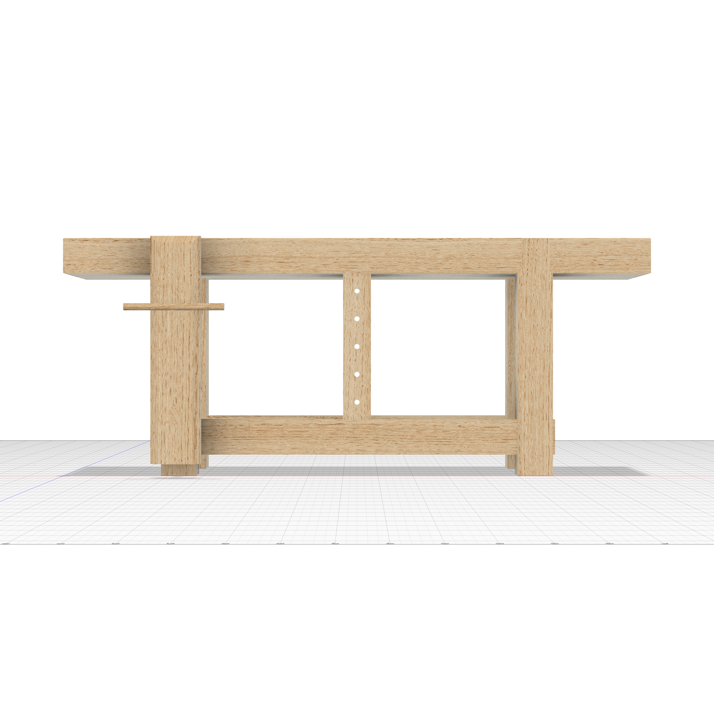
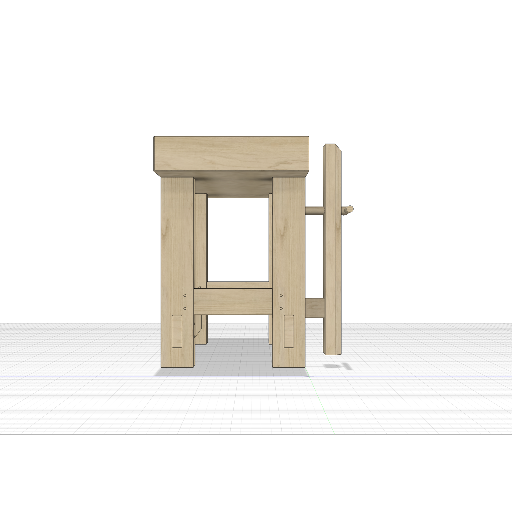
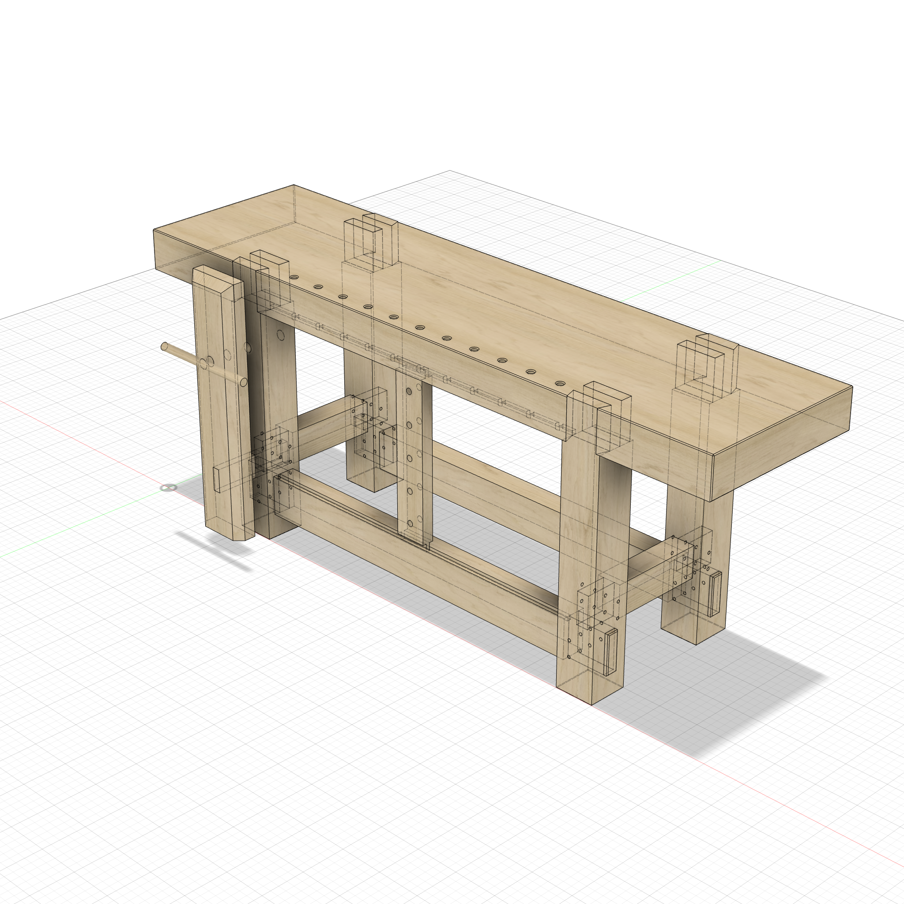

# Roubo Workbench

84"L x 22"W x 34"H. Classic Andre Roubo French workbench in white oak with a massive 5" slab top, heavy legs flush with front/back edges, through-tenon joinery, sliding deadman with tongue-and-groove track, dog holes, and a traditional leg vise.

## Features

- **5" slab top** with through-tenon mortises, dog holes along the front edge, and a tongue groove on the underside for the sliding deadman
- **Full-width dovetail + tenon paired joint** — each leg has a trapezoidal dovetail and a rectangular tenon, both full leg width, extruding through the top. Sketches reference the leg top face directly (no `leg_setback` dependency)
- **Leg vise** on the front-left leg with wider chop (7"), chamfered front edges (top + both sides), one-body screw hardware (rod + handle + back collar bearing on the leg), and a parallel guide mortised through the chop. All vise geometry references the FL leg face via `LegFL_Left` construction plane
- **Sliding deadman** with tongue-and-groove: tongues on top/bottom edges slide in grooves cut into the front stretcher and bench top underside
- **Drawbore through-tenon long stretchers** — tenon shoulders with 3/8" pin holes through each leg for mechanical lock (the pin cylinders are consumed as drilling tools)
- **Blind tenon short stretchers** — tenons stop 2.5" inside the legs, clear of the long-stretcher through-tenons that cross the same legs
- **Fully parametric** — every dimension uses parameter expressions

## Views

| Front | Back |
|:---:|:---:|
|  |  |

| Left | Transparent (joinery) |
|:---:|:---:|
|  |  |

## Key Parameters

| Parameter | Default | Description |
|-----------|---------|-------------|
| `bench_l` | 84 in | Overall length |
| `bench_w` | 22 in | Overall width/depth |
| `bench_h` | 34 in | Overall height |
| `top_thick` | 5 in | Slab top thickness |
| `leg_w` / `leg_d` | 5 in | Leg cross-section |
| `leg_setback` | 14 in | Leg setback from each end |
| `ls_t` / `ss_t` | 3 in | Stretcher thickness |
| `st_tw` / `st_tt` | 3 / 1.5 in | Stretcher tenon width / thickness |
| `dt_angle` | 7 deg | Dovetail taper angle |
| `dm_tongue_h` | 1 in | Deadman tongue projection |
| `vise_chop_w` | 7 in | Vise chop width (wider than leg) |
| `vise_distance` | 3 in | Gap between vise chop and leg |
| `ch_vise_chop` | 1 in | Vise chop outer top chamfer |

## Bodies (13)

| Component | Bodies |
|-----------|--------|
| Top | Top (with dog holes, through-mortises, and deadman tongue groove) |
| Legs | Leg_FL, Leg_FR, Leg_BL, Leg_BR (with full-width dovetail + rectangular tenons) |
| LongStretchers | LS_Front, LS_Back (through-tenon with shoulders, deadman tongue groove in LS_Front) |
| ShortStretchers | SS_Left, SS_Right (blind tenons, drawbore pin holes) |
| Deadman | Deadman (with tongues top/bottom, vertical dog holes) |
| LegVise | Vise_Chop (chamfered, guide mortise), Vise_Screw (rod + handle + collar, one body), Vise_Guide |

`validate_design` → PASS: 1 connected cluster (13 bodies), 0 interferences, 0
zero-impact features, dependency tree clean (`Leg_FL` is the origin root). The
vise hardware ties into the cluster through the collar's planar contact on the
leg back face; the chop ties in through the parallel-guide mortise.

## Script

[roubo_workbench.py](roubo_workbench.py) · [model.json](model.json)
