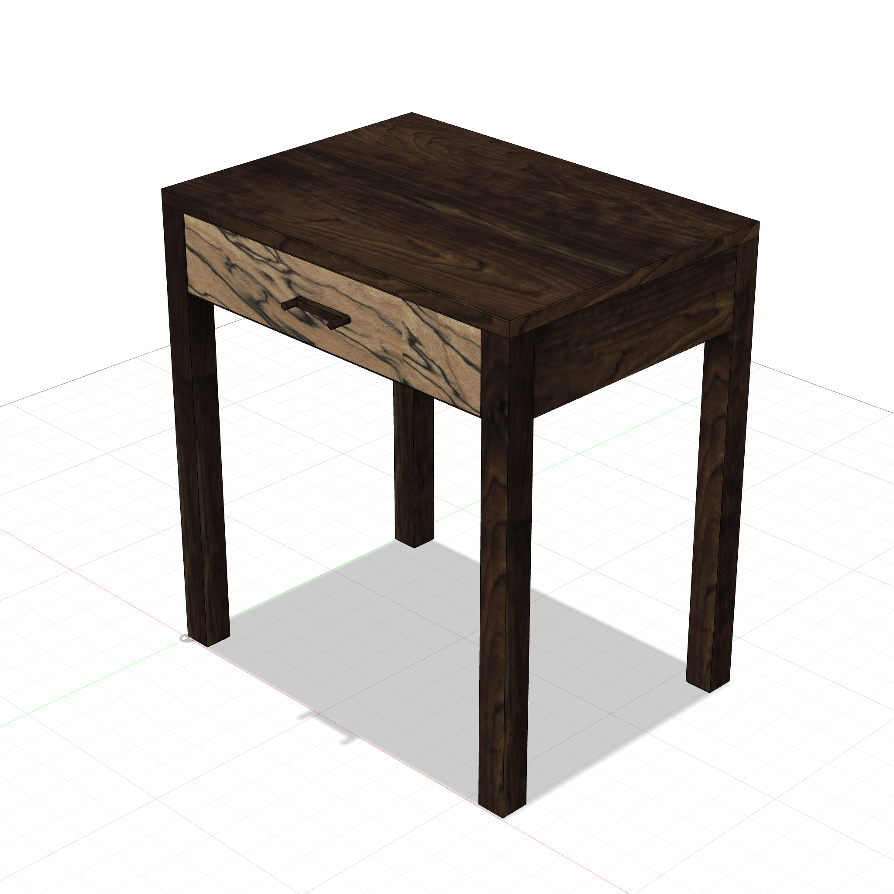
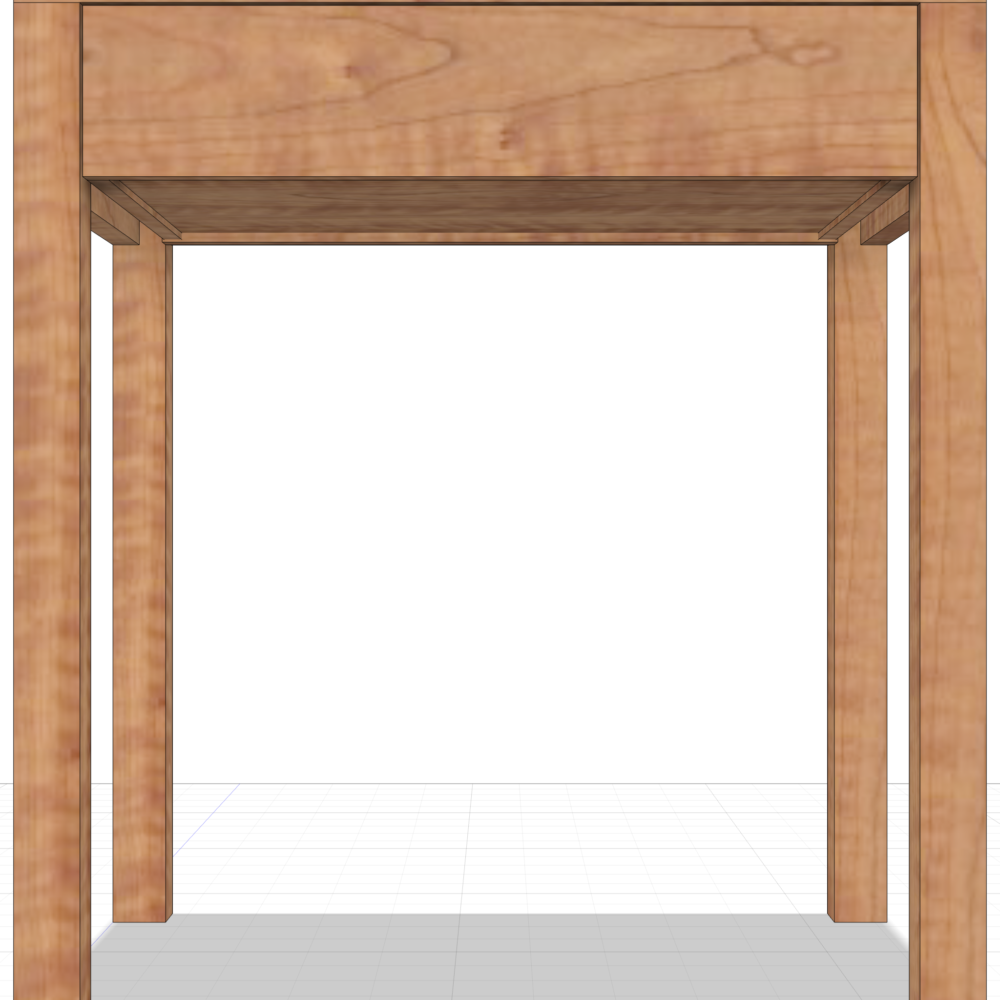
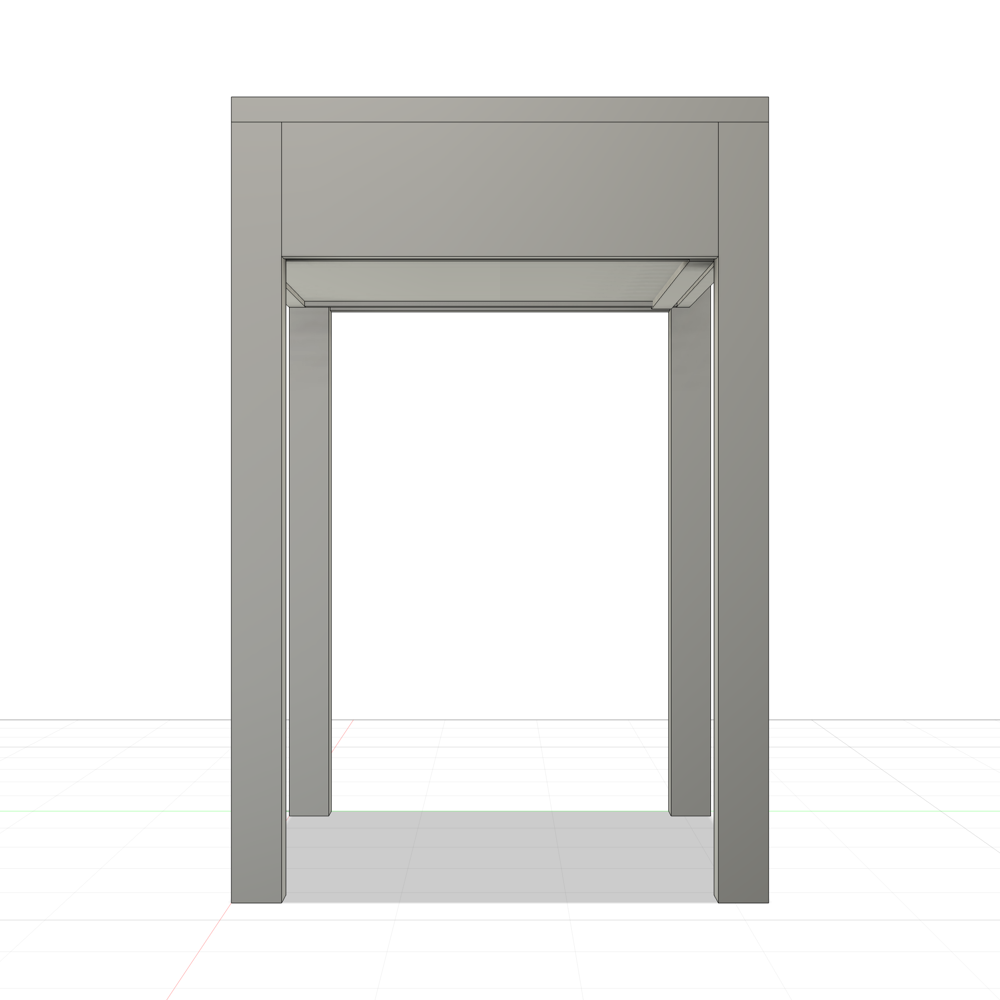
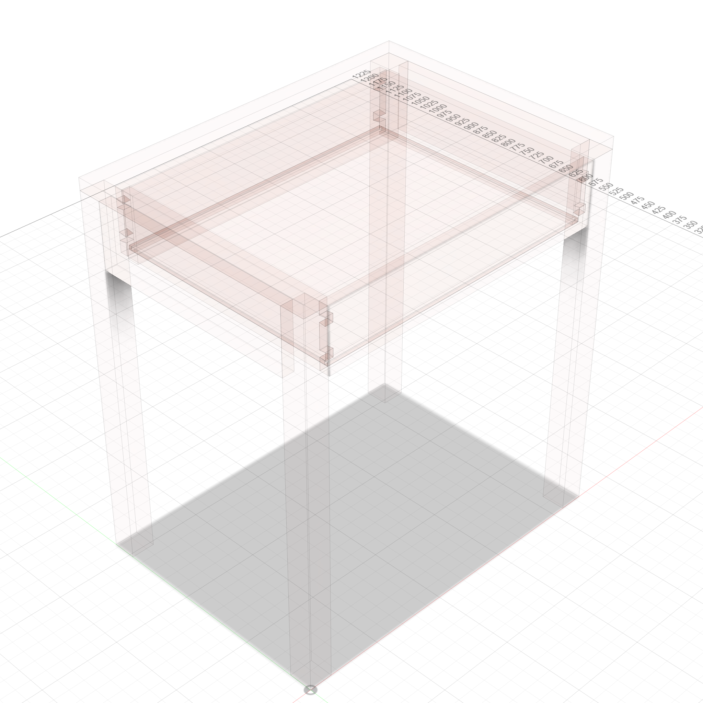

# Side Table / Nightstand

A parametric modern side table — 22"L x 16"W x 24"H with single dovetailed drawer. No front apron — the drawer front acts as the visible face. Half-blind dovetails at front, through dovetails at back.

  
  

### Transparent Views

  
  

---

**Script:** [`side_table.py`](side_table.py) — 13 bodies (4 legs, 3 aprons, top, 5 drawer). Uses `dovetailed_drawer` template.
