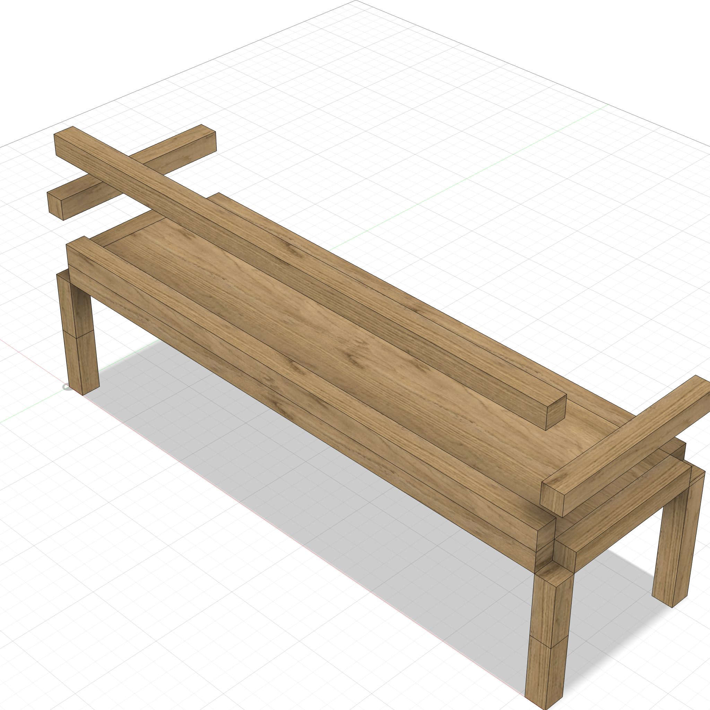
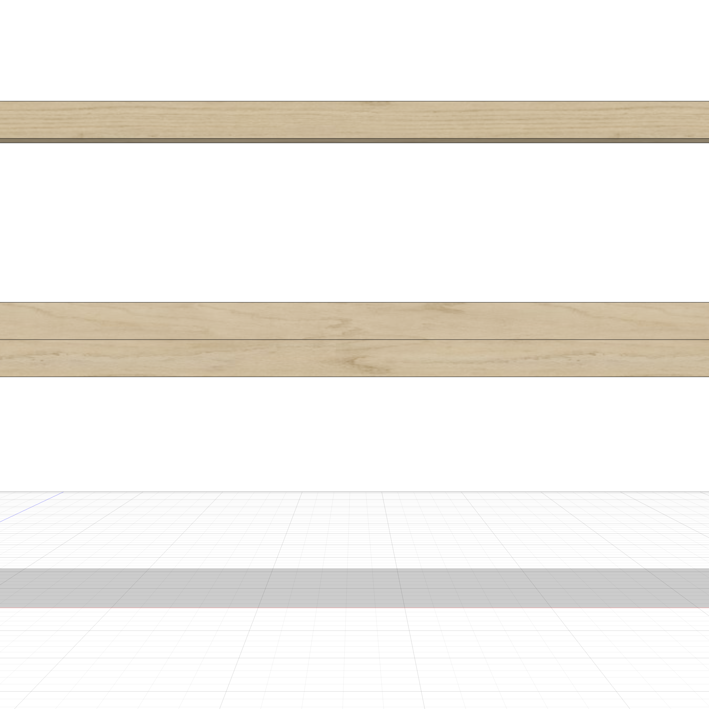
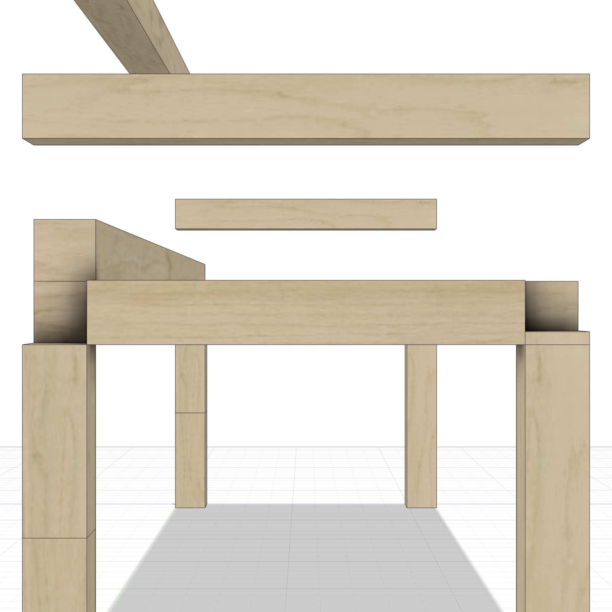
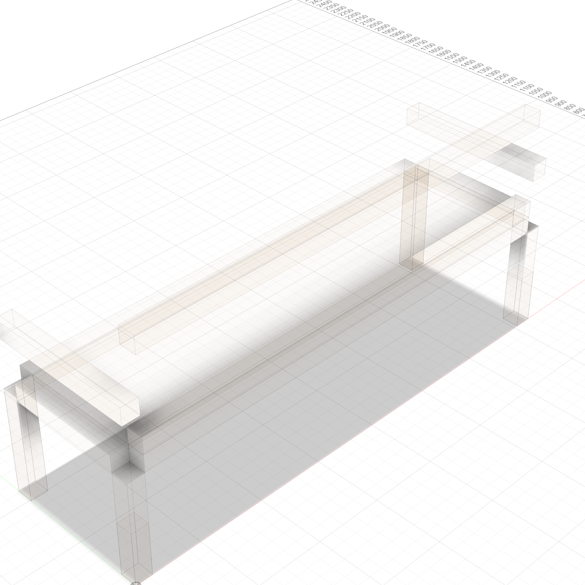
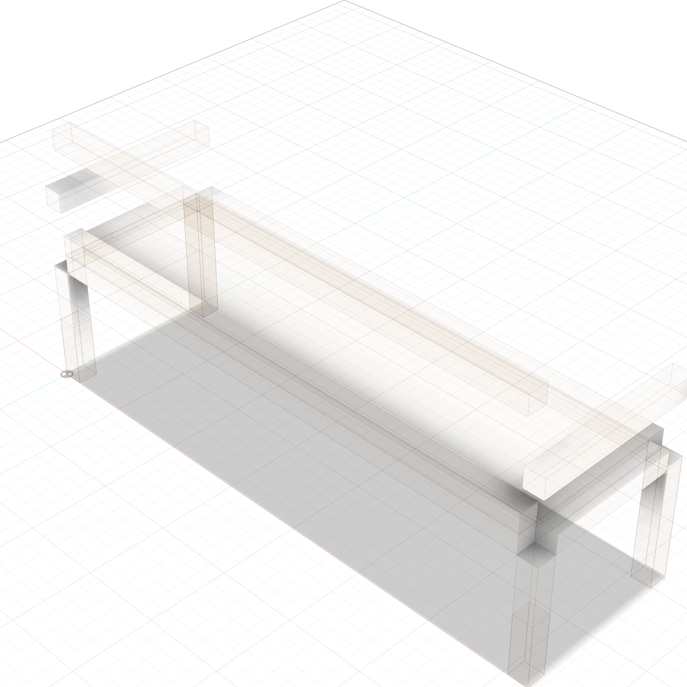

# Sofa Frame

A parametric modern sofa wood frame — 72"L x 22"D seat, 34"H back, 26"H arms. Frame only — cushions and upholstery not modeled.



<p float="left">
  
  
</p>

### Transparent Views

<p float="left">
  
  
</p>

---

**Script:** [`sofa_frame.py`](sofa_frame.py) — 17 bodies (4 legs, 4 seat rails, 4 back frame, 4 arm pieces, plywood deck).

### Appearance

```
apply_appearance(species="white oak")
```
