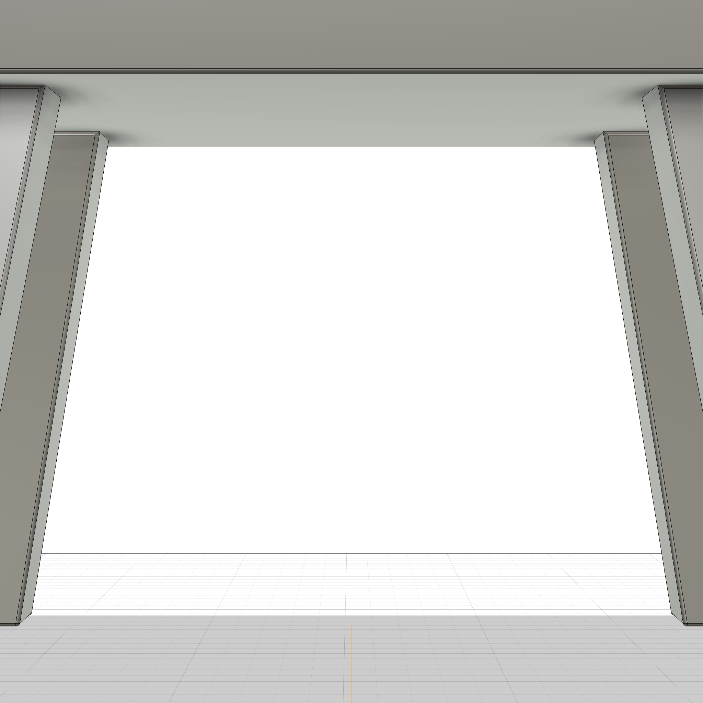

# Step Stool (Rebuild)

A parametric step stool with splayed legs and through-tenon joinery. 12"L x 7"W seat, 7" leg height, with compound splay angles and beveled seat edges.




## Regenerated Model

This script was **reverse-engineered from an existing Fusion 360 design** using `capture_design`. Unlike the [pergola rebuild](../pergola-rebuild/), which used the full search-build pipeline with per-feature ground truth validation, this stool was regenerated with the earlier export-based approach — a single-pass code generation from the captured timeline without incremental search.

The capture-and-rebuild pipeline reads the design's parameters, component tree, body geometry, and timeline features, then emits a standalone Python script that recreates the model from scratch.

---

## How to Run

**Via MCP (recommended):** If you have the [Fusion 360 MCP add-in](../../mcp/README.md) configured, ask Claude to run it.

**Manual:** Fusion 360 > Utilities > Scripts and Add-Ins > (+) > select this folder > Run

**Script:** [`stool.py`](stool.py)

### Appearance

```
apply_appearance(species="maple")
```

---

## Dimensions

All exposed as User Parameters (Modify > Change Parameters):

### Seat

| Parameter | Default | Description |
|-----------|---------|-------------|
| `seat_l` | 12 in | Seat length (X) |
| `seat_w` | 7 in | Seat width (Y) |
| `seat_t` | 0.9 in | Seat thickness |
| `seat_bevel` | 5 deg | Seat side bevel angle |

### Legs

| Parameter | Default | Description |
|-----------|---------|-------------|
| `leg_w` | 1.4 in | Leg width (X) |
| `leg_d` | 1.1 in | Leg depth (Y) |
| `leg_h` | 7 in | Leg height to seat bottom |
| `splay` | 10 deg | Leg splay along length |
| `splay_w` | 5 deg | Leg splay along width |
| `leg_inset_x` | 2 in | Leg center from seat end |
| `leg_inset_y` | 1.5 in | Leg center from seat edge |

### Tenons

| Parameter | Default | Description |
|-----------|---------|-------------|
| `tenon_proud` | 0.125 in | Tenon proud above seat |
| `tenon_shoulder_w` | 0.3 in | Tenon shoulder width |

### Derived

| Parameter | Expression | Description |
|-----------|------------|-------------|
| `seat_z` | leg_h | Seat bottom Z position |
| `leg_top_z` | leg_h + seat_t + tenon_proud | Leg extends to this Z |
| `splay_shift` | leg_top_z * tan(splay) | Foot offset from top |

---

## Design

### Bodies (5 total)

| Body | Description |
|------|-------------|
| **Seat** | Beveled rectangular seat with 4 mortise pockets |
| **Leg_FL** | Front-left leg with compound splay |
| **Leg_FR** | Front-right leg (mirrored) |
| **Leg_NL** | Near-left leg (mirrored) |
| **Leg_NR** | Near-right leg (mirrored) |

### Key Techniques

- **Compound splay** — legs angled in both X and Y directions using parametric `splay` and `splay_w` angles
- **Through tenons** — legs extend through the seat with `tenon_proud` visible on top
- **Mirror symmetry** — one leg modeled, mirrored twice for all four positions
- **Beveled edges** — seat sides tapered at `seat_bevel` angle
