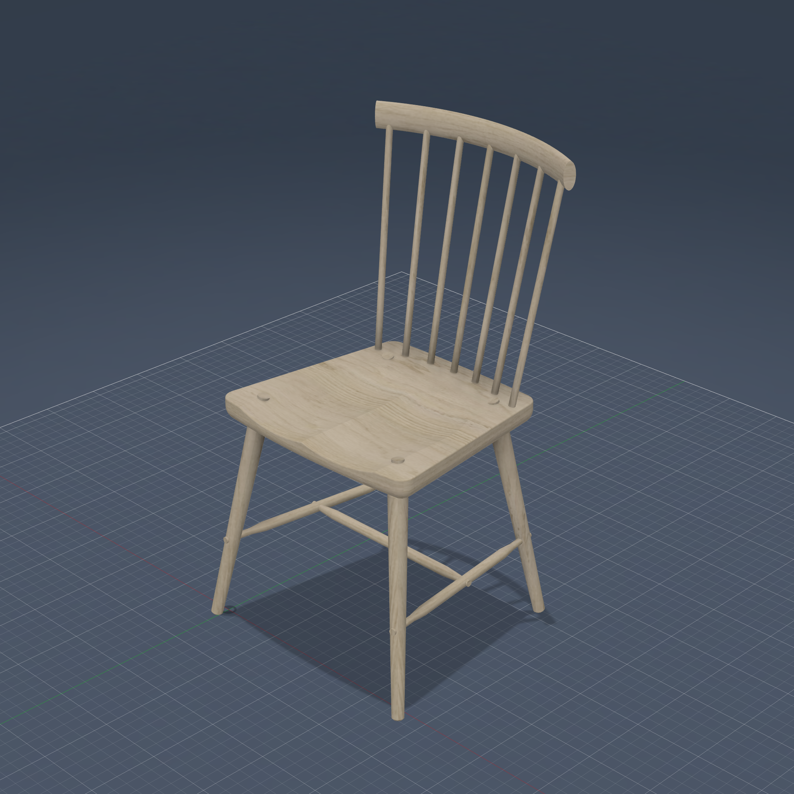
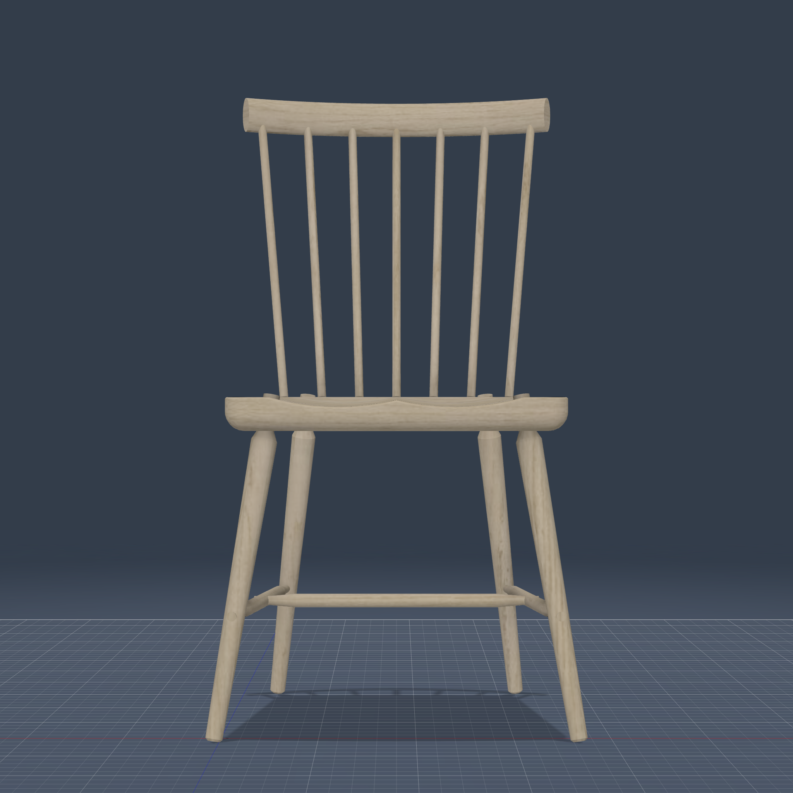
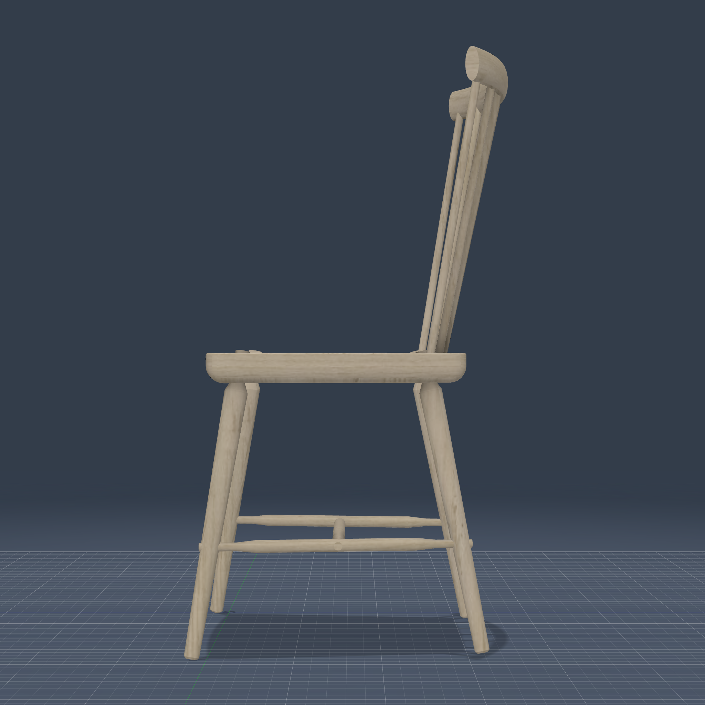
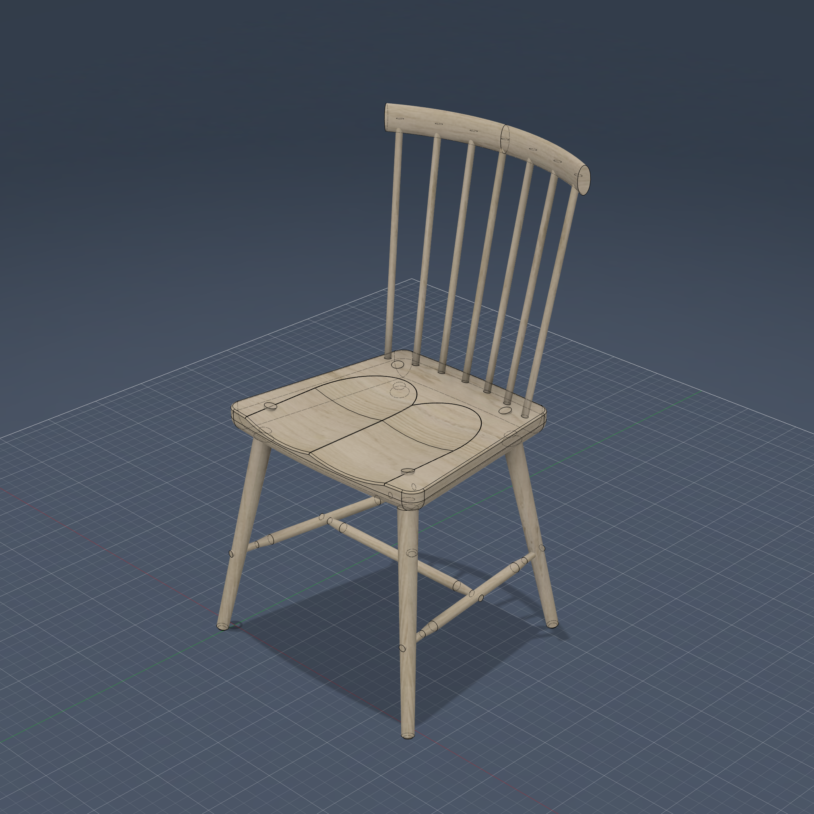

# Windsor Chair

A parametric Windsor chair with splayed/raked legs, turned stretchers, curved spindle back, and scooped seat.

| | |
|---|---|
|  |  |
|  |  |

## Features

- **Shaped seat** with trapezoidal outline (front/back arcs, angled sides), dual comfort scoops, and filleted edges
- **4 splayed/raked legs** with turned profiles (tenon, shoulder, taper) via revolve, positioned from seat corner geometry
- **H-stretcher system** — side stretchers connect front-to-back legs, cross stretcher connects side stretchers, all body-referenced via `intersectWithSketchPlane`
- **7 curved back spindles** arranged on a comfort arc, raked backward
- **Swept crest rail** following the spindle top arc
- **Tenon extensions** on all leg and stretcher ends
- **White oak appearance** with grain-aligned texture

## Key Parameters

| Parameter | Default | Description |
|-----------|---------|-------------|
| `seat_w` | 18 in | Seat width (front) |
| `seat_d` | 15 in | Seat depth |
| `seat_t` | 1.75 in | Seat thickness |
| `seat_h` | 17.5 in | Floor to seat top |
| `leg_splay` | 10 deg | Leg outward splay angle |
| `leg_rake` | 10 deg | Leg fore-aft rake angle |
| `leg_to_edge` | 2 in | Leg center distance from seat corner |
| `back_rake` | 12 deg | Back spindle rake angle |
| `n_spindles` | 7 | Number of back spindles |
| `scoop_depth` | 0.5 in | Seat scoop depth |
| `seat_fil` | 0.5 in | Seat edge fillet radius |

## Parametric Behavior

Legs are positioned from the seat's front-left corner: `leg_to_edge` along the side edge, then `leg_to_edge` perpendicular inward. Back legs are mirrored across the seat side edge midplane, then all are mirrored across the X midplane. Stretchers use body intersection — side stretchers intersect leg cross-sections at `str_z` height, cross stretcher intersects side stretcher cross-sections. All connections use sketch constraints (coincident, collinear) so geometry follows when parameters change.
